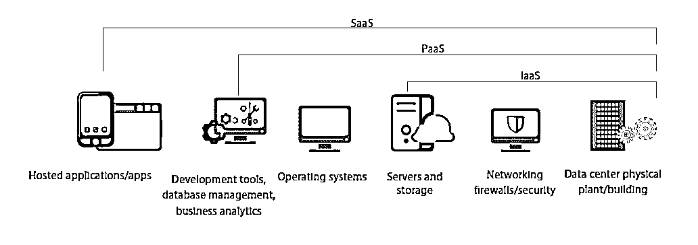
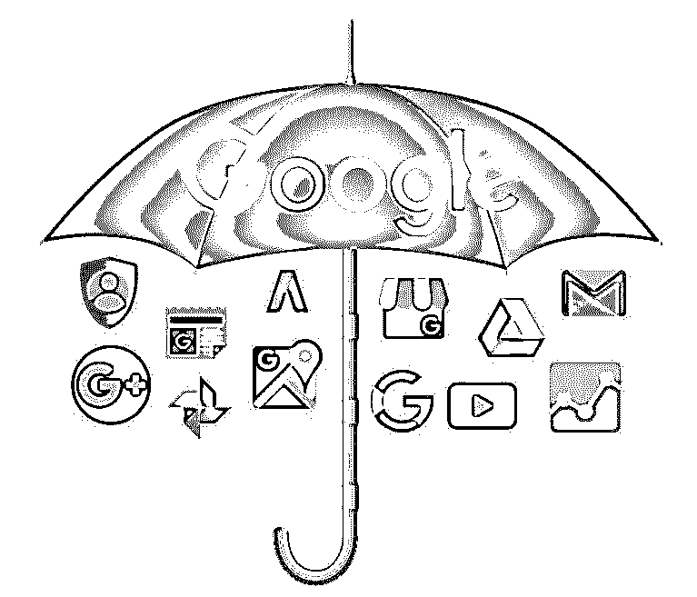
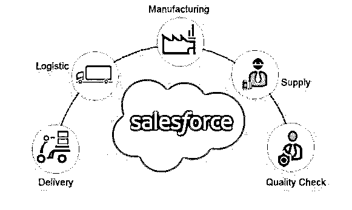
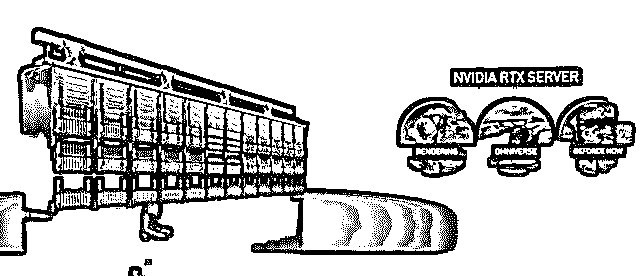
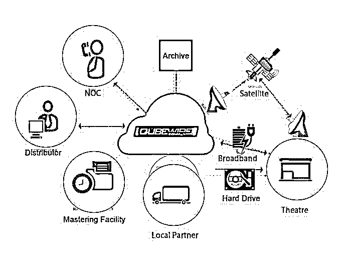

# 什么是云托管？

> 原文：<https://www.educba.com/what-is-cloud-hosting/>

## 云托管简介

云托管被定义为我们配置服务器的一种方式；通常，服务器配置涉及托管网站的服务器的物理限制，但对于云托管，我们依赖于独特的服务器配置，云托管分为三类，即基础设施即服务、平台即服务和软件即服务，其中包括 google accounts、Salesforce、Tensor Processing Units、云游戏、数字内容创建、内容分发等应用。

### 云解决方案的类型

*   IaaS:基础设施即服务
*   平台即服务
*   [SaaS:软件即服务](https://www.educba.com/what-is-software-as-a-service-saas/)

以下是云解决方案的类型。

<small>Hadoop、数据科学、统计学&其他</small>

#### 基础设施即服务

IaaS 提供对计算机、网络解决方案、数据存储等 IT 基础设施的访问。它为您提供了比传统的遗留 It 系统更大的灵活性，可用于未来升级、负载驱动的管理等。

#### 平台即服务

PaaS 提供了现成的构建和部署环境，云服务提供商可以在其中管理底层服务器、操作系统和开发工具。它消除了管理软件维护和修补的混乱，并根据您的需求简化了资源管理。一般来说，[云托管提供商](https://www.educba.com/cloud-hosting-providers/)提供一系列服务，可以根据开发者的需求进行定制。

#### 软件即服务

SaaS 为消费者提供基于云的终端用户应用。最后两种云服务是面向企业的，而 SaaS 是面向消费者的，被全世界数百万人使用，包括企业、开发者和普通人。

### 云托管的应用

以下是云托管的一些应用

#### 1.谷歌账户

谷歌是成功地从普通消费者到企业客户广泛使用云解决方案的公司之一。谷歌账户(SaaS)是使用最多的云解决方案，包括 Gmail、GSuite、Photos 等应用。它已经被集成到每一部 android 智能手机中，成为数十亿人的日常驱动力。简单、强大、免费使用的谷歌账户应用程序让用户可以毫不费力地加入并获得好处。类似的苹果替代产品 iCloud 以其简单而优雅的功能而闻名。

#### 2.销售力量

Salesforce 是企业领域的游戏规则改变者，在企业领域，公司可以使用多种设备管理其整个组织的 CRM 功能。它非常灵活，可根据企业需求进行扩展。自推出以来，Salesforce 已被全球数千家组织采用，以利用其能力。它帮助公司以一种安全的方式跟踪他们的产品从开始到销售的每一个价值流。Salesforce 每年都积极推出新产品，以满足整个经济环境中企业的不同需求。类似的 app 像 Freshsales，Zoho CRM 等。，提供类似 Salesforce 的解决方案。

#### 3.张量处理单元

AI 是当前软件解决方案的驱动力；云托管提供商提供的 TPU(PaaS)可以帮助个人和企业利用现有的云优势(如可扩展性、可靠性等)来试验和开发人工智能驱动的应用。云提供商甚至为特定用例设计了现成的工具，如 Sagemaker (AWS)、Rekognition (AWS)、Databricks (Azure)、ML Engine (GCP)等。这些人工智能云解决方案避免了对个人尖端硬件的需求以及相应的升级痛苦。

#### 4.云游戏

云游戏是一个神话，或者我应该说是一种营销手段。但直到最近，科技巨头们才开始介入，让主流游戏玩家看似可行。游戏行业是快速扩张的娱乐行业之一，为了给创作者和游戏玩家带来更大的灵活性，它正在云上快速追赶。创作者可以向大众提供更多的游戏，而游戏玩家可以忘记他们的硬件对最新游戏的兼容性。Stadia(谷歌)、xCloud(微软)、PlayStation Now(索尼)都是具有开创性功能的领先云游戏提供商。

#### 5.数字内容创作

如游戏、3D 渲染、媒体编码等新时代的数字内容创作。，需要先进的硬件来有效管理工作负载。基于云的解决方案已经成为满足各种需求的解决方案，如渲染(GCP Zync)、游戏开发(亚马逊 Lumberyard)、游戏托管(亚马逊 GameLift)等。这些应用为按需 SaaS 提供可扩展计算，以应对要求苛刻的工作负载。Nvidia 是云 GPU 硬件供应的市场领导者。他们甚至有自己的企业用户云解决方案。创作者可以忘记他们的机器维护和软件许可，更专注于他们的创造性工作。

#### 6.内容分发

知识产权或版权材料的安全分发对于内容管理公司来说是必不可少的。它必须快速、安全且可扩展，以满足市场需求并获得竞争优势。Qube 就是这样一家公司，它有效地获得了云的好处，以安全的方式将媒体直接传送到影院，而不影响媒体的质量。它消除了中间商，从而避免了配送中的成本和延误。它还可以帮助媒体公司根据其版权要求在需要时远程管理其内容。

### 结论

我们已经到了这样一个地步，我们都同意云托管肯定是新时代数字解决方案的支柱。它们对开发者和消费者都是友好的。然而，即使强大的云解决方案也有其缺陷。安全性是基于云的应用程序中的一个主要问题。企业通过先进的安全措施来保护他们对此类应用的访问，但普通用户可能不知道双重授权等基本安全措施。然而，在 IRL 中，我们看到两者都成为每年影响数百万用户的重大安全漏洞的牺牲品。因此，当我们享受云托管的好处时，我们也应该采取措施以各种可用的方式保护我们的数据。有多种方法可以做到这一点，但这是另一篇文章了。

### 推荐文章

这是一个什么是云托管的指南。在这里，我们讨论云托管的基础知识和一些有趣的云托管应用。您也可以阅读以下文章，了解更多信息——

1.  [什么是春云？](https://www.educba.com/what-is-spring-cloud/)
2.  [云计算公司](https://www.educba.com/cloud-computing-companies/)
3.  [云联网](https://www.educba.com/cloud-networking/)
4.  [春云组件](https://www.educba.com/spring-cloud-components/)

