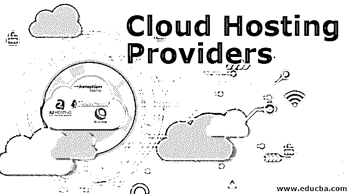

# 云托管提供商

> 原文：<https://www.educba.com/cloud-hosting-providers/>

## 云托管提供商简介

维护网站服务所需的资源分布在多个 web 服务器上，这些服务器集群称为“云”，云中的每个服务器都有助于执行一组特定的任务，在任何服务器出现故障的情况下，备份服务器将被指定为备份服务器来满足需求。反之亦然，网站数据分布在云中的所有服务器上，可以使用虚拟机进行访问。这种方法被称为云托管。在本主题中，我们将学习[关于云托管](https://www.educba.com/what-is-cloud-hosting/)提供商的知识。许多公司提供云托管设施，被称为云托管提供商。所提供设施的质量是根据正常运行时间、带宽、安全性、支持和可负担性等因素来评估的。

### 顶级云托管提供商

根据客户评论分析，2019 年以下被评为顶级云托管提供商。

<small>Hadoop、数据科学、统计学&其他</small>

#### 

#### 1.A2 托管

它们是独立拥有的，这意味着它们完全控制着自己的资源，不会过度销售。这带来了垄断，他们的计划是负担得起的。

很少观察到用户审查的有利功能如下:

*   无限的带宽和存储，总数据库，转让，电子邮件地址和子域，停泊的领域，和附加领域。
*   睿频服务器的页面加载速度提高了 20 倍。
*   HTTP/2、PHP7、SSD &免费 CloudFlare CDN & HackScan。
*   网站迁移很容易，WordPress 是预装的。
*   每日自动备份和服务器倒带任务。
*   保证 95%的正常运行时间。
*   有 Node.js 支持。

#### 2.InMotion

Inmotion 有 5 种不同类型的托管服务:

*   基本共享业务托管
*   WordPress 主机
*   虚拟专用服务器(VPS)托管
*   专用服务器
*   经销商托管

InMotion 最基本的计划是“基本共享商业主机”，它提供无限的磁盘空间和带宽，最适合小型商业网站，使用共享主机就可以了。这是最便宜的，有能力处理常规交通。InMotion 还提供免费的 SSL 证书，使你的网站成为 HTTPS，这是通过谷歌安全测试的基本要求。他们还提供免费黑客保护、免费备份和 DDoS 保护，你可以从 InMotion 网站的 cPanel 管理你的主机。

InMotion 的“VPS 主机”带有自动安全更新的服务器管理功能。InMotions 的“专用主机”适用于大型网站和企业级业务，它具有多层安全性，免费固态硬盘的加载速度快 20 倍，以及个人启动助理。

#### 3.宿主

HostGator 不像其他服务提供商那样提供免费域名，但它提供其他可靠的功能，如:

*   它提供无限的电子邮件帐户，子域，和 FTP 帐户，允许从计算机传输文件到网络。
*   无限带宽和存储。
*   自己的下拉网站建设者创建自己的网站，有 20 个类别的大量模板。
*   HostGator 提供 WordPress 托管和一键安装。它支持 Joomla 和 Drupal 内容管理系统，以及免费电子商务平台 Magento。
*   HostGator 提供免费的电子邮件营销工具，帮助任何想通过时事通讯建立受众的人。它还必须跟踪，以帮助你看到你的运动做得有多好。

#### 4.梦幻主机

根据在线评论，它是最实惠的云托管提供商，他们提供网站托管、WordPress 专用托管、电子邮件托管、域名注册和云服务的计划。

*   Dreamhost 平均速度 e 719 ms 平均加载时间。
*   Dreamhost 的正常运行时间约为 96%。
*   退款保证期为 90 天，比其他服务商提供的平均退款天数多 60 天。

它有最高限额的最便宜的计划，每月 2.59 美元，具有以下功能:

*   无限带宽和存储。
*   高级、易用的面板。
*   强大的一键式安装程序。
*   免费域名、电子邮件地址、免费隐私保护和免费 SSL 安全。
*   自动备份和即时 WordPress 设置。
*   梦想主机客户面临的主要问题是，没有 24/7 的支持，没有电话支持，也没有专业的电子邮件设置。

市场上有很多云托管提供商，它们有各种各样的功能和优势，选择最好的取决于我们的业务类型、服务和预算。

### 推荐文章

这是一个云托管提供商的指南。在这里，我们讨论四大云托管提供商及其各自的特点。您也可以看看以下文章，了解更多信息–

1.  [虚拟主机 vs 云主机](https://www.educba.com/web-hosting-vs-cloud-hosting/)
2.  [云计算挑战](https://www.educba.com/cloud-computing-challenges/)
3.  [什么是云计算中的虚拟化？](https://www.educba.com/what-is-virtualization-in-cloud-computing/)
4.  [最佳云托管](https://www.educba.com/best-cloud-hosting/)

