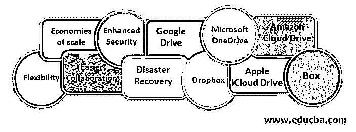

# 云数据存储服务

> 原文：<https://www.educba.com/cloud-data-storage-service/>

## 云数据存储服务简介

我们生活在一个技术创新的时代，技术创新已经彻底改变了我们互动、交流、社交和工作的方式。在这种情况下，变化是唯一不变的，每一次突破都会带来新的挑战。当今全球行业面临的一个挑战涉及到来自不同来源的数据的有效管理。[技术进步](https://www.educba.com/what-is-technology/)使得收集与业务流程、金融交易、企业间互动和客户互动数据等相关的实时数据成为可能。借助传统方法来存储和处理这些海量数据是根本不可能的。

通常，企业在管理大量物理 IT 基础设施以满足其数据存储和处理需求方面投资巨大。然而，如今数据积累的速度使得企业几乎不可能扩展其物理基础架构来满足存储和处理需求。为了填补这一空白，云计算已成为满足现代数据管理需求的创新和可持续解决方案。为了理解云计算到底是什么，掌握虚拟化基础设施的概念是非常重要的。

<small>Hadoop、数据科学、统计学&其他</small>

### 什么是云计算？

通常，云数据存储服务由管理物理基础设施并向其客户提供对特定软件或其他计算资源的在线访问的供应商提供。这种远程物理基础设施包括服务器和其他物理资源的网络，有时甚至在地理上分散开来。任何人都可以通过云购买特定软件的有限访问权限，并根据自己的需求扩大或缩小资源。

这使得企业不再需要管理大量的物理资源，而是专注于运营方面，将更多的时间花在提高效率上。如今，越来越多的企业倾向于利用最佳的云数据存储服务，而不是管理内部基础架构来满足其特定需求。云计算为用户提供了许多优势，包括更高的灵活性、可伸缩性、易访问性和成本效益等。

### 云计算的优势

云计算为企业和个人用户带来了诸多好处，包括:

*   #### Flexibility:

通常，它是在订阅的基础上提供的，让用户决定要使用的资源数量，而不必担心安装或管理软件或管理硬件资源。提供云数据存储服务的供应商负责管理远程基础设施，用户只需为他们使用资源的数量和时间付费。

*   #### Economies of scale:

不言而喻，云数据存储服务的最终用户不必担心物理资源的消耗和管理，即使在不使用时也是如此。云计算功能有助于减少对大量物理基础架构和人力的需求，以及维护它们所需的时间和资源，从而提高组织的运营效率。与传统方法相比，这有助于组织通过降低每种产品或每单位产出的总成本来实现规模经济。

*   #### Easier collaboration:

支持云的产品或项目开发允许团队成员更高效地协作并实时共享他们的输入，从而减少在产品设计或流程的某些方面的视图和审查上花费的时间。据用户称，更大的可见性、协作和即时文件共享只是其中的一些好处。共享的在线存储和随时随地访问资源的能力让用户真正充分利用可用资源。

*   #### Enhanced security:

对于个人用户以及各种大小公司来说，数据保护是一个价值百万美元的问题。尽管有些人可能有一些安全顾虑，但考虑到物理资源是由供应商管理的，因此数据可能会受到威胁。然而，在提供对任何种类的软件或硬件资源的基于云的访问时，采取了足够的措施，以便不会发生数据丢失，更重要的是，数据安全性不会受到损害。用户完全控制着存储在共享存储上的数据，这就是为什么大公司发现依赖基于云的基础设施相当容易。

*   #### Disaster recovery:

在现代组织中，数据丢失是一个严重的问题，在传统环境中，任何种类的硬件或软件故障都可能导致数据丢失。然而，它彻底改变了局面，任何硬件故障或其他技术问题都不会影响关键数据，只要这些数据存储在云上。它有助于最大限度地减少生产力的损失，这对提高组织过程的效率起着重要的作用。

根据市场研究公司 Vanson Bourne 进行的一项名为“云的业务影响”的研究，云数据存储服务的采用对业务产生了明显的影响。该研究指出，云的采用在缩短平均上市时间、提高流程效率和降低运营成本方面产生了可衡量的影响，以及导致公司增长可量化增长的几个关键因素。然而，当谈到云数据存储服务时，云数据存储服务占据主导地位，越来越多的人已经使用云数据存储服务来备份他们的个人和业务数据。

### 推荐课程

*   免费 jQuery 课程
*   自由角度 JS 训练
*   Mudbox 在线培训
*   免费的 Ruby 在线培训

### 最佳云数据存储服务选项

当今一些最佳的云数据存储服务选项包括

*   #### 收存箱:

[Dropbox](https://www.dropbox.com/?landing=dbv2 "Dropbox") 可以说是市场上最受欢迎的云数据存储服务选项之一，提供 2GB 的存储空间作为免费基本帐户的一部分。鉴于共享的媒体文件相对较大，这可能不足以满足当今大多数人的存储需求，但是可以通过多种方式扩展这种存储空间。

**附加存储:**

简单来说，基本帐户将额外获得 250 MB，如果您选择建立一个邮箱帐户，您可以额外获得 1 GB 的存储空间。你可以推荐朋友，每次注册都可以额外获得 500 MB 的存储空间。通过推荐获得的额外空间上限为 16 GB。启用摄像头上传功能将直接为您节省 3GB 的存储空间。

**付费订阅计划:**

或者，您可以订阅每月 9.99 英镑的 1TB 存储计划。对于付费企业用户来说，Dropbox Business 是一个很好的选择，每月 15 美元就可以无限存储。要查看该实用程序，您还可以免费订阅 30 天。

*   #### 谷歌驱动:

如果你有一个 Gmail 帐户，你就可以在谷歌提供的创新云数据存储服务 [Google Drive](https://www.google.com/drive/ "Google Drive") 上获得 15 GB 的免费云数据存储服务空间。这是目前最高效、最易于管理的云存储选项之一。然而，重要的是要记住，这个 15 GB 的免费云数据存储服务空间包括整个谷歌服务套件，而不仅限于 Google Drive。

这限制了 Gmail、Google Plus 和其他服务的普通用户可用的实际存储空间；不过，对于普通用户来说，还有很多空间。从 Google Drive 上传和下载数据的便利性也让它与众不同。使用 Google Drive 同步文件比以往任何时候都更容易，并且可以在 Google 服务之间即时共享。

**附加存储:**

Chromebook 用户可额外获得 2-3 年的 1 TB 免费云数据存储服务。

**付费订阅计划:**

用户可以订阅每月 1.99 美元的 100 GB 存储计划，或每月支付 9.99 美元购买 1 TB 存储。

*   #### 微软 OneDrive:

微软的原生云存储选项 OneDrive，原名 SkyDrive，自带 15 GB 免费存储。 [OneDrive](https://onedrive.live.com/ "OneDrive") 与最新版本的 Windows 完美配合，并易于与早期 Windows 版本和 Mac 用户的桌面应用程序配合使用。OneDrive 还提供适用于 Android、iOS 和 Windows 平台的应用，使其能够轻松用于各种移动设备。对于狂热的游戏玩家来说，甚至有一个专门为 Xbox 用户设计的 OneDrive 应用程序。

**附加存储:**

那些希望扩展存储大小的客户可以为每个转介增加 500 MB，上限为 5GB。

**付费订阅计划:**

对于额外的存储空间，用户可以每月为 65 GB 支付 2 美元，为 200 GB 支付 4 美元，为 1 TB 存储支付 7 美元。通过 1 TB 计划，用户还可以免费访问 Office 365 个人版。

出于显而易见的原因，那些频繁使用微软 Office Personal 和 Windows 操作系统的人，OneDrive 提供了更大的价值。然而，已经离开 MS Office 的用户可能不会发现它是一个非常有吸引力的选择。

*   #### 苹果 iCloud Drive:

那些使用苹果设备的人可以充分利用 iCloud Drive 的 5 GB 免费存储空间，它在 Windows 上的表现就像在 iOS 和 OS X 设备上一样好。然而，在 Windows phone 或 Android 和黑莓上没有使用 iCloud Drive 的应用程序，因此限制了大多数平台和设备的苹果生态系统内的访问，当然，Windows PC 除外。

如果你使用 iPhone、iPad 或 Mac，那么它肯定是一个有价值的附加产品。对于那些寻找完整办公套件的人来说，iCloud 与 iWorks 的集成已经足够好了。iWorks 是苹果公司开发的初学者办公套件。它有助于创造一些类似于谷歌通过其完整的基于云的 office 以及 Google Drive 和 Google Docs 的无缝集成所取得的成就。然而，随着移动性成为新趋势，仅从苹果设备有限地访问 iCloud drive 并不能很好地服务于它。

**附加存储:**

在 iCloud Drive 中没有免费扩展存储空间的选项。

**付费订阅计划:**

您可以每月为 20 GB 支付 1 美元，为 200 GB 支付 4 美元，或为 1 TB 的存储支付 10 美元。

遗憾的是，目前还没有商业版的 iCloud Drive。例如，iCloud Drive 的文件同步功能也不如 Google Drive 或 Dropbox 流畅。

*   #### box:

任何正在寻找非常适合专业用户的云存储选项的人都可以在 Box 的一个地方找到大多数想要的东西。它提供 10 GB 的免费云数据存储服务，文件大小上限为 250 MB，但这还不是全部；它允许用户在云上无缝地协作和共享，使其成为商业用户的完美选择。整个团队可以在这个盒子上轻松协作，轻松地创建和编辑文件。

还有更多。隐私控制非常好，允许用户在与其他用户共享数据时设置特定的访问和限制。单个文件可以受密码保护，如果需要，文件夹也可以在有限的时间内共享，并且可以设置共享特定文件夹的截止日期。

**附加存储:**

Box 没有免费的云数据存储服务扩展计划。

**付费订阅计划:**

每月 10 美元，用户可以获得 100 GB 的存储空间，文件大小限制为 5 GB，这显然足以满足专业目的。

*   #### Amazon Cloud Drive:

没有多少人知道云计算是亚马逊的一项大业务，但必须说，Cloud Drive 提供的云数据存储服务选项相当有限。我们这样说是因为 [Amazon Cloud Drive](https://www.amazon.com/b/?node=15547130011 "Amazon Cloud Drive") 只适合存储照片和视频，因为即使你存储了包括 Word、PDF 或 XLS 格式的文档文件，它也无法在移动设备上打开。

在存储方面，提供了 5GB 的免费空间，通过在 Fire 平板电脑或手机上打开相机回滚功能，可以轻松分享照片和视频。

**亚马逊的存储计划:**

说到亚马逊的云产品，必须记住的是，2015 年 3 月，该公司宣布了两项名为无限照片和无限一切的新计划。这两个计划主要提供三个月的试用版本，可以继续支付每年 12 美元的无限照片和每年 60 美元的无限一切。然而，如果你是亚马逊 Prime 会员或拥有 Fire 平板电脑或手机，就可以免费获得无限数量的照片。

需要说明的是,“无限照片”为照片提供无限存储空间，并为视频和所有其他类型的文件提供 5GB 存储空间，而“无限一切”仅提供无限存储空间，用于照片、视频和所有其他类型的文件。在文件同步方面，亚马逊 Cloud Drive 可能不是最好的，但它提供了一项物有所值的服务，包括 Windows PC 和 Mac 的桌面应用程序以及 Android 和 iOS 平台的移动应用程序，这使它成为一项相当不错的云数据存储服务。然而，最好的优势是留给那些拥有亚马逊 Prime 会员资格或拥有那些时尚 Fire 设备之一的人。

### 推荐文章

这是云数据存储服务的指南。在这里，我们讨论了基本概念、优势以及最佳云数据存储服务选项。您可以阅读以下文章了解更多信息——

1.  [Excel 公式的重要步骤](https://www.educba.com/best-basic-excel-formulas/)
2.  [什么是云计算？](https://www.educba.com/cloud-computing-benefits/)
3.  [营销云培训](https://www.educba.com/marketing-cloud-training/)
4.  [云计算问题](https://www.educba.com/cloud-computing-issues-challenges/)

