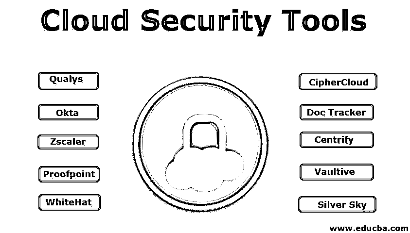

# 云安全工具

> 原文：<https://www.educba.com/cloud-security-tools/>

## 云安全工具简介

云安全工具(像 Qualys，WhiteHat Security，Okta，Proofpoint，ZScaler，CipherCloud，DocTracker，Silver Sky 等。)有助于提供云安全，基于用户所面临的问题，云安全分为两大类，即云提供商所面临的问题和客户所面临的问题，这些工具很有前途并且易于安装在软件和硬件系统中，并且有助于防止任何数据丢失、数据泄露或黑客的任何数据窃取。

### 顶级云安全工具

在安全方面，公司的规模不是问题。甚至手机都有很多密码和花样锁来保护用户数据。每当防火墙不完善时，黑客就会分散到每个地方窃取数据。所以安全是第一个必须定期检查的。这里有几个安全工具，它们很有希望安装在你的硬件和软件系统上。

<small>Hadoop、数据科学、统计学&其他</small>

#### 1.Qualys

安装 Qualys 工具是为了检查任何威胁，并通过云解决方案保护您的设备、web 应用程序和网页。该组织分析任何恶意软件攻击，并确保用户的数据或系统不受任何影响。如果发现任何攻击，它会显示解决问题所需的步骤，并再次扫描所有网页和应用程序，以清除攻击并有效工作。Qualys 生产了一种纯云防火墙来保护网页免受任何威胁。

#### 2.怀特哈特安全公司

WhiteHat security 旨在从根级别保护用户网站，包括[编码过程](https://www.educba.com/what-is-coding/)。该工具以套件的形式提供，嵌入了五种不同的应用程序。第一个应用程序用于保护网页和代码。第二个应用程序有助于在网站启动前的预生产期间发现问题。另一个应用程序帮助用户检查现场环境中的任何主要问题。第四个应用程序允许用户在检测到任何补丁时甚至通过漏洞访问网页。主要的一个作为一个研究部门，为您提供有关用户安全网络的最新信息。

#### 3.天空的八分之一

Okta 专注于对任何人登录的身份管理，以及他们登录背后的原因。它已经拥有每天登录进行基本健康检查和性能检查的员工的数据库，然后它拥有客户、云服务提供商和第三方客户的详细信息。它了解在后端工作的人员，以及面向前端的人员访问。它帮助用户管理应用程序，包括应用程序、salesforce、workday 和 Microsoft office suite 365。它还可以跟踪数据隐私协议、登录按钮和登录仪表板。

#### 4.校对点

Proofpoint 是一种只关注电子邮件的工具，它是从系统的一个漏洞中自动生成的，黑客很容易进入这个漏洞。它阻止传入数据，并确保传出的每一个数据单元。它有助于防止数据丢失。它还对数据处理和数据流的[加密和解密](https://www.educba.com/encryption-vs-decryption/)起作用。

#### 5.Zscaler

它是直连云网络的产品，比传统的安全方法更具成本效益且易于部署。该公司的产品 Zscaler 通过监控进出用户网络的流量来保护系统免受高级威胁攻击，用户网络就像一个检查站。它还通过一个特殊的在线移动应用仪表板来保护和监控手机。

#### 6.密码云

CipherCloud 是一个用于保护所有其他服务和产品的应用程序，如谷歌应用程序、亚马逊网络服务、Chatter、Office 365。它通过加密、定期流量监控和防病毒扫描来确保数据安全。

#### 7.文档跟踪器

Doc Tracker 存在于安全层的顶层，它共享来自 Box 和 office 365 的文件。用户应该在文件上应用一个安全层，如果他们忘记这么做，任何人都可以阅读，编辑和控制它。Doc Tracker 致力于防止文档出现这种情况。它使用户能够知道将要访问共享文件的另一个人。如果他试图超出他的限制来处理它，用户可以通过点击“取消共享”来重新获取文件

#### 8.使中心化

Centrify 旨在跨多个应用程序和设备进行身份管理。主要目标是使用户、雇主、客户看起来像是通过公司政策来查看和访问的中心区域。当有人试图从内部云软件或云应用程序登录时，它会发出警报。它是一种特殊的产品，适用于三星 Knox，增加了保护软件功能。该产品允许唯一的登录过程。

#### 9.跳马

Vaultive 作为一个透明的网络代理，位于网络空间和网络之间，不需要任何前置设备。在使用基于云的服务器之前，不要指望该公司为用户的文件和数据提供完全的安全性，而是在数据进入服务器之前通过加密来保护自己的数据。Vaultive 在 office 365 的每个传出数据进入网络和应用程序之前对其进行加密。

#### 10.银色的天空

它需要成为基于云的安全性的用户一站式商店。它提供电子邮件监控和网络保护。它促使用户成为 HIPAA 和 PCI 协议的客户。该大客户通过提供强大的多层安全系统来管理公司政策和医疗保健信息，以及企业的在线支付。

### 结论

这就是为什么安全即服务必须在整个网络中有效部署和使用，以防止任何数据泄漏、数据丢失和黑客窃取数据。

### 推荐文章

这是云安全工具指南。在这里，我们讨论的意义和不同的云安全工具是有前途的和口袋友好的安装在您的硬件和软件系统。您也可以浏览我们的其他相关文章，了解更多信息-

1.  [物联网安全问题](https://www.educba.com/iot-security-issues/)
2.  [免费数据分析工具](https://www.educba.com/free-data-analysis-tools/)
3.  [网络安全原则](https://www.educba.com/cyber-security-principles/)
4.  [云计算的类型](https://www.educba.com/cloud-computing-security-challenges/)

