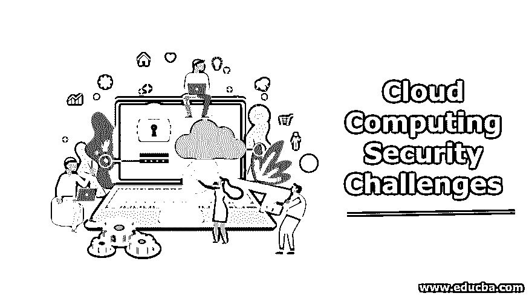
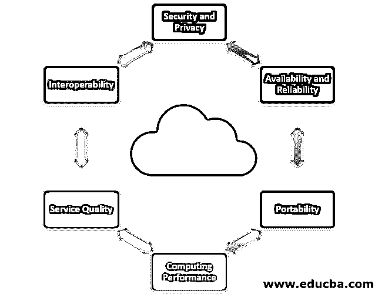
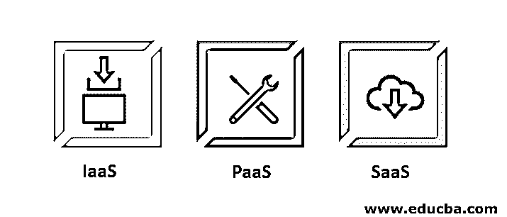

# 云计算安全挑战

> 原文：<https://www.educba.com/cloud-computing-security-challenges/>

## 云计算安全挑战简介

以下文章概述了云计算的安全挑战。这一切都始于 2008 年，当时谷歌发表了一篇关于 map-reduce 的论文，然后开源开始为集群计算构建 Hadoop 来完成更多并行任务。这样做需要大量的计算资源，随之而来的是高昂的基础设施成本。那时[亚马逊网络服务(AWS)](https://www.educba.com/aws-databases/) 从 2006 年开始在他们的服务器上支持虚拟主机和其他网络相关技术。亚马逊抓住了这个机会，为工业和学术目的支持基于云的计算资源。随着需求逐年增长，越来越多的玩家加入进来。截至目前，60%的云计算市场由 AWS 主导，其余由谷歌的谷歌云平台和微软的 Azure 主导。

### 云计算中的挑战

云计算的主要挑战如下:

<small>Hadoop、数据科学、统计学&其他</small>

#### 1.安全性和隐私

当我们谈到安全性和隐私时，我们指的是存储在云服务提供商(CSP)数据中心的用户数据。CSP 应该遵守不共享机密数据或任何对用户重要的数据的规则。数据中心必须安全，数据隐私应由 CSP 维护。

#### 2.可用性和可靠性

来自 CSP 的数据和服务应该在任何时候都是可用的，不管外部条件是理想的条件。计算资源应该对用户可用，并且它们的可操作性应该是可靠的。云计算的挑战基本上是在电信运营商方面，而不是用户。

#### 3.轻便

这意味着，如果用户希望从一个 CSP 迁移到其他 CSP，供应商不应[锁定客户数据](https://www.educba.com/customer-data/)或服务，迁移应该很容易。不同国家对数据有不同的法律。

#### 4.计算性能

云计算是按需计算服务，支持多租户，因此性能不会因为新用户的加入而下降。CSP 应该维护足够的资源来服务所有用户和任何特别的请求。

#### 5.功能质量

服务质量应该是好的，并且是最终用户关心的主要问题。云计算的整个生态系统都呈现在虚拟环境中，因此 CSP 应该在服务方面做出承诺，无论是计算资源还是客户满意度。

#### 6.互用性

CSP 的服务应该足够灵活，能够将自己集成到其他平台和其他 CSP 提供的服务中。数据管道应该易于集成，并且应该提高性能。云计算中有很多挑战，比如大数据、长时间的大厅传输、传输数据问题，但它仍然是迄今为止最好的计算资源。

### 云计算交付模式的类型

现在我们知道了什么是云计算，让我们看看云提供了哪些不同的服务。云计算有以下三种交付模式:

#### 1.SaaS:软件即服务

向用户提供按需付费的软件应用程序，不同于需要由客户购买的许可软件。SaaS 是一种独立于平台的服务，因为最终用户不需要在系统上安装软件，而是可以从互联网上使用它。它完全由支持服务的供应商管理，因为只需要有一个软件实例可用。许多并发用户可以按需访问软件服务，并在使用时付费。这样，计算变得非常便宜，软件可以通过浏览器或轻量级客户端应用程序访问。因此，最终用户可以使用 SaaS。SaaS 的产品是谷歌生态系统的办公软件，与微软的 Office 365 和 salesforce 一样。

*   **优点:**可从任何互联网平台上普遍访问。无需在用户系统上进行计算，您可以在任何地方工作。所有的计算都发生在云中。协作工作的优秀工具。多个用户可以同时使用该软件，每个用户的体验都是一样的。
*   反对意见:浏览器问题可能会导致糟糕的用户体验。互联网性能可能决定整体性能。

#### 2.平台即服务

该服务由编程语言执行环境、操作系统、web 服务器和数据库组成。封装环境，用户可以在其中构建、编译和运行他们的程序，而不用担心底层的基础设施。在这个模型中，您管理数据和应用程序资源，所有其他资源都由供应商管理。因此，开发人员使用 PaaS 来部署他们的应用程序，例如 AWS elastic Beanstalk、Heroku 和 force.com。

*   **优点:**这是一种经济高效的快速应用开发方法。通过这项服务，开发者可以轻松地在 web 上部署应用程序。这样，私有和公共部署都是可能的。
*   **缺点:**开发人员有时受限于云提供商的语言和工具。供应商锁定等迁移问题依然存在。

#### 3.IaaS:基础设施即服务

它提供计算架构和基础设施、所有计算资源，但在虚拟环境中，以便多个用户可以访问它们。资源包括数据存储、虚拟化、服务器和网络。大多数供应商负责管理上述四种资源。用户将负责处理其他资源，如应用程序、数据、运行时和中间件。因此，IaaS 基本上由系统管理员或 IT 基础设施团队使用。IaaS 提供商的例子有 EC2、GoGrid、Rackspace。

*   **优点:**供应商提供基础架构，因此增强了可扩展性和动态工作负载处理能力。IaaS 非常灵活，采用相同的按使用付费收入模式。
*   **缺点:**有时候会有安全问题。IaaS 也可能遭受网络和服务延迟。

### 结论–云计算安全挑战

起伏不定的云计算是我们这一代最好的工程服务。随着越来越多的人开始使用云服务，通信服务提供商正在提供增强的服务，CC 的采用也在增加。

### 推荐文章

这是云计算安全挑战的指南。在这里，我们讨论云计算的简介、挑战和云计算交付模式的类型。您也可以浏览我们推荐的其他文章，了解更多信息——

1.  [云监控工具](https://www.educba.com/cloud-monitoring-tools/)
2.  [什么是云爆](https://www.educba.com/what-is-cloud-bursting/)
3.  [网络安全挑战](https://www.educba.com/cyber-security-challenges/)
4.  [云计算服务](https://www.educba.com/cloud-computing-services/)

