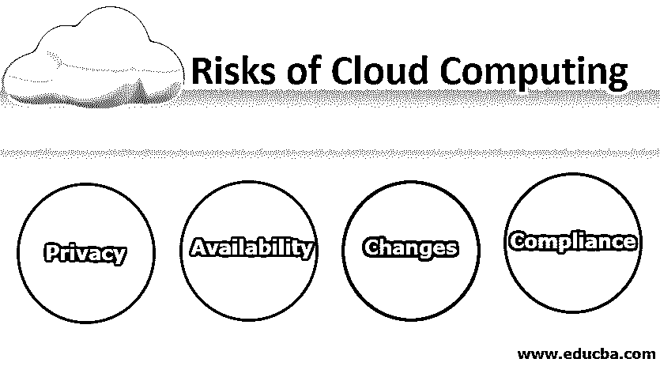
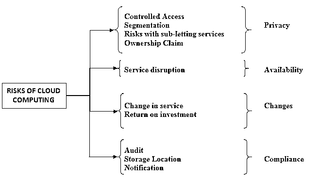

# 云计算的风险

> 原文：<https://www.educba.com/risks-of-cloud-computing/>

## 云计算风险简介

作为一种系统资源的按需可用性，如计算能力和数据存储，云计算涉及各种类型的风险，这些风险分为不同的类别，如隐私(涉及受控访问、分割、分包服务和所有权主张等风险)、可用性(涉及服务中断等风险)、变更(涉及服务和投资回报等风险)和合规性(涉及审计、存储位置和通知等风险)。

### 什么是云计算？

现在，为了更好地了解风险，让我们更好地了解高谭市。城市是人们共享服务的环境。这些服务可以是基础设施、平台、软件、数据、API，以及任何你能想到的公开/私有共享的东西。这种云计算概念使得计划在城市中建设基础设施的人变得超级容易。有了这个想法，成本效益、首次投资、维护以及计算能力、存储能力(硬件)都是有形的。描述。研究公司 Forrester 引用云计算的话说:

<small>Hadoop、数据科学、统计学&其他</small>

“以按使用付费的自助方式交付的标准化 IT 能力(服务、软件或基础设施)。研究范围包括云安全。”

### 云计算的风险类型

哥谭市的入侵者可以是任何人，背后有任何动机。让我们来看看云计算中普遍存在哪些不同类型的风险[以及我们可以将它们归为哪些不同的类别。](https://www.educba.com/free-cloud-computing/)

#### 1.隐私

以下所有风险都可能源于旨在攻击私人数据的恶意活动。

*   **受控访问**:如果个人/组织试图将机密数据存储到云上，云的本质是向服务提供商组织提供访问权限。

类似情况 *:* 高谭市政府拥有所有数据和访问权限。

*   **分段:**根据云计算订阅策略的真实性质，会有许多订阅者，从而使一个组织的数据容易被另一个组织使用。

类比情况 **:** 哥谭市政府的数据没有得到适当的保护，这可能会导致人们可以知道其他人的健康问题的情况(不适合在公共场合显示)。

*   **分包服务的风险:**随着服务提供云计算类型的日益流行，组织的云服务层是从其他服务提供商组织构建的。因此，合同协议可能对最终客户不完全透明，使他们处于盲点。

类似的情况:哥谭市政府与其他一些管理机构签署了谅解备忘录(MoU ),而市民并不知道，因此对他们的数据使用视而不见。

*   **所有权声明:**如果没有仔细阅读协议，数据的所有权可能会不知不觉地转移到服务提供组织。

类似的情况:如果公民不仔细阅读协议，有人可以访问个人数据，这些数据有可能被用于非法活动。

#### 2.有效性

*   **服务中断:**这可以归因于互联网连接中的任何故障，因为所有云计算交易都是通过互联网完成的。这可能是服务质量下降或整体中断。

类似的情况:市民依赖电力满足日常需求。如果哥谭市没有电，发展城市的整个想法就泡汤了。

#### 3.变化

*   **服务变更:**由于市场波动，服务提供商可能被收购或关闭，从而导致在短时间内无法提供服务。

类似的情况:政府可能来了又走，当他们走了，数据可能暂时或永久不可用，这取决于下一届政府的计划。

*   **投资回报:**云计算背后的全部直觉是要有成本效益。但由于不可预见的情况，订阅的成本很高；这可能会危及云计算的整个目的。

类似的情况:订阅服务的成本如此之高，以至于每个公民为这些服务分配的预算最终不具成本效益。

#### 4.服从

*   **审计:**服务提供商组织可能没有遵循外部审计流程，从而导致最终客户处于弱势地位。
*   **存储位置:**由于服务数据存储在硬件中，存储设备的位置未知，因此可能会有国家敏感数据被竞争对手泄露的风险。
*   **通知:**向最终客户进行适当、透明的沟通，告知他们未发生违规行为，会使他们处于风险之中，因为他们可能没有意识到违规行为会造成严重破坏。

### 云计算的优势

除了云计算涉及的上述风险，我们可能会思考云计算是否值得大肆宣传。让我们看看云计算的[优势](https://www.educba.com/advantages-of-cloud-computing/)，最后就其可行性展开讨论。

*   降低成本
*   可量测性
*   与技术保持同步。
*   存储空间优化
*   工作的灵活性
*   中断后的快速启动时间

这取决于组织在优势和风险之间进行权衡。风险缓解有不同的渠道来真正评估云计算的有效性，这完全可以作为一个新的话题来处理。但是，仅仅为了增加减轻风险的味道，就要根据合同协议确定对服务提供商的适当控制，并不时地跟踪服务提供商的实践。

### 云计算思维导图

### 结论

因此，拥有一个适当的缓解渠道将增强云计算的使用，同时具有适当的安全性和隐私性，并且符合为什么创建云计算的意图。有可能在云中需要小心处理的数据很少，例如健康/财务数据。计划迁移到云的组织在推进之前需要有一份完整的比较报告。

### 推荐文章

这是关于云计算风险的指南。在这里，我们将介绍云计算的风险及其类型和优势。您也可以浏览我们推荐的其他文章，了解更多信息——

1.  [云计算服务](https://www.educba.com/cloud-computing-services/)
2.  [云计算架构](https://www.educba.com/cloud-computing-architecture/)
3.  [云计算技术](https://www.educba.com/cloud-computing-technologies/)
4.  [云计算职业](https://www.educba.com/career-in-cloud-computing/)

