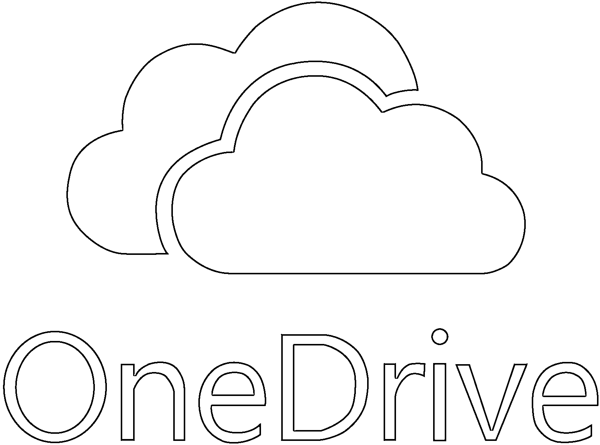
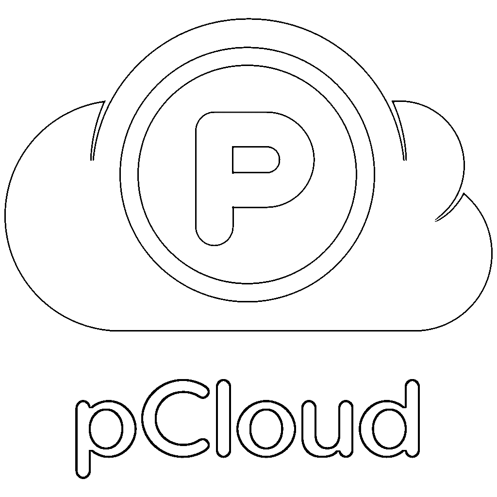

# 免费云计算

> 原文：<https://www.educba.com/free-cloud-computing/>

## 免费云计算简介

在文章中，免费云计算时代已经到来，当我们丢失一张照片或一份文件时，我们不必紧张。Google Drive 和 Google photos 中的一切都很安全。安全地正确使用会将所有照片和文档保存在云中。云服务的基础知识有助于我们自由使用它们。常见的云服务有 Google Drive、Dropbox、one drive 和 iCloud 等等。其中大多数提供 50GB 的存储空间。公司被引进来帮助人们和他们的企业。如果我们提到朋友，许多免费云服务提供更多的存储空间。让我们查看一些免费的云服务。

### 8 大免费云计算服务

以下是顶级的免费云计算服务。

<small>Hadoop、数据科学、统计学&其他</small>

#### 1.Google Drive

我们许多人有意或无意地使用 google drive 来保存文档或幻灯片。它免费提供 15GB 存储空间。如果我们已经将手机或电脑设备与谷歌账户同步，使用谷歌驱动就很容易了。即使我们离线或网络很慢，也可以轻松访问 Google Drive 并查看所需文件。这是著名的免费云存储之一。可以在 google drive 中创建文件夹，并与其他用户共享。存储与其他谷歌应用程序共享。使用 google drive 与他人协作很容易。

#### 2.Dropbox

Dropbox 是一个家喻户晓的名字，它同时拥有移动和桌面应用程序。Dropbox 从 2GB 免费存储空间开始，以简单的方式增加到 18GB。我们可以通过 dropbox 与任何人分享文件，即使他们没有 dropbox 帐户。Dropbox 有很好的备份功能。Dropbox 提供远程擦除功能，如果设备丢失，可以帮助擦除所有文件或文档。Dropbox 不会自动复制所有文件，因此我们必须选择并复制文件。Dropbox 通过 256 位[高级加密标准(AES)](https://www.educba.com/advanced-encryption-standard/) 保护的可扩展基础设施来确保安全。如果文件保存在 dropbox 中，Dropbox 会在我们的计算机上保存一份副本。

#### 3.OneDrive

OneDrive 被称为 SkyDrive，归微软所有，当用户注册时提供 5GB 的存储空间。如果我们推荐朋友或做一些其他任务，这个应用程序会提供额外的存储空间。OneDrive 还支持与不使用 OneDrive 的用户共享文件。OneDrive 既可用于移动设备，也可用于桌面设备。继 dropbox 之后，人们更喜欢 OneDrive 用于[云存储](https://www.educba.com/what-is-cloud-storage/)。以前它提供 15GB 的存储空间。用户可以在 OneDrive 中访问微软应用。OneDrive 中提供备份。OneDrive 设置中提供了文件夹保护功能，用于安全存储文件。

#### 4.非常

Mega 免费提供 50GB 存储空间。Mega 不与文件系统集成，但需要一个网络浏览器来上传或下载文件。我们可能无法获得我们保存在 Mega 中的原始数据，因为它添加或删除了我们保存的一些数据。Megastores 只存储加密文件。AES 128 位密钥用于加密和解密文件或文档。我们可以在手机和台式机上使用 Mega。与其他应用程序相比，Mega 速度较慢。大型文件是公开共享的，因此任何人都可以下载共享的内容，而无需任何授权。

#### 5.媒体火了

Media Fire 提供 10GB 的数据存储空间，可以在线存储照片和文档。这个很好用。文件同步也是在 Media Fire 中完成的。Media Fire 在移动端和桌面端都有使用。通过 Media Fire 可以公开和私下共享文件。它还提供了下载文件时只能使用一次的链接。Media Fire 是增长最快的云应用之一。它支持音频和视频存储以及文档存储的大多数文件格式。导入联系人是为了私人共享文件。此外，这是通过电子邮件。

#### 6.Sync.com

Sync.com 提供 5GB 免费存储空间，可随时升级。同步通过端到端加密提供隐私。同步帮助用户向任何人发送文件，即使他们没有同步帐户。文件备份是自动完成的。手机和桌面都可以使用同步。共享的文件通过同步文件夹进行访问。删除的文件会在同步应用程序中恢复。该应用程序会自动更新，以确保更好的性能。文件受用户提供的密码保护。App 传输速度可以根据用户喜好设置。“进度”选项卡显示正在传输的文件的进度。

#### 7\. pCloud

pCloud 终身最多提供 2TB 存储，基本账户最多提供 10GB 存储。在 pCloud 中，我们可以处理存储在服务器中的文件，因此它可以作为一个工作共享工具。它在计算机中创建一个虚拟驱动器来存储文件。pCloud crypto 通过加密安全地存储文件。pCloud drive 中提供了集成的文件共享和同步功能。上传状态显示在窗口底部。pCloud 既有移动应用，也有桌面应用。文件历史记录即使被删除，也会被跟踪 30 天。

#### 8.亚马逊大道

Amazon Drive，原名 Amazon Cloud Drive，是亚马逊的云存储，为 prime 和非 prime 会员提供 5GB 存储。此外，用户可以在亚马逊驱动器订购照片打印。该应用程序是高度可定制的。截至目前，亚马逊的驱动仅限于少数几个国家。亚马逊的 Drive 既有移动应用，也有桌面应用。该应用程序主要用于存储照片。文件会自动备份和上传。创建可共享链接是为了与其他用户共享文件。在任何时候，用户都可以断开链接，使文件成为私有文件。亚马逊的驱动器支持多种语言。其他一些免费的云存储应用有 iCloud，Zoho，planbox，box。这些大多有助于协作和项目管理。

### 结论

虽然云存储有助于存储和访问我们的数据，但要记住云在一定程度上是不安全的。因此，最好选择一个能够为我们的文件和照片提供更好的加密和安全性的云应用程序。在云中共享私人照片时必须小心。除此之外，云存储是技术给予我们的最好的东西之一。

### 推荐文章

这是免费云计算指南。在这里，我们详细讨论基本概念和顶级免费云计算服务，如 google drive、OneDrive、Mega、Media Fire 等。您也可以浏览我们推荐的其他文章，了解更多信息——

1.  [云计算公司](https://www.educba.com/cloud-computing-companies/)
2.  [云计算 vs 网格计算](https://www.educba.com/cloud-computing-vs-grid-computing/)
3.  [云计算技术](https://www.educba.com/cloud-computing-technologies/)
4.  [云计算服务提供商](https://www.educba.com/cloud-computing-service-providers/)

