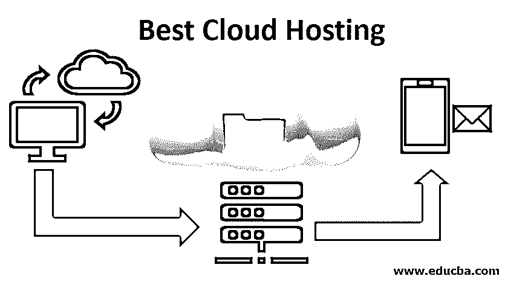

# 最佳云托管

> 原文：<https://www.educba.com/best-cloud-hosting/>

## 最佳云托管简介

基础设施即服务(IaaS)、软件即服务(SaaS)和平台即服务(PaaS)是云计算的三大类别。在 [SaaS 和 PaaS](https://www.educba.com/paas-vs-saas/) 类别中提供的服务分别围绕特定软件和软件相关平台。IaaS 为云中的用户提供计算和存储基础架构，以便根据他们的需求在他们想要的操作环境中托管任何应用程序。在 IaaS 类别的众多产品中，它是最佳选择。[虚拟专用服务器托管](https://www.educba.com/what-is-vps-hosting/) (VPS)和共享托管是 IaaS 中的其他产品。在本文中，让我们详细了解一下[云托管](https://www.educba.com/what-is-cloud-hosting/)，它是如何工作的，以及它的好处。

### 为什么云托管很重要？

组织应制定强有力的云战略，并提供明确的指导方针，以根据应用程序需求、使用因素和其他参数(如下所列)采用正确的云部署模型类别和该类别中正确的托管选项。应该进行详细的研究以得出选择方案。

<small>Hadoop、数据科学、统计学&其他</small>

*   寻求云服务的用户希望计算资源。
*   在 24×7 时间窗口内无任何中断可用。
*   根据他们的需求放大或缩小。
*   从多个服务器位置提供，以便其他服务器可以充当缓冲区，并且在一个服务器出现故障时，服务可以无缝恢复。
*   专门分配给他们并且不与其他用户共享，以确保他们的数据得到保护。根据商定的性能水平交付。
*   没有安全威胁和漏洞。
*   易于管理。
*   以更便宜的价格购买。

这是满足用户上述所有期望的最佳选择。它远程提供计算、网络和存储资源，并虚拟托管在多台服务器上。这些服务根据用户的需求大量提供。用户可以根据自己的业务需求，利用这些硬件资源部署他们的应用程序、数据和任何其他服务。

VPS 托管和共享托管是 IaaS 云产品中可供用户选择的其他方式。虽然提供的解决方案很便宜，但它们也有局限性。在共享宿主中，资源在一个公共环境中与其他用户共享，这可能会带来安全问题和性能问题。

在 VPS 托管中，扩大/缩小计算资源以及缺少备份资源来处理主服务器故障是主要问题。如上所述，它在许多方面比其他托管选项更重要，并且满足了愿意将其应用程序迁移到云的用户的大多数期望。

### 云托管解决方案是如何部署的？

在选择云托管服务提供商并监控其实施后的表现时，应考虑以下参数:

1.  易于扩展。
2.  无停机时间或停机时间最短。
3.  更简单的水平部署。
4.  从最初的页面加载到事务和查询的完成，满足性能预期。
5.  业务连续性流程通过辅助站点服务器中的数据复制(镜像)来实现。
6.  轻松迁移到其他云服务提供商(如果需要)
7.  付费阅读。
8.  通过自助服务选项简化管理。
9.  由内部团队 10 控制各种资源之间的流量。供应商在稳定性能方面的支持水平。

### 管理云运营的步骤

以下是管理云运营的不同步骤:

**步骤 1:** 搭载云托管厂商。

**第二步:**将现有数据迁移到云服务器。

**第三步:**直接用户访问云资源。

**第 4 步:**监控应用性能和数据流量。开发仪表板和警报来管理极端情况。

**步骤 5:** 在服务器和存储中分配与负载相称的额外 RAM 和 CPU 内核。

**步骤 6:** 如果流量减少，根据需要解除资源分配。

**第 7 步:**开发一种机制，根据实际使用情况核实付款，并确保计费服务得到有效使用。如果不经常使用，请停止服务。

**步骤 8:** 监控辅助站点的数据复制状态，确保辅助站点做好了在发生灾难时托管服务的准备。

**步骤 9:** 从最终用户那里获得关于服务可用性、性能和中断的反馈。

**步骤 10:** 定期与服务提供商就测量的性能参数召开审查会议，并在需要时进行过程修正。

### 云托管服务提供商

像亚马逊、谷歌、IBM、微软 Azure 这样的大公司在全球范围内提供云托管服务，而在印度，有多个服务提供商像 DigitalOcean Cloud、Jelastic PaaS、Netmagic 提供这种服务。在参与任何项目之前，必须对供应商进行技术评估。

### 一般用户体验

超过 80 %的用户采用云服务，其中 70%与多家云供应商合作。用户热情地接受云选项，并在他们的旅程中面临几个问题，例如

*   云服务的成本似乎很高。
*   用户不清楚计费的标准。
*   用户觉得自己是被收费的隐形服务，缺乏透明度。
*   服务中存在性能问题。

最近，由于高成本、可管理性问题等多种原因，出现了许多用户更换云供应商或将服务带回内部的情况

### 优势

以下是下面给出的优点。

1.  安全环境中的无限计算资源，可根据业务需求进行扩展/缩减。
2.  免费服务。
3.  IT 服务中的成本节约
4.  测试和托管新技术应用的平台
5.  加速业务转型的途径

这种模式将业务转变为:

*   脚步敏捷
*   敏捷
*   竞争的
*   节俭的

通过在适当的时间以适当的成本使用适当数量的资源来响应动态计算需求。

### 结论

对于那些需要易于扩展/管理、稳定、安全的用户来说，它有很多优点，而且很少出现问题；云中最便宜的计算资源来满足不断增长的需求。供应商将在未来解决云供应商在许可证和服务计费指标上缺乏透明度等问题，云托管成本将随着使用的增加而降低。

### 推荐文章

这是最佳云托管指南。在这里，我们讨论云托管服务提供商，它的重要性和步骤，以及用户体验和优势。您也可以浏览我们推荐的其他文章，了解更多信息——

1.  [什么是混合云？|优势](https://www.educba.com/what-is-hybrid-cloud/)
2.  [云托管提供商](https://www.educba.com/cloud-hosting-providers/)
3.  [虚拟主机 vs 云主机](https://www.educba.com/web-hosting-vs-cloud-hosting/)
4.  [云计算安全挑战](https://www.educba.com/cloud-computing-security-challenges/)

