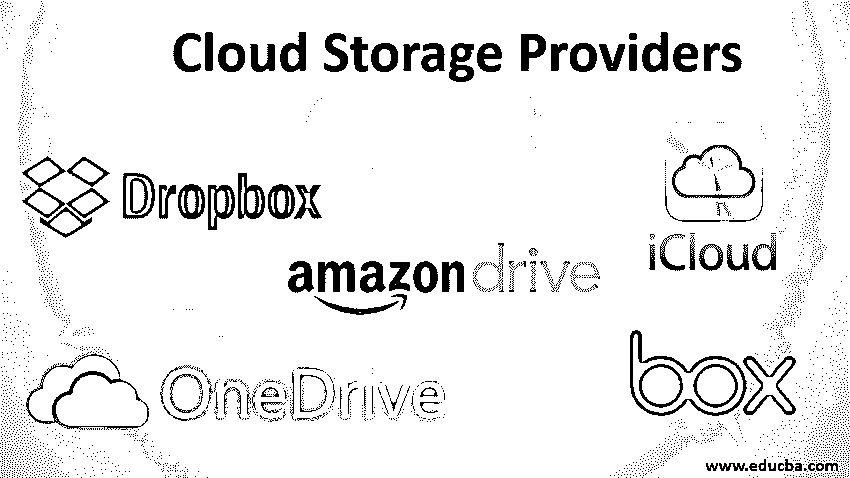

# 云存储提供商

> 原文：<https://www.educba.com/cloud-storage-providers/>

## 云存储提供商简介

今天，许多个人和组织都不愿意将他们的数据存储在家里或办公室。他们中的大多数人选择[云存储](https://www.educba.com/what-is-cloud-storage/),因为它省钱、省事、节省物理空间、提供卓越的安全性和一系列其他显著优势。领先的行业专家预测云存储在未来只会增加。鉴于目前市场上有许多云存储提供商，选择一个最符合个人或组织独特和具体要求的提供商变得令人困惑，也是一项艰巨的任务。下面，我们将详细分析各种云存储提供商的特性、优缺点。

### 最佳云存储提供商

以下是各种云存储提供商:

<small>Hadoop、数据科学、统计学&其他</small>

#### 1.Dropbox

非常适合数据有限的用户。这个平台提供了一个最先进的工作空间，可以在一个中心位置存储文件。您可以从任何地理位置全天候访问它。电脑、手机和平板电脑都可以访问 Dropbox 中的文件。

**特性:**

*   任何规模的用户都可以使用它。
*   允许你与任何人共享文件。
*   管理控制使团队管理变得轻而易举
*   共享数据是安全的。

**劣势:**

*   计划开始时只有 2GB 的免费数据，这对许多人来说可能是不够的。

**定价:**

*   2GB 免费提供。有两个针对个人的计划和两个针对团队的计划。这两个个人计划被称为 Plus 和 Professional。在 Plus 计划中，用户每月收费 8.25 美元。在专业计划中，用户每月支付 16.58 美元。
*   这两个团队计划被称为标准和高级。在标准计划中，用户每月支付 12.50 美元。在高级计划中，用户每月支付 20 美元。用户可以免费试用高级、专业和标准计划。Plus 计划不提供免费试用。

#### 2.微软 OneDrive

OneDrive 是 Windows 10 的文件浏览器的内置功能。使用它，你不需要下载任何额外的应用程序。因此对于 Windows 10 用户来说非常方便。微软的照片应用程序可以选择使用 OneDrive 来同步所有设备上的图像。最近，OneDrive 增加了 AutoCAD，此举可能会吸引 AutoCAD 用户。个人保管库功能提供了额外的安全保护。一款适用于 iOS 和 Android 设备的应用已经存在。App Store 中也有一款为 Mac 用户准备的便捷应用。

**定价:**

*   OneDrive 免费提供 5GB。前者提供 100GB，每月 1.99 美元。接下来 1TB 的价格是每月 7 美元。OneDrive for Business 以每月 10 美元的价格提供无限存储。

#### 3.Google Drive

Google Drive 是当今最强大的云存储服务之一。然而，使用它与你可能习惯的方式有点不同，所以这里我们看到了 Google Drive 的优点和缺点。

**优点:**

*   提供巨大的免费存储空间。
*   用于协作目的的最先进的生产力套件。
*   附带桌面到桌面文件同步功能
*   过多的第三方集成
*   为不同平台设计的应用

**缺点:**

*   所有内容都由消费者桌面实用程序存储在本地
*   隐私是一个重要的相关问题
*   生产力应用程序在与当代 Microsoft Office 进行基准测试时表现不佳。
*   缺少共享文件非常需要的密码保护。

总的来说，Google Drive 是一个巧妙的、功能丰富的云存储提供商，拥有巨大的云存储空间。如果您正在寻找卓越的协作功能以及存储，那么这是正确的选择。

#### 4.iCloud

这个平台的新颖之处在于，对于苹果迷来说，它是最好也是最理想的云存储提供商。此外，它对私人用户非常有用。云存储平台在包括 iOS、Mac OS 以及 Windows 的操作系统上运行。

**特性:**

*   它声称自己是久负盛名的苹果公司的专有云存储平台。
*   用户可以与包括 Notes、Keynote 以及 Pages 在内的应用程序进行协作。
*   从暂停时间开始恢复每个对话
*   它在更换手机时达到最佳性能。

**缺点:**

*   某些项目，如演示文稿、待办事项以及日程安排，只能与拥有有效 Apple ID 的人共享。

#### 5.亚马逊大道

事实上，亚马逊简单存储服务对程序员来说非常有效。亚马逊 Drive 过去的表现相对较差。这种情况已经不同了。前者为各种操作系统提供同步服务，包括 Windows、Android、Mac OS 以及 iOS。缺点是没有 Linux 客户端。

该服务利用块级文件复制技术移动文件。顺便说一下，Dropbox 也采用了这项技术。当同步特定文件时，只发送和接收文件之间的差异(增量)。当与当代云存储提供商进行基准测试时，同步文件在更短的时间内完成。显示器上一个有趣的功能是任务栏通知。由于后者，你可以比以前更好地监控文件传输。任务栏通知使您能够在忙于高带宽消耗的前台进程时限制同步速度。

目前，Amazon Prime 的每个成员都被分配了 5GB 的存储空间来使用 Amazon Drive。好消息是，会员可以在 Prime Photos 中获得无限的照片存储空间。亚马逊的年度云存储计划从 100GB 的存储空间开始，用户需支付 11.99 美元。此外，1TB 的售价为 59.99 美元。最高套餐是 30TB 存储，价格为 1，799.70 美元。

#### 6.箱子

这家云存储提供商拥有大量面向业务的功能。它还吹嘘扩大了隐私控制。该解决方案的缺点是上传限制。前者免费提供 10GB。它还为每个软件包提供 14 天的免费试用。启动计划的费用是每个用户每月 5 美元。企业升级计划的费用是每个用户每月 25 美元。该计划包含无限的存储空间，并且对最大用户数量没有限制。Business Plus 计划的文件上传限制为 5GB。

### 结论

选择合适的云存储提供商。你需要非常清楚自己的要求。在投资任何特定云存储提供商的服务之前，做好自己的功课。做研究，严格测试免费试用的服务，并向以前的用户征求意见。

### 推荐文章

这是云存储提供商的指南。在这里，我们讨论云存储提供商的介绍以及功能、优点和缺点。您也可以浏览我们推荐的文章，了解更多信息——

1.  [云计算架构图](https://www.educba.com/cloud-computing-architecture/)
2.  [云计算服务提供商](https://www.educba.com/cloud-computing-service-providers/)
3.  [云计算风险介绍](https://www.educba.com/risks-of-cloud-computing/)
4.  [广泛使用的十大云安全工具](https://www.educba.com/cloud-security-tools/)

