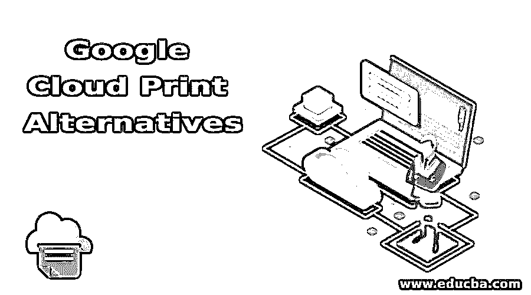
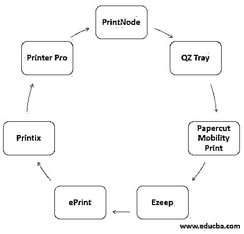

# 谷歌云打印替代方案

> 原文：<https://www.educba.com/google-cloud-print-alternatives/>

## 谷歌云打印替代方案介绍

谷歌服务的替代方案是将家庭和办公室的打印机连接到互联网，以便用户可以连接任何设备，无论是移动设备还是平板电脑，并从任何地方打印所需的文档，因此可以管理设备的打印任务，使其更加安全，因为它连接到个人云，这被称为谷歌云打印替代方案。

### 顶级谷歌云打印替代品

以下是谷歌云打印的替代方案:

<small>Hadoop、数据科学、统计学&其他</small>

#### 1.打印节点

这个云应用程序将打印集成到任何其他类型的应用程序中，因此可以在任何具有互联网连接的设备中使用。它可以连接 android 和 iPhone 功能。任何连接到云的设备都会从云中获取要打印的文档，并通过打印机打印出来。这些文件可以直接从打印机中取出。原始打印和通过软拷贝打印都在 PrintNode 中完成。它也适用于 Linux，这里支持任何类型的文档。USB 秤和连接到串行接口的秤与 PrintNode 一起工作。打印是通过操作系统完成的，应该安装适当的驱动程序，以便 PrintNode 在系统中工作。

#### 2.QZ 托盘

这是通过连接不同的浏览器和跨平台工作来实现的。在这个应用程序中使用了插件，其中 USB 和串行设备也可以连接，以从云中打印所需的文档。与应用程序一起下载了一个示例 HTML 页面，以了解应用程序的工作情况。该应用程序支持所有操作系统。原始数据、HTML 或图像类型用作 QZ 纸盒中的输入，性能取决于打印应用程序中使用的内容和类型。存在应用程序的免费和付费版本，其中免费版本；中间会弹出一个警告，以便连接命令。现在，提供了自签名证书来消除警告。

#### 3.剪纸移动打印

这个免费的打印应用程序可以作为 GCP 的最佳选择，其设置和安装非常简单。它支持几乎所有的操作系统，并有一个良好的用户界面。使用网络找到打印机，同一网络中的任何打印机都可以用来打印文档。由于打印选项直接出现在应用程序的用户界面中，因此启用了功能打印。应用程序的维护成本很高，但可以通过不断更新应用程序并通过增加功能使其多样化来进行管理。剪纸移动中的云打印测试版最近发布了。该应用程序本身表现得很聪明，将打印内容保存在本地，只在需要时才使用互联网。因此，在应用中节省了空间和成本。此外，通过确保只有受信任的用户才能使用该应用程序，并且如果打印机位于访客网络中，则不会使用该打印机，从而使网络变得安全。

#### 4.Ezeep

轻松印刷是 Ezeep 的座右铭。打印是通过云完成的，因此在这个应用程序中不再使用存储和服务器。与其他应用程序一样，Ezeep 也是免费提供的，通过系统中的浏览器界面管理打印机和用户。不需要安装打印机驱动程序，因此可以从桌面应用程序到打印机进行直接打印。所有打印机都由一台云服务器集中管理。所有文件在打印时都得到妥善保管。它运行速度快，并且易于安装。此外，客户服务对应用程序来说也很重要。该应用程序不需要维护，因为它被称为从任何设备进行打印的一种轻松方式。此外，Ezeep 可以在虚拟桌面中使用，以连接到云，因为它可以即时完成几乎所有的服务。从各种设备到服务器的打印可以同时进行，这有助于保持不同操作系统之间的协作。

#### 5.ePrint

HP 提供 ePrint 服务，用户向打印机发送一封带有要打印的附件的邮件，然后用户收到打印的文档。这是一个易于使用的应用程序，不需要在用户设备中进行安装或配置。应该启用打印机上的 Web 服务，并且应该从设备中获取邮件地址。打印机上将提供在线说明，用户可以设置打印机来接收邮件。设备和打印机应该连接到同一个网络，打印机才能正常工作。

#### 6.Printix

此应用程序中不需要打印服务器本身，因为它基于 Microsoft 云服务，其中的基础架构旨在提供具有安全打印的全功能打印系统。该系统保证了效率以及生产率和成本节约。Printix 服务器是自动安装的，它运行在用户的操作系统上。该应用程序是作为与微软云类似的预付费订阅提供的。此外，它可以与谷歌服务集成，以使用谷歌的功能。打印机和用户通过集中式 web 应用程序进行管理。

#### 7.专业打印机

可以通过 printer pro 从 iPhone 或 iPad 打印任何文档。打印速度非常快，效率也很高。可以在应用程序中设置不同方向的高级打印选项。它的工作方式与普通打印机完全相同，因为打印机的所有选项都可以直接设置到设备的应用程序中。网络中的打印机被应用程序找到，打印完成。此外，USB 电缆可用于打印文档。

**Note:** If the user is not satisfied with any of these options, google itself provides the solution by making the Chromebook to add a printer to the device and work or to the admin console of the G Suite. This makes the devices to print via google to the printers in the same network.

### 推荐文章

这是谷歌云打印替代指南。在这里，我们讨论了前 7 名谷歌云打印替代品的简要概述，如 PrintNode，QZ 托盘，剪纸移动打印等。您也可以浏览我们推荐的文章，了解更多信息——

1.  [计算机网络与数据通信——主要差异](https://www.educba.com/computer-network-vs-data-communication/)
2.  [网络类型介绍](https://www.educba.com/types-of-network/)
3.  [最佳 8 种网络设备](https://www.educba.com/types-of-network-devices/)
4.  [四大网络协议类型](https://www.educba.com/types-of-networking-protocols/)

