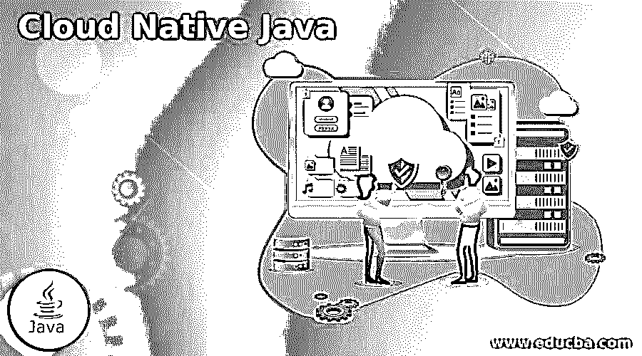

# 云原生 Java

> 原文：<https://www.educba.com/cloud-native-java/>

## 云原生 Java 简介

Cloud Native Java 是一种构建基于 Java 和 JVM 的应用程序的方法，最初面向云框架。在本文中，我们将介绍 Java 平台上的 Cloud Native，并回顾多个实用程序的功能范围。此外，为了理解基于微服务、CI/CD、DevOps 和容器的云原生方法的概念。虽然云原生一直是 IT 软件开发领域最热门的话题，大部分开发者都认为这将失去其炒作性，无法在 IT 市场立足，但这已经成为软件开发的未来。因此，Java 中的 cloud Native 已经成为软件行业中较大的趋势技术之一。

### 为什么要云原生 Java？

根据 Octoverse 的说法，Java 对于企业开发者来说是一种普遍的语言，但它仍然没有被认为是首选的云原生运行时。

<small>Hadoop、数据科学、统计学&其他</small>

尽管 Java 和 Enterprise Java 构建在传统的堆栈之上，并针对云原生进行了优化，但与其他语言相比，它需要更多的内存和时间来启动应用程序。

像 Istio、Kubernates、Knative 这样的现代平台都有可以相应伸缩的小运行时。

为了克服这些缺点，Cloud Native 应运而生。

云原生 Java 应用程序的主要优势在于，

1.  **开发效率的提高**:作为开发人员，他们希望零配置、轻松注入扩展，以及实现传统应用程序的实时编码。
2.  **优化到无服务器**:当 cloud native JRE 提供超快且小的占用空间时，开发人员开发已经可用于无服务器应用的微服务。
3.  **启用反应式编程**:开发人员能够使用 Vert.x 或 EventBus 来实现反应式应用以及传统的命令式应用。
4.  **采用开源项目和工具**:开发者需要集成标准开源项目或工具，如 Kubernates、RESTEasy、Vert.x、Kafka、Infinispan、Jaegar 等。

有了上述所有标准，对于云原生的考虑就清楚了为什么需要云原生，并且清楚了在云原生和 DevOps 平台上设计运行容器化的应用。

### 云原生 Java 环境

云原生应用的关键组件，

云原生 Java 方法结合了以下架构原则，

1.  **微服务**:它是一个独立部署、升级、重启和扩展的小型独立应用程序。微服务架构是松散耦合的。它通过执行自己的业务逻辑以及与 API 或消息服务通信来独立运行。与其他有利于构建更简洁界面的整体架构相比，这些是轻量级的。
2.  **容器**:这些是虚拟机的替代品，它们利用独立的轻量级操作系统级虚拟化，提供比虚拟机更高的速度和效率。该容器是分层的，并且包括需要在云中运行的 Java 应用程序的组件。容器的开销较低，非常适合部署单个云原生微服务。
3.  **CI/CD** :持续集成和持续部署为应用提供了更快、更频繁的可靠性。使用各种其他工具和技术，通过自动化以增量方式将应用程序更新推送到生产中。
4.  DevOps:它是软件开发和 It 运营之间的协作，包括过程和最终结果的联合，确保软件的自动化交付。目标是创建一个环境，在这个环境中，软件的开发、测试和发布以自动化的方式快速一致地进行。每个流程都有一个最终目标，即在任何给定时间部署到生产环境中。

因此，简而言之，云原生应用程序开发是一种构建、部署和管理面向云框架的基于 Java 的应用程序的方法。

### 云原生 Java 的特性

云原生应用展示了下面提到的一些特征，

*   包装在容器中的微服务。
*   支持各种用户界面和设备。
*   很好地定义了用于通信的 API。
*   降低手动管理的要求
*   应用程序内置于 DevOps 中，并使用 CI/CD 管道进行部署
*   对各种数据存储范例的访问
*   水平和垂直的动态可伸缩性。

### 云原生 Java 方法

有一些云原生方法可以帮助开发变得更容易，

**方法 Linux 容器中的 Java 虚拟机。**

云原生开发的一个重要组件是 Docker 容器。这种容器可能设置是，

*   运行在云中服务器上的虚拟机管理程序主机操作系统。
*   运行在客户操作系统上的 Docker 容器。
*   在虚拟机管理程序虚拟机上运行的来宾操作系统
*   Java 虚拟机在 docker 容器内的主机 CPU 上运行 Java 字节码。
*   同一主机上的所有容器互相共享内核。

这种方法的局限性在于内存管理；将堆大小提高到容器允许的范围之外可能会导致错误。

**方法 2:微轮廓**

这是开发企业应用程序的经典方法。微配置文件服务在通常围绕容器管理系统构建的服务网络中工作。这种方法是轻量级的，但是对于那些不熟悉 Kubernates 的人来说，有时会很不方便。

**方法 3:使用 Spring Native 的原生映像**

原生映像是云原生的，允许创建一个进步的、对开发人员友好的环境。此外，使用这种方法有几个优点:易于在系统间转移，内存占用少，以及各种编程语言中丰富的工具包。

一些限制包括由于封闭世界假设导致的异常行为，由于映像运行时间和构建时间之间的差异导致的与 Java 虚拟机不同的 Java 执行，以及不能使用原始字节码进行操作。

### 结论

至此，我们将结束主题“云原生 Java”我们已经了解了什么是原生云以及它的显著特征。我们还看到了 Cloud Native 的优势及其好处，以及 Java 应用程序中 Cloud Native 所涉及的关键组件。

### 推荐文章

这是一本云原生 Java 的指南。在这里，我们讨论云原生 Java 的优势及其好处，以及云原生中涉及的关键组件。您也可以看看以下文章，了解更多信息–

1.  [Cloudcraft](https://www.educba.com/cloudcraft/)
2.  [Cloudflare 替代品](https://www.educba.com/cloudflare-alternatives/)
3.  [云迁移服务](https://www.educba.com/cloud-migration-services/)
4.  [春云相依](https://www.educba.com/spring-cloud-dependencies/)

