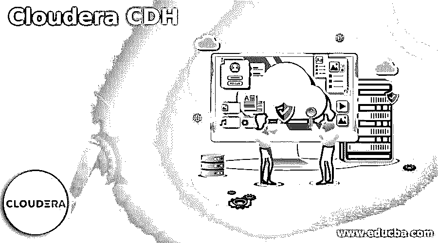

# 云时代 CDH

> 原文：<https://www.educba.com/cloudera-cdh/>

## CDH cloud era 简介

Cloudera CDH 是 Cloudera 的 100%开源平台发行版，由 Cloudera Inc 提供；它是一家总部位于帕洛阿尔托的美国企业软件公司，包括 Apache Hadoop，旨在满足企业需求。Cloudera CDH 提供了用户在企业应用中所需的一切。CDH，Cloudera Distributed Hadoop，是 Apache Hadoop 和其他相关项目最完整、经过测试、最流行的发行版。它提供 Hadoop、分布式计算和可扩展存储的核心元素，以及重要的企业功能和 Web 用户界面。我们将了解如何使用 Cloudera CDH，以及如何将其连接到云存储及其设置。

### 如何使用 Cloudera CDH？

在研究如何使用 Cloudera CDH 之前，我们需要了解一下 Cloudera 的安装过程，

<small>Hadoop、数据科学、统计学&其他</small>

**第一步:**在安装 Cloudera Manager CDH 和其他托管服务之前，用户需要考虑存储空间并为 Cloudera Manager 做好规划。

1.  Cloudera Manager 需要在后台进程中跟踪作业指标和应用程序。根据组织的规模，存储可以是本地的、远程的或基于磁盘的，因为所有指标都需要存储。
2.  未能规划存储需求，CDH 会在许多方面产生负面影响，

*   群集可能会错过未保留或收集足够长时间的关键审计信息。
*   集群可能无法获取历史运行数据来满足内部需求。
*   集合和图表中可能存在缺口。
*   管理员可能没有历史 Yarn、MR1 或 Impala 数据使用情况，当他们稍后需要参考或报告时。
*   管理员可能无法获得研究健康状态或过去的数据。

1.  集群中的配置主机允许所有成员相互通信。

*   设置唯一的主机名

sudo hostname CTL set-主机名 sample.example.com

*   编辑/etc/hosts/
*   使用主机的域名编辑/etc/sysconfig/network。
*   检验每台主机能否一致地识别网络。

1.  防火墙禁用，保存 iptables 的现有规则集，然后根据兼容性禁用防火墙，无论是 RHEL 7 和 SLES 还是 Ubuntu。
2.  设置安全增强型 Linux 允许通过策略设置控制访问。例如，如果在部署 CDH 时出现问题，那么在集群上部署 CDH 之前，应该在每个主机上将 SELinux 设置为许可模式。
3.  启用 NTP 服务:Cloudera CDH 需要在集群中的每台机器上配置网络时间协议(NTP)。并在系统中安装软件集合库储存库。

**步骤 2:将 Cloudera Manager 连接到 CDH 的云存储/设置连接**

1.  为 Cloudera Manager 配置存储库。Cloudera Manager 是使用一个打包工具安装的，比如 SLES 的 zypper、RHEL 的 yum 和 Ubuntu 的 apt-get。
2.  安装 JDK，Java 开发工具包。它可以是使用 Cloudera Manager 的 Oracle JDK，也可以是开放的 JDK。Cloudera 支持的大多数 Linux 发行版都包含开放 JDK。
3.  安装 Cloudera Manager 服务器:在这里，用户必须在 Cloudera Manager 服务器主机上安装 Cloudera Manager 包，并启用 auto-TLS(可选)。基于操作系统，安装包的语法如下:

sudo yum install cloud era-manager-daemons cloud era-manager-agent cloud era-manager-serveràOracle Linux，CentOS，RHEL

sudo zypper 安装 cloud era-manager-daemons cloud era-manager-agent cloud era-manager-serveràSLES

sudo apt-get 安装 cloud era-manager-daemons cloud era-manager-agent cloud era-manager-serveràUbuntu

1.  数据库的安装和配置。Cloudera 使用各种数据库和数据存储来存储关于 Cloudera 配置和系统或任务健康状况的信息。用户可以将 MariaDB、PostgreSQL、Oracle DB 或 MySQL 用于 Cloudera Server 和其他服务。
2.  设置 Cloudera 数据库，Cloudera Server 包含一个脚本，可以帮助创建、配置数据库。首先，该脚本可以创建一个 Cloudera 服务器数据库配置文件。然后，为 Cloudera 服务器创建一个数据库以供使用，并为 Cloudera 服务器创建和配置一个用户帐户。
3.  安装 CDH 等相关软件，设置好 Cloudera 数据库后，需要启动 Cloudera Manager 服务器，登录管理控制台。默认凭据是 admin，默认密码也是 admin。
4.  使用向导设置集群，添加集群完成后，安装向导、添加集群配置向导将自动启动。

### Cloudera CDH 入门

Cloudera CDH 是一个完整的、经过测试的、受欢迎的 Apache Hadoop 发行版。CDH 提供 Hadoop、分布式存储和可扩展存储的核心元素，以及基于 Web 的用户界面。此外，CDH 是统一批处理、交互式搜索和交互式 SQL 以及基于角色的访问的唯一 Hadoop 解决方案。

Cloudera CDH 公司提供，

*   兼容性:它利用了 It 基础设施和投资。
*   灵活性:它存储任何类型的数据，并使用各种计算框架对其进行操作，包括批处理、自由文本搜索、交互式 SQL、统计计算和机器学习。
*   高可用性:It 人员能够满怀信心地执行关键业务任务。
*   可伸缩性支持范围广泛的应用程序，这些应用程序可以根据用户需求进行伸缩和扩展。
*   安全性:它处理和控制敏感数据。

### cloud era CDH–经典集群

经典群集跟踪为 Replication Manager 启用的群集总数，跟踪处于错误状态的群集、活动的群集以及已发出警告的群集。

用户必须在管理控制台上现有的本地 cloud era Hadoop 发行版上注册，之后用户可以将数据复制或移动到云中。这些被称为经典星团。

经典集群显示以下状态:

活动、警告、错误、总计。

要调查传统集群的状态，必须使用 CDH 的 Cloudera Manager。

### 结论

以此，我们将结束“云时代 CDH”的话题我们已经了解了什么是 CDH，如何使用它，如何安装它，安装所需的步骤，以及安装前的先决条件。我们还经历了 Cloudera 与云存储的连接或 Cloudera CDH 的设置。最后，我浏览了 Cloudera CDH 中的经典集群，这将有助于更深入地了解这个概念。

### 推荐文章

这是云时代 CDH 的指南。在这里，我们讨论如何使用 Cloudera CDH，以及如何将其连接到云存储及其设置。您也可以看看以下文章，了解更多信息–

1.  [云迁移工具](https://www.educba.com/cloud-migration-tools/)
2.  [云迁移的优势](https://www.educba.com/cloud-migration-benefits/)
3.  [什么是 pCloud？](https://www.educba.com/what-is-pcloud/)
4.  [云迁移工具](https://www.educba.com/cloud-migration-tools/)

