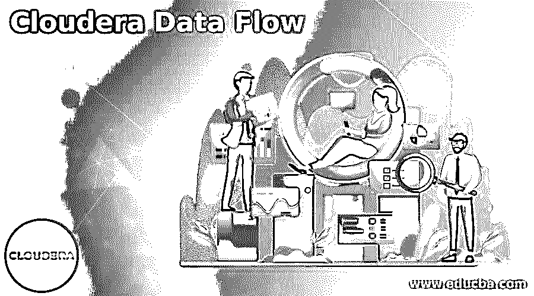

# Cloudera 数据流

> 原文：<https://www.educba.com/cloudera-data-flow/>

## Cloudera 数据流简介

Cloudera Data Flow 是 CDP 的公共云服务，以前称为 Hortonworks Data Flow，是一个可扩展的实时流分析数据平台，可帮助摄取、分析和整理数据，以获得关键见解和即时可操作的情报。它支持 Apache NiFi 数据流的自助式部署，以自动扩展 Cloudera 数据平台管理的 Kubernetes 集群。Cloudera Data Flow 消除了与 Apache NiFi 集群相关的运营开销，并允许用户完全专注于数据流开发和满足业务 SLA。

### Cloudera 数据流平台

CDP 公共云通过下面提到的两个选项提供 Cloudera 数据平台功能:

<small>Hadoop、数据科学、统计学&其他</small>

#### 1.数据中心的数据流

*   借助 CDP 部署流管理、流处理集群可通过简单的数据中心服务进行访问，该服务在云中运行，消除了复杂、耗时的基础架构管理和规划。
*   它通过 Azure、谷歌云平台和 AWS 上可用的易于使用的流媒体云服务简化了数据收集。
*   Data Hub 的数据流还提供 Kafka、Apache NiFi 和 Flink 的创新和能力、企业安全性和可扩展性，以及跨混合云和公共云的一致安全性和治理。

#### 2.公共云的数据流

*   公共云的数据流解决了低估集群规模和计划外基础架构支出等挑战。
*   它正在按需扩展基础架构，这可能是一场运营噩梦。
*   在相同集群中的多个 NiFi 流之间共享资源会影响整体性能。
*   使用当前的工具，无法在单个视图中监控多个集群的数据流指标。

### Cloudera 数据流的应用

Cloudera Data Flow 通过在安全性丰富的环境中为大数据基础架构提供现成的基于流程的编程来加快速度。CDF 旨在简化当前复杂的安全数据获取、实时分析和分布式异构数据源的接收。

*   **Edge &流管理:** It 部门管理、控制和监控 Edge 的流物联网计划，并交付实时流数据，无需代码摄取和管理。
*   **流消息传递:**它缓冲和扩展大量数据接收，以满足云和企业应用程序的实时数据需求。
*   **流处理和分析:**它支持实时洞察，以改进响应并检测可带来有价值业务成果的关键事件。
*   **流管理:**它提供了一个简单的可视化用户界面，可以跨各种流数据目标和源构建复杂的数据转换、接收和丰富需求。它使用户能够以每秒 10 亿个事件的速度从设备、合作伙伴系统、企业应用程序和云应用程序接收流数据。
*   **流消息传递:**它使企业能够将大量实时数据接收、扩展和缓冲到云服务器和本地应用程序。它由 Apache Kafka 提供支持，这是一种流消息传递功能，可以实时访问各种应用程序。
*   **流分析:**它采用最新一代低延迟流处理和分析引擎，可满足实时洞察和预测分析需求。Apache Flink 支持流分析，这有助于在企业中普及流分析，以交付业务成果。

### Cloudera 数据流示例

下面是提到的例子:

#### 示例#1

物联网

Cloudera Data Flow 是一个用于摄取和获取物联网的可扩展平台，被广泛称为 IoA，即万物互联。

*   **安全数据收集:** Cloudera Data Flow 通过简单设计的可靠、安全、集成的大规模数据收集来满足物联网的安全需求。安全功能包括端到端保护和数据保管链。此外，它使物联网系统能够验证数据流的来源，从起始点到目的地进行故障排除，并确定数据源。
*   **适应资源约束:**数据源可能是远程的，物理足迹将是有限的；带宽和功率很可能既受限制又是可变的。它支持数据流中的优先级。双向数据流适应数据量波动、网络连接、端点和源容量。它为将来的传输保存不太重要的数据。

#### 实施例 2

加速数据收集和操作效率。

大数据收集和摄取工具是专门构建和过度设计的，因为它们不是根据运营高效和普遍适用的设计原则创建的。这完成了一个复杂的消息传递体系结构、不同的收购和定制的转换工具，使得运营既耗时又昂贵—该流程可加快大数据项目的投资回报并提高运营效率。

#### 实施例 3

提高安全性和健全的监管链

用于传输电子数据的工具不是为未来的安全需求而设计的。现有的工具很难共享离散的数据位。

*   **使用 Cloudera 数据流提高安全性和来源:**它提供端到端的数据历史记录。满足法规遵从性和数据来源的能力提供了一种方法，可以从原始点和数据流中的几乎任何点跟踪数据，以确定哪些数据源是主要使用的和最有价值的。

### 结论

我们已经了解了 Cloudera 数据流的含义及其包含两种功能的 CDF 平台概述，即面向数据中心的数据流和面向公共云的数据流。我们还浏览了每个数据中心和公共云的数据流应用程序。最后，我列举了几个 Cloudera 的数据流应用。

### 推荐文章

这是 Cloudera 数据流指南。这里我们讨论一下简介、Cloudera 数据流平台、应用和例子。您也可以看看以下文章，了解更多信息–

1.  [Cloudera CDH](https://www.educba.com/cloudera-cdh/)
2.  [Cloudera 架构](https://www.educba.com/cloudera-architecture/)
3.  [Cloudera 管理器](https://www.educba.com/cloudera-manager/)
4.  [云迁移工具](https://www.educba.com/cloud-migration-tools/)

