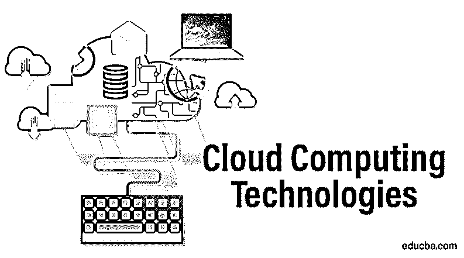

# 云计算技术

> 原文：<https://www.educba.com/cloud-computing-technologies/>

## 云计算技术简介

云计算是基于互联网和网络的下一代技术，以多种方式为用户提供服务。这是一个简单的数据外包资源，也可以临时使用，而且成本效益高，因为客户可以为他们使用的东西付费。要在云应用上工作，要求是快速的互联网连接和标准的网络浏览器。它通过将池资源共享给客户端网页或 IP，为客户端即时提供可扩展的按需访问。

### 顶级云计算技术

云计算的不同创新列举如下:

<small>Hadoop、数据科学、统计学&其他</small>

#### 1.虚拟化

它是在企业的不同用户之间共享应用程序的物理实例的许可证密钥的过程。这项技术的主要目的是为所有客户端提供标准版本的云应用程序。它因其灵活性和即时运行过程而被广泛使用。少数虚拟化类型包括

*   **硬件虚拟化:**如果虚拟机直接安装在硬件服务器上，则称为硬件虚拟化，因为控制虚拟机比控制物理服务器更容易。
*   **操作系统虚拟化:**如果虚拟机安装在来宾服务器而不是硬件系统中，则称为操作系统虚拟化。它增加了各种操作系统平台上各种软件的测试情况，
*   **服务器虚拟化:**如果系统上安装了虚拟机，则称为[服务器虚拟化](https://www.educba.com/server-virtualization/)。它被划分为多个资源，用于按需负载平衡。
*   **存储虚拟化:**从不同网络存储设备收集物理存储的过程称为[存储虚拟化](https://www.educba.com/storage-virtualization/)。它主要用于备份和恢复。

#### 2.面向服务的架构

SOA 是一个应用程序，它将服务划分为单独的业务功能和日常流程。云应用程序的这一独特组件支持与云相关的安排，这些安排可以根据业务需求进行修改和调整。面向服务的系统包括两个主要部分，一个是质量即服务，另一个是软件即服务。服务质量的功能是从不同的角度识别服务的功能和行为。软件即服务提供了一种新的软件交付模型，这种模型是从应用程序服务提供商那里继承来的

#### 3.网格计算

这是从多个服务器连接多个服务器以实现共同目标的过程。网格计算将大问题转化为小问题，并广播给服务器，将它们放在网格中。它主要应用于电子商务，旨在共享大规模集群计算的资源。一个流行的网格计算项目是 Folding@home。该项目旨在发现蛋白质折叠、错误折叠及相关疾病。它包括利用闲置计算机的能力和解决复杂的科学问题

#### 4.效用计算

这一过程依赖于按使用付费模式。它按需提供计算服务，以获得计量收益。它主要通过减少初始投资来帮助削减成本。随着企业计算需求的变化，计费也会相应变化，而不会产生任何额外成本。如果客户端使用率降低了，那么计费成本也会相应降低。

### 我们在哪里使用云计算？

下面是解释云计算使用的要点。

#### 1.基础设施即服务(IaaS)

云计算提供虚拟和物理计算机。实际的机器由虚拟机管理程序访问，这些虚拟机管理程序被分组到池中，并由运营支持网络进行管理。云计算介绍了实际机器上的操作框架图片和应用程序编程。基础架构即服务提供防火墙、IP 地址、监控服务、存储、带宽、虚拟机等资源，所有这些资源都按时间成本提供给客户端。例如:Windows Azure、谷歌计算引擎、亚马逊 EC2、Rackspace。

#### 2.平台即服务(PaaS)

它是应用程序开发和部署平台的一部分，是程序员或开发人员可用的服务。他们可以利用基础来有效地构建、部署、测试和处理 SaaS 应用程序。PaaS 的主要属性是具有点击式设备，使程序员能够设计基于 web 的应用程序。一些例子是谷歌，Force.com，阿帕奇，AWS 弹性豆茎和 Windows Azure。

#### 3.软件即服务(SaaS)

它是通过网络浏览器向最终用户传输应用程序。云客户端安装它，他们可以让它们在云平台上运行。但这并不是这个过程的强制要求，因为他们需要软件支持和减少维护。相反，他们可以使用便携的 SaaS 应用程序。最好的例子，一个办公套件。SaaS 为我们提供了应用程序编程接口(API ),允许开发者构建所需的应用程序。

### 云计算技术的优势

云计算的优势如下。

*   **高可扩展性:**它要求在没有任何人为干预的情况下大规模地提供资源。
*   **高可用性和可靠性:**服务器在正确的时间可用，没有任何延迟或失望
*   敏捷:它在用户之间有效地分配资源，执行速度非常快。
*   **多共享:**通过分布式计算，来自多个地区的不同客户端通过基础设施共享相同的资源。
*   **维护:**这是一种用户友好的方式，因为从他们的位置很容易接近，并且不需要任何安装设置。
*   **成本低:**性价比很高，按使用量付费。
*   **服务即付费使用模式:**应用编程接口提供给客户使用资源和服务，并在服务的基础上付费。
*   **按需自助服务:** [云计算向客户端提供](https://www.educba.com/free-cloud-computing/)所需的服务和应用。有了登录密钥，他们就可以在没有任何人工交互和云服务提供商的情况下开始使用。它包括存储和虚拟机。

### 结论

云计算有一个独特的功能，即广泛的网络访问，在这种情况下，可以通过移动电话、个人笔记本电脑和计算机轻松访问广泛的资源，如存储和虚拟机。因此，它可以在任何时候访问。资源池允许多个用户共享一个公共池，如数据库、应用程序和网页，并为客户端使用的资源或最近分配给客户端的资源提供快速的灵活性。随时都有可能扩大或缩小资源规模。

### 推荐文章

这是云计算技术的指南。在这里，我们讨论了云计算技术的类型、云计算的用途和优势。您也可以浏览我们的其他相关文章，了解更多信息——

1.  [云计算的类型](https://www.educba.com/types-of-cloud-computing/)
2.  [云计算的例子](https://www.educba.com/example-of-cloud-computing/)
3.  [云计算的优势](https://www.educba.com/advantages-of-cloud-computing/)
4.  [云计算职业](https://www.educba.com/career-in-cloud-computing/)
5.  [Mac 与 IP 地址的 12 大对比](https://www.educba.com/mac-vs-ip-addresses/)

