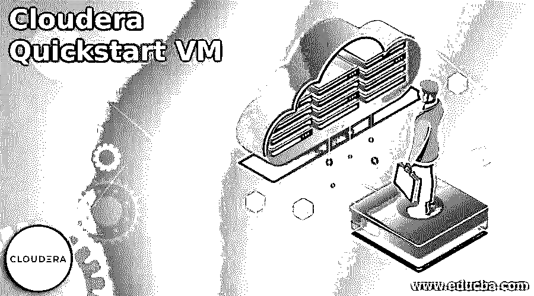
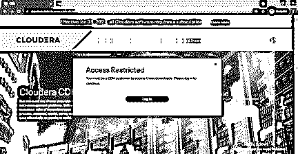
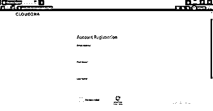
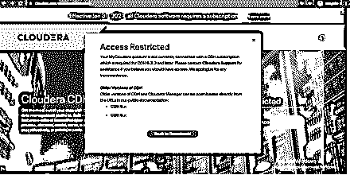
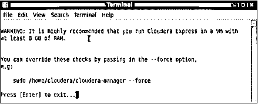

# Cloudera 快速启动虚拟机

> 原文：<https://www.educba.com/cloudera-quickstart-vm/>

## Cloudera Quickstart 虚拟机简介

Cloudera QuickStart VM 包括用户使用 Impala、CDH、Cloudera Manager 和 Cloudera Search 所需的所有功能。Cloudera QuickStart VM 使用基于包的安装程序，允许用户使用或不使用 Cloudera Manager。Cloudera 软件为数据分析、机器学习和数据仓库提供了一个平台。Cloudera 最初是一个开源的 Apache Hadoop 分发项目，称为 Hadoop 或 CDH 的云分发，包含 Hadoop 和相关项目，其中的组件都是 100%开源的，拥有 Apache 许可证。Cloudera 提供了 Apache Hadoop 集群的虚拟机映像，使得从 Cloudera CDH 开始变得更加容易。现在我们已经了解了 Cloudera 软件和 Cloudera QuickStart VM，让我们看看先决条件和安装过程。

### Cloudera 快速启动虚拟机安装

**步骤 1:** 安装 Cloudera QuickStart 虚拟机的先决条件是:

<small>Hadoop、数据科学、统计学&其他</small>

*   虚拟机:VMWare 或 Oracle 虚拟机器
*   12+ GB RAM，其中 4 + GB 用于操作系统，8 + GB 用于 Cloudera
*   和 80 GB 硬盘

**步骤 2:** 要下载 Cloudera QuickStart 虚拟机，请点击 https://www.cloudera.com/downloads/cdh.html.

下面是该页面的截图，

在下载之前，用户需要访问，因此需要登录。要登录，用户将被重定向到 https://sso.cloudera.com/

**第三步:**如果你是老用户，可以直接登录；否则需要在 https://sso.cloudera.com/register.html 注册

在这里提供所需的凭据后，用户将收到一封带有链接的激活邮件，可用于激活帐户并为 Cloudera 帐户设置密码。

提交密码后，完成 Cloudera 配置文件，然后用户将被重定向回主页，如下所示。

**第四步:**选择需要的 CDH 版本，下载 CDH 5.13.0 版本，

**第五步:**根据可用的操作系统，

安装语法会相应改变。

用户可以在 https://docs . cloud era . com/documentation/enterprise/release-notes/topics/CDH _ VD _ CDH _ download _ 513 . html # download _ 5121 中查看下载存储库所需的所有语法。

**第 6 步:**文件下载完成后，将其解压缩，即可用于创建单节点 Cloudera 集群。您可以找到 Cloudera QuickStart 虚拟机的两个虚拟映像。

一旦下载了 Cloudera QuickStart VM，用户就需要安装它。

**步骤 7:** 即使在设置 Cloudera 虚拟机之前，用户也需要在系统上安装 Oracle Virtual Box 或 VMWare 等虚拟机。

**步骤 8:** 相应地，用户需要在系统上安装虚拟机。对于 Oracle 虚拟机箱，请单击 https://www.virtualbox.org/wiki/Downloads.

**步骤 9:** 要在虚拟机中设置 Cloudera QuickStart 虚拟机，请选择“导入设备”并选择 QuickStart 虚拟机映像。它将导入。vmdk 文件，即虚拟磁盘映像，到虚拟机中。

**步骤 10:** 然后需要更改机器的规格并设置 Cloudera QuickStart 虚拟机。在设置下，选择 RAM，将其增加到 5 GB，并分配 2 个 CPU 核心。

**步骤 11:** 现在，您需要启动机器，以便它使用 5 GB 和 2 个 CPU 内核，并启动 Cloudera QuickStart 虚拟机。

**第 12 步:**需要获得管理控制台的访问权限。接下来，用户需要点击出现在 Cloudera 屏幕顶部的终端。

下面是需要在控制台中输入的命令，

hostname:显示主机名，即 quickstart.cloudera

hdfs dfs -ls /:检查用户是否具有访问权限和群集工作条件

服务 cloud era-SCM-服务器状态:使用 cloudera express free 所需的命令

su –:超级用户登录

服务 cloudera-SCM-服务器状态:root 密码是 cloud era

**步骤 13:** 一旦一切正常，关闭终端。然后启动“Cloudera Express”，下面是终端

**步骤 14:** 在上述终端中获取命令，并将其复制到新终端，新终端将重新启动服务，因此用户可以访问管理控制台。

**步骤 15:** 至此部署已经完成，客户端配置已经部署完毕。Cloudera 管理服务已经重新启动，并且已经可以访问 Cloudera QuickStart 管理控制台。

**步骤 16:** 根据控制台显示的端口，在浏览器中打开 URL，提供凭证登录。用户名和密码将是 cloudera。

### 快速入门虚拟机管理信息

在大多数情况下，QuickStart VM 不需要管理，只需要管理已安装的服务和产品。但是，如果需要任何额外的管理或出现问题，它会提供有关帐户的信息以及常见问题解决方案的可能解释。

**账户**:一旦虚拟机启动，用户自动以 Cloudera 用户的身份登录。

**快速启动虚拟机映像**:要启动映像，用户需要安装适用于 Linux 和 Windows 的 VMware Player 以及适用于 Mac 的 VMware fusion。

**quick start Virtual Box Image**:如果 Virtual Box VM 启动时出现内核恐慌攻击，用户可以尝试通过设置à系统à主板à选择 ICH9 而不是 PIIX3 来解决芯片组问题。

**快速启动 KVM 映像:** KVM 映像提供许多虚拟机管理程序使用的原始磁盘映像。因此，这种机器应该配置足够的 RAM。

### 结论

至此，我们将结束“快速启动虚拟机”这一主题我已经了解了什么是 QuickStart VM 以及如何安装它。我们已经完成了下载 Cloudera CDH 版所需的步骤，以及拥有 QuickStart VM 所需的虚拟机。我查看了 Cloudera QuickStart VM 的管理信息，它管理已安装的产品和服务。谢谢！快乐学习！!

### 推荐文章

这是 Cloudera Quickstart 虚拟机指南。在这里，我们将讨论下载 Cloudera CDH 版本所需的步骤以及拥有 QuickStart VM 所需的虚拟机。您也可以看看以下文章，了解更多信息–

1.  [云安全服务](https://www.educba.com/cloud-security-services/)
2.  [春云相依](https://www.educba.com/spring-cloud-dependencies/)
3.  [云淡风轻的选择](https://www.educba.com/cloudinary-alternatives/)
4.  [云迁移的优势](https://www.educba.com/cloud-migration-benefits/)

