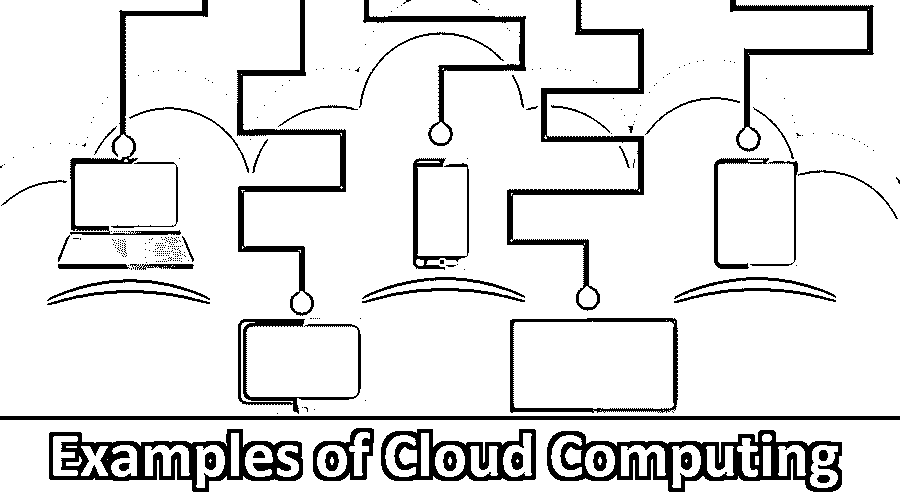

# 云计算的例子

> 原文：<https://www.educba.com/example-of-cloud-computing/>

## 云计算示例介绍

云计算是一种使用互联网在远程服务器上存储和管理数据，然后通过互联网访问数据的技术。这种类型的系统允许用户远程工作。云计算客户不拥有物理基础设施；他们从第三方提供商那里租赁使用。云计算和云服务的本质特征是按需自助服务、广泛的网络接入、资源池化、快速弹性。云计算之所以如此成功，是因为它使用简单。对于企业来说，它们是一种经济高效的解决方案。各种特性是最佳的服务器利用率、按需云服务(满足客户需求)、动态可伸缩性、[虚拟化技术](https://www.educba.com/cloud-computing-or-virtualization-techniques/)。一个这样的例子是谷歌云——它是由谷歌提供的一套公共云服务。所有的应用程序开发都在谷歌硬件上运行。它们包括谷歌计算引擎、应用引擎、谷歌云存储、谷歌容器引擎。

**服务类型:**

<small>Hadoop、数据科学、统计学&其他</small>

1.  SAAS(软件即服务)——微软 Office Live、Dropbox 的例子。
2.  PAAS(平台即服务)-谷歌应用引擎示例
3.  IAAS(基础设施即服务)IBM cloudburst 的例子。

### 为什么是现在的云计算？

1.  **规模经济:**电子商务和社交媒体的快速增长增加了对计算资源的需求。在较大的数据中心，最大化工作量和减少服务器空闲时间更容易。
2.  **专业知识:**公司为其内部云构建数据中心，他们可以开发专业知识和技术来构建公共数据中心。
3.  开源软件:Linux 操作系统已经成为云计算的主要推动者。

### 云计算的部署模式

1.  **私有云:**它适用于私有网络上的单个组织，并且是安全的。例如:公司 IT 部门。
2.  **公有云:**归云服务提供商所有。例如:Gmail。
3.  **混合云:**混合云是私有云和公共云的结合。专有技术。

### 顶级云计算提供商

*   Amazon EC2 & S3:是一个关键的 web 服务，它创建和管理运行操作系统的虚拟机。EC2 比 S3 复杂得多。
*   谷歌应用引擎:是一个纯粹的 PAAS 服务。它由 web 或应用服务器来表示。
*   Windows Azure
*   谷歌应用
*   熊猫云

### 云计算的例子

现在，我们将讨论下面提到的云计算示例:

#### 1.Dropbox、脸书、Gmail

云可以用来存储文件。优点是容易备份。它们会自动同步桌面上的文件。 [Dropbox 允许](https://www.educba.com/what-is-dropbox/)用户访问文件和存储高达 1tb 的免费存储空间。社交网络平台需要强大的主机来实时管理和存储数据。基于云的通信提供了从社交网站点击呼叫的功能，以及对即时消息系统的访问。

#### 2.银行、金融服务

消费者将财务信息存储到[云计算服务提供商](https://www.educba.com/cloud-computing-service-providers/)。他们将纳税记录存储为在线备份服务。

#### 3.卫生保健

使用云计算，医疗专业人员可以远程托管信息、分析和进行诊断。随着医疗保健也出现在云计算的例子列表中，它允许世界各地的其他医生立即访问这些医疗信息，以便更快地开处方和更新。云计算在医疗保健领域的应用包括远程医疗、公共和个人医疗保健、电子医疗服务和生物信息学。

#### 4.教育

这在高等教育机构中是有用的，为大学和学院提供了好处，因此教育从此成为云计算的例子。谷歌和微软向不同学习机构的员工和学生免费提供各种服务。美国的一些教育机构使用它们来提高效率，降低成本。例如，谷歌应用教育(GAE)。它们允许用户使用他们的个人工作空间，教学变得更加互动。

#### 5.政府

他们使用基于云的 IT 服务向公民提供电子政务服务。他们拥有处理大型交易的技术，市民可以看到更少的拥堵瓶颈。

#### 6.大数据分析

大数据分析是云计算的另一个例子，因为云计算使数据科学家能够分析他们的数据模式、见解、相关性、预测，并帮助做出良好的决策。有很多开源的大型工具，比如 Hadoop，Cassandra。

#### 7.沟通

云允许基于网络访问通信工具，如电子邮件和日历。Wats 应用程序也是一个基于云的基础设施，因为它是在通信中出现的，它也是云计算的一个例子。所有的消息和信息都存储在服务提供商的硬件中。

#### 8.业务流程

商务电子邮件是基于云的。ERP、文档管理、CRM 都是基于云服务提供商。SAAS 已经成为企业的重要手段。例子包括 Salesforce、HubSpot。它们使许多业务流程更加可靠，因为数据可以在云提供商的多个冗余站点上复制。

### 应用程序

当今世界有各种各样的云计算应用。许多搜索引擎和社交网络、商业都使用相同的概念。使用 google wave，我们可以创建一个文档，并邀请其他人进行评论。例子香料鸟，米高戈。谷歌目前是云计算的先行者，因为它为数以千计的搜索查询提供准确和即时的结果。

### 云计算的优势和劣势

正如我们在上一节中对云计算的例子所做的研究，现在我们继续讨论云计算的优点和缺点

#### 优势

*   **降低成本:**计费模式按使用量付费。初始的昂贵的和经常性的费用比传统的低得多。
*   **存储容量增加:**他们拥有海量存储和大量数据的维护。
*   灵活性
*   它们是可扩展的，因为我们可以为所需的存储量付费。并且用于紧急备用计划。

#### 不足之处

*   共享基础架构上的性能可能不一致。云计算维护的服务器可能会倒向自然灾害和内部 bug。
*   云中的隐私和安全更令人担忧。
*   可靠性，以及隐私。供应商锁定和失败也是云计算中的另一个问题。
*   数据传输费用:每月的出站数据传输按 GB 计费。
*   宕机:如果互联网连接中断，将无法从云中访问任何应用程序、服务器或数据。

### 结论

由于云计算的众多优势，它正日益流行。避免昂贵的软件许可费用的能力是公司能够提供云服务的因素之一。它们是基于互联网的云资源，可随时通过网络获得，并通过标准机制进行访问，该机制可促进不同类型平台(例如:移动电话、笔记本电脑和 PDA)的使用。他们还通过提供许多在线教育服务来帮助电子学习。[云计算让](https://www.educba.com/free-cloud-computing/)可以更专注于业务，而不是数据中心。

### 推荐文章:

这是云计算示例的指南。在这里，我们讨论了云计算的各种例子，如教育、政府、大数据分析等。您也可以阅读以下文章，了解更多信息——

1.  [云计算面试问题](https://www.educba.com/cloud-computing-interview-questions/)
2.  [云计算与网格计算——差异](https://www.educba.com/cloud-computing-vs-grid-computing/)
3.  [云计算 vs 大数据分析](https://www.educba.com/cloud-computing-vs-big-data-analytics/)
4.  [什么是云计算？](https://www.educba.com/cloud-computing-benefits/)
5.  [什么是云计算中的虚拟化？](https://www.educba.com/what-is-virtualization-in-cloud-computing/)
6.  [云计算的优缺点](https://www.educba.com/advantages-and-disadvantages-of-cloud-computing/)

