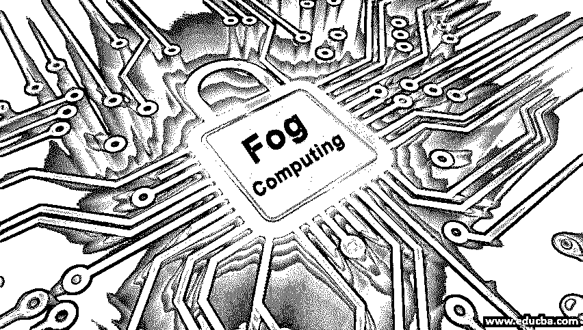
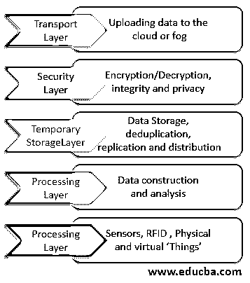

# 雾计算

> 原文：<https://www.educba.com/fog-computing/>

## 雾计算简介

雾计算是介于云数据中心和物联网设备/传感器之间的中间层。它在物联网设备/传感器附近提供计算、存储和联网服务。雾计算的概念来源于边缘计算。边缘计算有望让数据计算更接近数据来源。边缘计算中的边缘设备由于资源有限，无法支持物联网中的多个应用，导致资源争用和延迟增加。它吸收边缘设备和云资源，以克服与边缘计算相关的限制。

### 云计算和雾计算的区别

下面是云和雾计算的一些区别。

<small>Hadoop、数据科学、统计学&其他</small>

| **特性** | **云计算** | **雾计算** |
| 耽搁 | 高的 | 低的 |
| 潜伏 | 高的 | 低的 |
| 客户端-服务器距离 | 多次跳跃 | 一跳 |
| 服务位置 | 在互联网内部 | 在本地网络的边缘 |
| 实时互动 | 支持 | 支持 |
| 移动支持 | 低的 | 支持 |
| 地理分布 | 集中的 | 分布的 |
| 位置感知 | 不 | 是 |

### 雾计算的需求

以下是指出的需求:

*   物联网应用产生大量数据。需要对这些数据进行分析，以做出实施决策并采取各种措施。
*   将这些数据传输到云中会导致许多问题，例如，延迟、带宽的过度使用、实时响应的延迟、数据的集中位置等。
*   为了克服物联网应用面临的这些挑战，思科于 2012 年在云环境中引入了术语雾计算。
*   它有望将计算带到终端设备附近，从而最大限度地减少延迟并有效利用带宽。
*   随着基于传感器的设备的增加，产生了大量的数据。这些数据需要存储和处理。将数据存储在云上成本很高，并且增加了更多的处理时间。它将资源放在靠近终端设备的地方，减少了处理时间，也节约了成本。

### 工作

可以通过分层架构来理解其工作原理:

#### 1.物理和虚拟化层

在这一层，我们有物理节点和虚拟节点。节点在地理上是分散的，并且捕获数据。节点中使用传感器来感知周围环境，收集数据并通过网关将其发送到上层，以进行更多处理和过滤。

#### 2.监控层

在这一层中，监视各种节点，包括监视由各种节点执行的任务、执行任务的时间以及下一个动作过程。应用程序的性能和状态也受到监控。出于监控目的，还考虑了雾节点的能量使用。

#### 3.预处理层

预处理层执行[数据分析操作](https://www.educba.com/data-analysis-process/)。清理收集的数据，过滤掉不重要的数据。这一层的数据过滤可能包括从数据中去除所有杂质，并确保在这一层只收集有用的信息。

#### 4.临时存储层

这一层与临时数据分发和复制相关联。在这一层使用存储虚拟化。许多存储设备，如 NAS、FC、ISCSI 等。

#### 5.安全层

雾计算中的安全性涉及数据的隐私性、完整性、加密和解密。隐私可以是使用隐私、数据隐私和位置隐私。

#### 6.传输层

这一层将预处理过的数据上传到云中进行永久存储。数据通过各种智能网关，以确保必须存储在云上的任何内容都通过网关。

### 范围

范围可在以下标题下讨论:

*   **带宽感知的光纤陀螺系统设计:**它应该减少核心网络中的带宽使用。光纤陀螺计算中带宽的研究还处于起步阶段。需要进行大量的实验来找到在雾计算中带宽的适当使用。必须考虑向光纤陀螺架构添加无数设备的影响以及对光纤陀螺带宽的影响。
*   **Fog 系统 SLA:**Fog 系统目前还没有自己定义的 SLA。当前所有用于雾计算的 SLA 实际上都是针对云计算的。与中央云模型相比，雾架构实际上是分布式的，由跨不同平台的设备组成。一个潜在的和可行的 SLA 是未来的需要，这将特别意味着雾计算范式。
*   **雾可扩展性:**其中使用的各种算法和目前可用的方案与物联网设备的规模不匹配。这阻碍了 fog 和物联网设备之间的兼容性。
*   **绿雾计算:**对雾节点的能耗有很大的改善需求。目前，不得不考虑将能量采集器用于物联网设备和传感器。还应考虑利用风力、阳光等可再生能源为雾节点提供燃料。
*   **Fog 资源监控:**由于 Fog 节点由位于多个位置的多个不同用户使用，因此监控成为一项挑战。未来需要开发一种支持多运营商使用的光纤陀螺资源监测技术。

### 雾计算的优缺点

下面给出了提到的优点和缺点:

#### 优势:

*   **低延迟:**雾计算的一个重要优势是资源的接近性。数据不会被发送到远处的服务器进行处理和分析。[数据处理在离设备更近的地方进行](https://www.educba.com/what-is-data-processing/)，因此延迟大大降低。
*   **更好的安全性:**由于本地化的数据处理，fog 提供了与安全性相关的优势。在任何 IT 基础架构中实施的相同安全策略可以在雾计算环境中本地实施。
*   **降低运营成本:**数据在本地处理，节省了网络带宽和基础设施成本，这些成本会增加大型中央云基础设施的成本。
*   **可扩展性:**这一优势允许在雾环境中快速添加设备。设备可以按需扩展。
*   **灵活性:**它允许来自多个平台的多个设备无障碍地连接和共享数据。

#### 缺点:

*   **认证:**在大量连接设备的情况下，设备的认证是雾计算中的一个主要问题。在雾计算中识别一个特定的设备变得非常困难，因为它是分布式的。
*   **调度:**由于任务在 fog 设备、fog 节点和云服务器之间移动，因此调度成为一个问题。
*   **功耗:**雾节点比集中式云架构耗电更多。
*   **雾服务器:**雾服务器必须放置在适当的位置，以获得最大的服务。

### 结论

它有望消除物联网数据目前面临的劣势，这些数据存储在位于远处的数据中心。它将处理节点放置在终端设备和云数据中心之间，消除了延迟并提高了效率。

### 推荐文章

这是雾计算的指南。在这里，我们还将讨论雾计算的需求和范围，以及它的优点和缺点。您也可以看看以下文章，了解更多信息–

1.  [云计算 vs 虚拟化](https://www.educba.com/cloud-computing-vs-virtualization/)
2.  [R 编程语言](https://www.educba.com/what-is-r-programming-language/)
3.  [iSCSI vs NFS](https://www.educba.com/iscsi-vs-nfs/)
4.  [雾计算架构](https://www.educba.com/fog-computing-architecture/)

