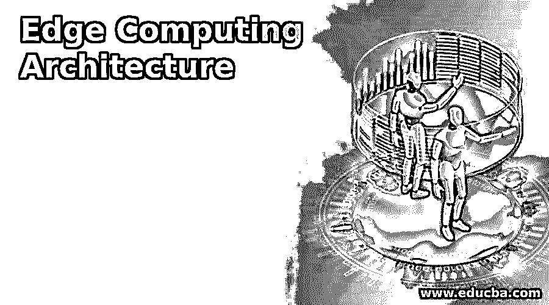
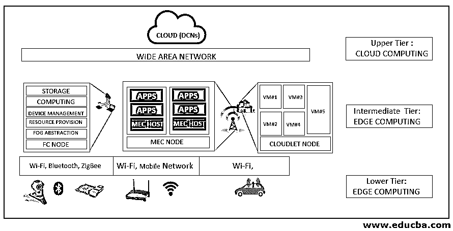

# 边缘计算架构

> 原文：<https://www.educba.com/edge-computing-architecture/>

## 边缘计算架构简介

边缘计算架构是一种在设备附近提供存储和大量计算特性的新模式。这种将存储和计算放在离设备更近的地方的做法缩短了响应时间，减少了带宽。边缘计算涉及发生在云之外的网络边缘的所有类型的计算。Edge time 处理传感器和实时应用程序生成的实时数据。物联网设备的大量出现将带宽需求推到了极致，导致了延迟。边缘计算将服务移近边缘，并增强服务交付。

### 边缘计算架构

边缘计算架构由以下组件组成

<small>Hadoop、数据科学、统计学&其他</small>

#### 数据源/设备

边缘计算环境中的数据源可以是捕获数据的应用程序、传感器、设备或任何数据捕获设备。这些设备生成的数据因来源而异。数据源根据它们的功能和位置而各不相同。各种边缘设备捕获数据并通过物联网协议进行通信，将数据发送到边缘网关。用于数据传输的协议可以是以太网、蓝牙、Wi-Fi、NFC、ZigBee 等。简而言之，每个数据生成设备都将被视为边缘设备。

#### 边缘网关

边缘网关充当边缘设备和核心网络之间的节点。核心网络包括足以预处理数据的强大设备。边缘网关用于为有线和基于无线电的传输提供接口。

使用的各种标准是:

*   **Z-Wave:** Z-Wave 用于 30 米点对点通信，专用于家用电器控制等涉及小型传输的应用。z 波在 ISM 频段(约 900 MHz)工作，允许 40 kbps 的传输速率。Z-wave 被认为是家用电器通信的最佳选择。
*   **LTE-A(高级长期演进):**该通信协议由一组不同的通信协议组成，属于机器类型信号和基于物联网的架构。在服务成本和可扩展性方面，它优于其他蜂窝解决方案。
*   **EPC-global:** 电子产品代码在供应链管理中用于识别物品，作为存储在 RFID 标签上的唯一标识号。该架构使用 RFID 技术以及易于使用的 RFID 标签和阅读器进行信息共享。这种架构被认为是物联网未来的一种有前途的技术，因为它具有开放性、可扩展性等特点
*   **蓝牙低能耗:**蓝牙低能耗(BLE)或蓝牙智能利用短程无线电信号和最低功耗要求。它的工作范围是传统蓝牙技术的近十倍。与传统的蓝牙技术相比，它的延迟系数要小 15 倍。0.01 mW 到 10 mW 之间的传输功率对于其操作是可行的。

### 使用的协议

该层中使用的各种协议

#### CoAP

CoAP 是用于边缘设备和应用的应用层协议，由 IETF 约束 RESTful 环境(CoRE)工作组创建。CoAP 提出了一种基于 HTTP 功能之上的代表性状态传输(REST)的传输协议。REST 是一个可缓存的连接协议，它依赖于无状态的客户端-服务器架构。它代表了一种在 HTTP 之上的客户机和服务器之间交换数据的适当方式。它用于基于移动的社交网络应用程序，通过使用 HTTP 方法(get、post、put 和 delete)降低了复杂性。

#### MQTT

MQTT 用于在嵌入式设备、具有服务的网络以及中间件之间建立连接。连接操作基于路由机制，并使 MQTT 成为物联网和 M2M 的最佳连接协议。MQTT 建立在 TCP 协议之上，适用于资源可用性低、不可靠或低带宽链接的设备。MQTT 只包含三个组件，订阅者、发布者和代理。

#### AMQP

AMQP 专注于面向消息的环境，是一个开放的标准应用层协议。它通过消息传递保证原语提供可靠的通信，这些原语包括最多一次、至少一次和恰好一次传递。TCP 被用作消息交换的可靠协议。

#### 边缘

边缘计算架构仅仅意味着网络的边缘。网络边缘的设备因功能而异。可以在边缘使用移动电话。可以在网络边缘使用路由器等。Edge 由那些可以在将实际数据发送到云进行进一步存储和处理之前执行临时数据处理和临时存储的设备组成。边缘设备和边缘之间的通信由边缘网关来促进。Edge 提供了更接近数据源的数据计算能力。边缘是边缘计算环境中核心网络和网络其余部分之间的分界。它只是充当连接边缘架构与雾域或云环境的接口。在边缘使用的设备应该能够提供存储和计算服务。网络的边缘可能离实际的边缘设备有一段距离。在大多数情况下，根据响应时间和可用带宽，边缘设备可能距离收集数据的主边缘设备只有一跳的距离。

### 结论

它旨在使实时应用程序能够高效工作，并在指定时间内提供响应。该架构侧重于减少带宽使用和最小化延迟。该架构可以包括基于云的功能，这在大多数情况下都会发生，在某些情况下，云属性不包括在边缘架构模型中。

该架构有一个适当的接口来连接云数据中心，用于永久数据存储和其他基于云的服务。edge 架构非常灵活，可以添加来自不同异构环境的设备，并在更靠近设备的地方提供服务。

### 推荐文章

这是一份边缘计算架构指南。在这里，我们讨论边缘计算架构的介绍，这一层中使用的各种协议。您也可以浏览我们的其他相关文章，了解更多信息——

1.  [雾计算架构](https://www.educba.com/fog-computing-architecture/)
2.  [rabbitq 体系结构](https://www.educba.com/rabbitmq-architecture/)
3.  [Azure 物联网边缘](https://www.educba.com/azure-iot-edge/)
4.  [什么是微服务架构？](https://www.educba.com/what-is-microservices-architecture/)

