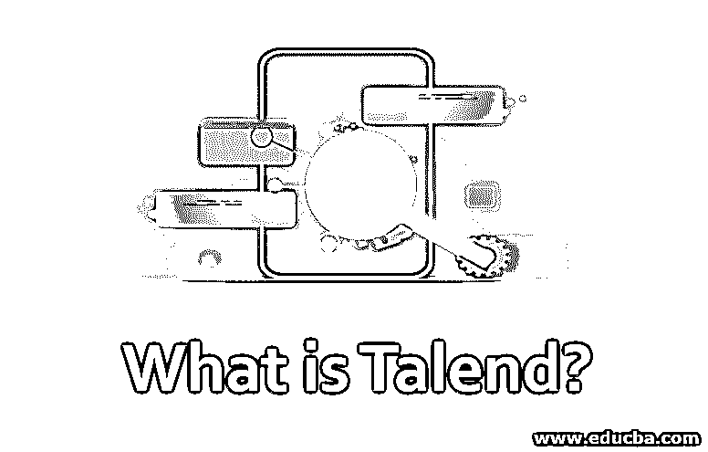

# Talend 是什么？

> 原文：<https://www.educba.com/what-is-talend/>

## Talend 简介

Talend 是一个开源应用程序的代码管理工具。它提供各种数据处理和数据管理软件和服务，集成到企业应用程序云存储、数据质量和大数据中。数据集成应用程序的第一个商业开源提供商是 Talend，它于 2005 年在市场上发布。它是 Talend open studio，现在被称为 Talend Open Studio for data integration，由 Talend 于 2006 年 10 月发布。自那时以来，已经发布了一些产品，在市场上使用非常良好。它被视为引领下一代的云和大数据集成平台。这有助于公司实时做出决策，并更多地以结果为动力。

### 我们为什么需要它？

当今世界主要围绕着大数据分析和云平台。在整个企业中，决策过程和日常业务活动都依赖于存储在多个数据存储系统、位置和格式中的数据。因此，这些公司决心从数据中提取关键信息。数据通常经历多次转换，如数据合并、数据清理和整理，最终将这些数据转换成可用的业务信息。

<small>Hadoop、数据科学、统计学&其他</small>

它为组织提供了多种数据解决方案工具来利用企业信息。通过其产品，该公司使集成民主化，并使 IT 用户和组织能够以更简单和全面的方式部署复杂的架构。它解决了从技术层到业务层的集成的所有方面，所有产品都被重新组合到一个统一的平台中。这是一个非常灵活、可扩展和性能驱动的开源解决方案，用于对大数据执行数据操作和提取操作。它有各种技术优势，比竞争对手快得多。

### Talend 的工作

它主要是一个 ETL 工具，允许您轻松管理 ETL 过程中涉及的步骤，从作业配置到目标系统 ETL 数据加载的执行。要完成源设备和目标设备之间的映射，您可以使用 Talend Open Studio 的图形用户界面从托盘中拖放所需的组件。

使用广泛的预建公式/组件，它甚至允许您对数据列进行转换。Talend Open Studio 通常用于整合操作系统(提取、转换、加载)、商业智能(BI)、数据仓库和数据迁移。它建立在一个叫做 Eclipse 的环境上。这个环境根据用户的选择生成一个代码。这些代码可以在支持 Java 的外部环境中重用。

它分为三个主要特征:

#### 1.贮藏室ˌ仓库

存储库位于屏幕的左侧。存储库是作业中使用的技术组件的集合。这个面板也被称为“塔伦德开放工作室的心脏”。在这个部分中，可以创建和存储数据库、表模式和结构的元数据。

#### 2.设计工作空间

Talend Studio 的下一个功能是设计工作区窗口，在这里可以借助以图形方式显示工作的设计器选项卡来设计和建模工作，代码选项卡可以检测可能的错误并读取生成的代码。

#### 3.组件面板

Talend open studio 的下一个重要特性是调色板，它用于包含构建作业所需的各种组件。组件面板用作预配置的连接器来执行特定的数据集成操作，它还可以减少处理多个数据所需的手动编码量。

### 优势

它提供了大量的连接器，用于集成数据库、服务器、salesforce、SAP 等资源。通过简单的拖放操作，用户可以轻松地[完成 ETL 过程](https://www.educba.com/etl-process/)，例如从 CSV 文件中读取数据并将数据写入 MySQL 数据库。它是业内最受欢迎的 ETL 工具，有很多好处。

下面给出了一些优点:

1.  Talend open studio 将数据处理时间减少了一半，从而降低了开发人员的费用。
2.  Talend open studio 在处理大型数据集时非常高效和可靠。此外，与手工 ETL 相比，功能性错误的发生要少得多。
3.  Talend 有一个很大的用户社区，开发人员可以利用它来定位 ETL 作业开发过程中的任何错误。
4.  它向用户免费提供多种开源集成工具。

### 范围

这些组织每天通过查询、电子邮件和服务请求接收大量数据。组织的未来取决于其处理数据和与客户保持良好关系的能力。借助 ETL 工具，企业可以提高数据处理能力，提高生产力，从而卸下数据管理的重担。

由于 Talend 中有多达 900 多个组件可用，组织开始选择 Talend 提供的 ETL 解决方案。在当今的 Talend 开发市场中，Talend 管理员是非常需要的关键技能工作。它有着广阔的未来。Talend Enterprise 提供市场上领先的开源和商业版本的 ETL 软件。所有这些工具对于您的数据架构来说都是面向未来的，旨在预测数据负载。

### 所需技能

它是当今市场上最简单的 ETL 工具之一。在开始学习之前，必须熟悉 ETL(提取、转换、加载)和数据仓库概念。此外，为了执行数据操作，必须了解诸如 Java 之类的编程语言[。选定组件的组件视图也称为表达式生成器界面，可用于在 JAVA 中编写代码片段作为表达式。](https://www.educba.com/what-is-java/)

### 结论

在本文中，我们看到了它是如何为组织中的数据管理做出贡献的，并了解了它的多种优势。许多组织选择 Talend 提供的数据解决方案，因为它有大量的组件支持。此外，它还适合大数据集成，如 [Hadoop 和 Spark](https://www.educba.com/hadoop-vs-spark/) ，这使得它比竞争对手更受欢迎。正如新燃料中所说的数据，它在处理和管理数据方面起着非常重要的作用。

### 推荐文章

这是一个什么是 Talend 的指南？在这里，我们讨论学习 talend 所需的工作、优势和技能。您也可以看看以下文章，了解更多信息–

1.  [Talend 数据整合](https://www.educba.com/talend-data-integration/)
2.  [MATLAB 中的贝塞尔函数](https://www.educba.com/bessel-functions-in-matlab/)
3.  [数据可视化的类型](https://www.educba.com/types-of-data-visualization/)
4.  [什么是 MuleSoft？](https://www.educba.com/what-is-mulesoft/)
5.  [Python 读取 CSV 文件|示例](https://www.educba.com/python-read-csv-file/)