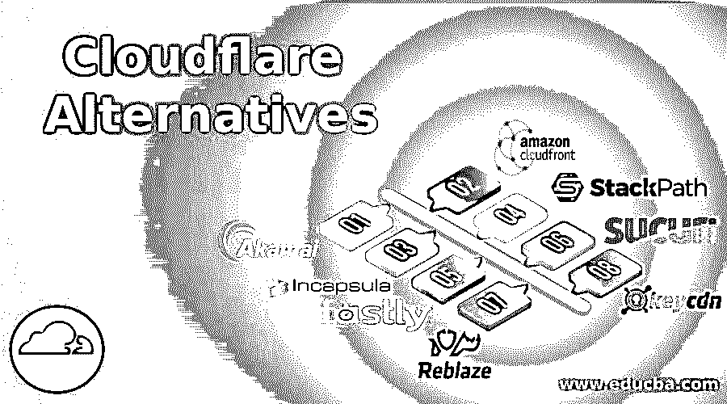

# Cloudflare 替代品

> 原文：<https://www.educba.com/cloudflare-alternatives/>

## Cloudflare 替代产品简介

Cloudflare 最初创建于 2009 年，于 2010 年晚些时候在 TechCrunch Disrupt 大会上推出。Cloud flare 在 2011 年获得关注，当时它为网站提供安全服务，并在 2012 年晚些时候与各种 web 主机合作以提高性能。到 2017 年，最受欢迎的反向代理 Cloudflare 为数百万网站提供 DNS 服务。此外，Cloudflare 还提供 DDoS 保护、web 应用防火墙(WAF)、DNS、反向代理、内容交付网络、域名注册商(2019 年推出，提供低成本定价和更简单的方式来启用 DNSSEC(域名系统安全扩展))等服务。
用户可以根据自己的需求和兴趣选择各种 Cloudflare 替代方案。

### Cloudflare 的替代产品

Cloudflare 受到了一些投诉，美国执法机构在政府要求时向政府提供其客户的信息。因此，考虑迁移到不同 CDN(内容交付服务)的用户，由于其价格因素或安全问题，可能会选择以下替代方案:

<small>Hadoop、数据科学、统计学&其他</small>

#### 1.阿卡迈

Akamai 是全球最大、最受欢迎的 CDN(内容交付网络)和云服务提供商之一。它为大约 20-30%的网络流量提供服务。最有说服力的服务是阻止 DDoS 攻击和内容交付速度，这使其优于任何其他替代方案，并使其成为仅次于 Cloudflare 的首要任务。Akamai 技术为 DDoS 吸收提供了完善的 2.3 Tbps 带宽，为应用层保护提供了 WAF 服务。Akamai 提供的一些增值服务是“Kona site defender”，它可以保护网站免受 DDoS 攻击和其他恶意攻击，并提供定制的实时体验监控体验，用户可以根据需要进行更改。

**赤麦的缺点:**

根据其规模和范围，它不能像敏捷的小公司那样一夜之间改变规则。与 Cloudflare 不同，它不提供免费的增值服务，那些希望获得额外好处的用户，Akamai 为他们提供了 Cloudflare 的最佳替代方案。

#### 2.亚马逊云锋

CloudFront 是众所周知的 CDN(内容交付网络),采用“按需付费”模式。CloudFront 在内容交付服务方面与 Akamai 和 Limelight Networks 存在巨大的竞争。于 2008 年推出，在 29 个国家拥有超过 138 个接入点，提供网络静态和动态内容、网站加速、内容下载和视频流。CloudFront 在其管理控制台上提供了太多 GUI，用户可以添加自定义 SSL，并提供通配符 cName 支持。另一项服务是动态扩展，允许在网络流量出现问题时自动分配硬件资源。

#### 3.胶囊内

Incapsula 是一个基于云的应用交付平台，提供 web 应用安全、DDoS 保护、负载平衡、故障转移服务、应用内容交付。

**由 Incapsula 提供的特性:**

*   当攻击者经常瞄准特定区域并使其难以检测时，Bot 识别引擎可以减少大多数误报。
*   DDoS 额外层保护旨在保护子网网络基础设施，如电子邮件、FTP。
*   它主要提供免费服务，但如果用户需要 DDoS 或 WAF(防火墙)保护，则需要付费。
*   后门保护是 2013 年推出的一款工具，用于检测和阻止恶意 web shells。2013 年晚些时候，它推出了登录保护，这是一种双重身份认证，是其产品的附加功能。
*   最近推出的一个功能是“Incap 规则”,它为客户提供了成熟的安全策略。

#### 4.堆栈路径

StackPath 通过 WAF 和完整记录的 API 提供内容交付服务。它为服务提供即时配置、清除和实时实例。Stack path 为中高端用户提供简单实惠的计划，起价从 20 美元到 600 美元不等。

#### 5.快速地

如果喜欢实时 CDN，那么“Fastly”是 Cloudflare 的替代产品，成立于 2011 年，提供一系列服务，包括即时配置更新、即时清理、动态内容缓存、实时流和分析、私有 CDN、WAF、映像优化器、负载平衡。Fastly 附带定价，如请求总数和数据传输量。它允许用户测试高达 50 美元的流量。

#### 6.苏库里

无论你运行的是 WordPress、PHP 还是 Magneto 电子商务网站，一个平台无关的云服务提供商都会保护你的网站。它也支持免费开放的 CMS 平台。提供的服务有 Web 应用防火墙、负载平衡。它阻止 DDoS 攻击，SQL 注入。像 Cloudflare 一样，Sucuri 没有免费的定价计划，此外，它还提供 SSL 证书、WAF 和网站监控。

#### 7.重新 blaze

另一种替代方案声称可以防范 SQL 注入、XSS、DDoS、零漏洞，阻止来自某些城市或国家的流量。Reblaze 还提供弹性负载平衡，通过其全球网络传输增加的流量。它还使用下一代人类和机器人识别算法来识别高级铲运机机器人。它无缝集成，包括缓存和 SSL、分析和管理。

#### 8.KeyCDN

在提升网站性能方面，它是 CDN 服务方面 Cloudflare 的最佳替代方案？此外，它还提供了双因素身份认证、DDoS 保护和实时保护等功能。

### 结论

从所有可能的备选方案中选择最佳方案有点令人担忧。查看 Cloudflare 所有替代产品的功能。用户根据提供的服务和增加的安全(如 DNS、DDoS、CDN、SSL 证书)进行选择。作为 Cloudflare 用户，最期待的服务是 CDN 服务，根据定价计划，这是非常有前途的。根据他们提供的服务，这些替代方案可以在不牺牲性能的情况下加速和保护您的站点，并提供快速的全球安全网络。用户应该选择能够满足他们需求的解决方案。

### 推荐文章

这是 Cloudflare 替代产品指南。在这里，我们讨论了 8 大 Cloudflare 替代产品的简要概述，如 Akamai、Amazon CloudFront、Incapsula 等。您也可以浏览我们推荐的文章，了解更多信息——

1.  [计算机网络与数据通信——主要差异](https://www.educba.com/computer-network-vs-data-communication/)
2.  [网络类型介绍](https://www.educba.com/types-of-network/)
3.  [最佳 8 种网络设备](https://www.educba.com/types-of-network-devices/)
4.  [四大网络协议类型](https://www.educba.com/types-of-networking-protocols/)

