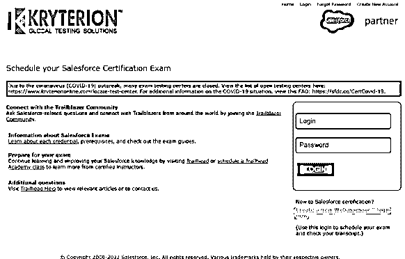
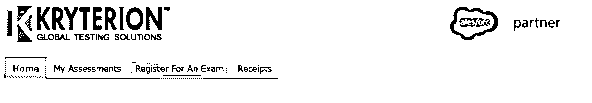
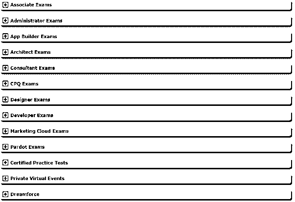
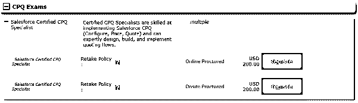
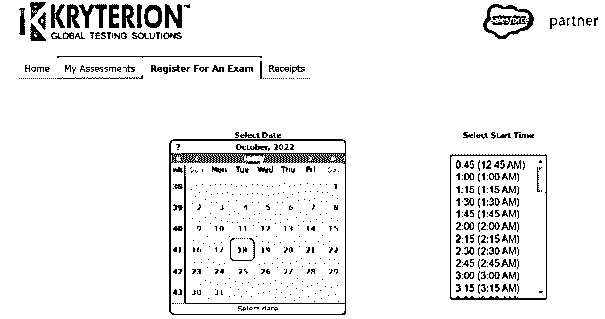
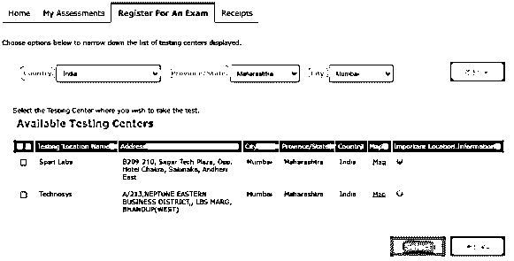
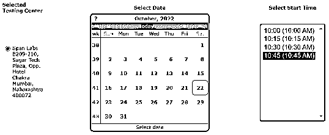
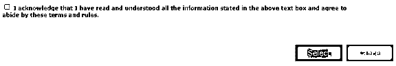
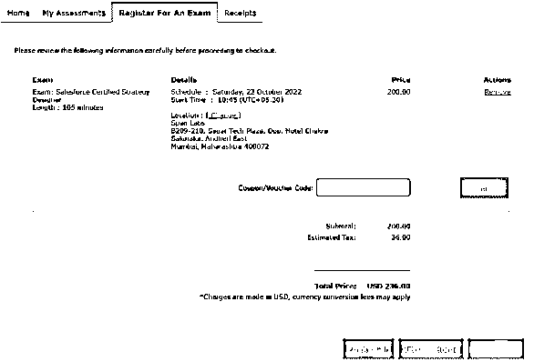
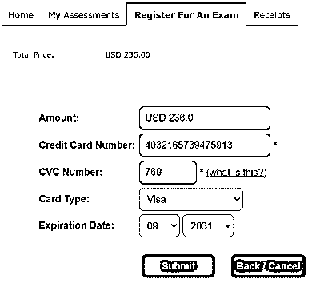

# Salesforce Webassessor

> 原文：<https://www.educba.com/salesforce-webassessor/>

## Salesforce Webassessor 简介

Salesforce Webassessor 是 Kryterion 提供的在线工具，用于测试开发和交付解决方案。[Kryterion Global Testing Solutions](https://www.kryterion.com/)推出了 Salesforce Webassessor，便于访问 Salesforce 认证。

[Salesforce](https://www.salesforce.com/in/) Webassessor 的主要特点是允许参加服务认证考试。这些测试是在线的，成功完成后可以下载证书。任何 QA 和测试服务 Salesforce tester 都可以通过 Webassessor 帐户完成认证。

### Salesforce Webassessor 的主要亮点

*   Salesforce Webassessor 是 Salesforce 的交付和开发平台。Kryterion 开发了这个工具来管理在线/现场认证考试。
*   它通过提供用户友好的测试选择和认证设施来帮助改善专业环境。
*   人们可以在 24 小时内免费重新安排在线考试，在 72 小时内重新安排离线考试。
*   收到证书后，还可以将其链接到社区档案、雇主，甚至 trailhead 帐户。

### 什么是 Salesforce Webassessor？

*   Kryterion Inc .为 Salesforce 开发了在线测试开发和解决方案工具，以便为未来的工作收集知识和认证。
*   作为基于网络的 Salesforce 管理工具，Salesforce Webassessor 通过提供用户友好的测试选择和认证工具来帮助改善专业环境。
*   此外，它通过创建测试帐户提供在线和现场 Salesforce 认证。

### 如何注册 Salesforce Webassessor？

Salesforce Webassessor 认证的注册步骤如下:

<small>Hadoop、数据科学、统计学&其他</small>

#### 第一步:登录

*   打开 [Webassessor 登录页面](https://www.webassessor.com/salesforce)，进入**创建新的 Webassessor**
*   按照开立新账户的要求填写详细信息
*   用户也可以使用现有的 ID 和密码登录到现有的帐户
*   在注册的第一步之后，它继续到考试登录过程。

图片来源:webassessor

#### 第二步:考试类型选择

*   登录后，从主菜单进入**注册考试**

*   从不同种类的评估中选择评估类型

图片来源:webassessor

*   现在，从所选的评估中进行选择，以进一步进入流程。例如:根据 CPQ 考试，有两类认证考试，费用为 200 美元。您可以选择所需的选项

图片来源:webassessor

*   遵循在线考试的后续步骤，并跳到离线/现场考试中心考试的步骤 4。

#### 步骤 3:考试日期和时间(在线考试)

*   从下拉列表中选择可用的日期和时间段
*   接受确认后，继续下一步。

图片来源:webassessor

#### 步骤 4:考试中心选择(离线/现场)

*   对于 Salesforce Webassessor 中的现场考试，选择**国家、省/州和城市。**
*   从所有可用的中心中选择一个合适的中心，然后点击选择。

图片来源:webassessor

#### 步骤 5:考试日期和时间选择(离线/现场)

*   选择可能不需要任何重新安排的最相关的日期和时间段

图片来源:webassessor

*   接着点击确认声明，然后点击**选择**按钮。

#### 步骤 6: Salesforce Webassessor 优惠券或优惠券代码输入(在线和离线)

*   您可以在付款前在结账页面输入**优惠券/优惠券代码**。折扣将适用，然后点击提交和退房。

图片来源:webassessor

#### 第七步:结账

*   在这最后一步，提供您的信用卡详细信息，包括信用卡/借记卡号、CVV 和到期日。
*   遵循该流程将导致付款流程的完成。

图片来源:网络评估员

#### 第八步:确认

*   成功付款后，您将收到一封确认邮件和考试详情到注册的电子邮件地址。

### 考试取消和重新安排

*   您可以在在线考试注册后 24 小时内重新安排或取消考试，而无需支付任何额外费用。
*   在现场考试的情况下，如果在 72 小时内完成，重新安排或取消费用为零。
*   如果在 24 小时前(现场考试为 72 小时)重新安排/取消考试，他们可以收取 75 美元的费用。

### 链接证书

*   首先，登录 Webassessor 帐户，进入[合作伙伴页面](https://partners.salesforce.com/loginswitcher?startURL=%2FprofileView)，选择**编辑个人资料**选项。
*   要将证书与您的雇主关联，请使用 Salesforce 记录检查公司名称，选择 SFDC 合作伙伴，然后单击**保存**按钮。
*   要将证书链接到社区简档，请从下拉列表中选择 Salesforce 认证和 Trailhead 徽章。接下来，选择链接以连接 Webassessor 帐户，输入电子邮件地址，并点击**连接帐户**。

### 重考方案

*   [Salesforce 考试发布](https://www.salesforcekeeda.com/2022/05/salesforce-certification-release-cycle-2022.html)每年举行三次，分别在夏季、春季和冬季。所以一个上进的人一年可以考九次。
*   假设你第一次尝试失败了；您可以在等待一天(24 小时)后重新申请
*   如果有人第二次尝试失败，他们可以等待 14 天再次申请。
*   在第三次尝试失败后，必须等待下一个发布周期才能申请考试。

### 结论

Salesforce Webassessor 是一个在线测试开发和交付平台，为 Salesforce 提供[认证。这些证书可以很容易地链接到社区概况和雇主，便于参考和访问证书徽章。在 Webassessor 下注册帐户后，用户可以使用它进行多次考试和认证，只需支付最低的取消政策和重新安排考试日期和时间的费用。](https://www.educba.com/salesforce-certification-benefits/)

### 常见问题

#### 1.Salesforce 认证值得吗？

**回答**:由于 Salesforce 平台有多种用途，大多数顶级公司都会寻找经过认证的员工。因此，Salesforce 认证值得投资。

#### 2.它的职业道路是怎样的？

**回答**:sales force 云平台在市场上有海量需求，认证有助于职业发展。具有此证书的典型角色是 Salesforce 管理员、顾问和开发人员。这些职位的薪水在[7 万美元到 8.75 万美元](https://www.payscale.com/research/US/Job=Salesforce_Administrator/Salary)之间。

#### 3.Salesforce 认证难吗？

**回答**:这次考试相对容易得分。有了足够的准备和奉献，一个人可以很容易地通过考试。

#### 4.一个人可以重考几次？

**回答**:由于 Salesforce 考试每年发布三次，申请人可以尝试每次发布，他们全年有九次重考。

#### 5.重新参加 Salesforce 考试的费用是多少？

**回答**:重考 Salesforce 考试的费用大多是第一次尝试费用的一半。例如，如果 Webassessor 考试的费用是 236 美元，那么重考的费用可能在 100 美元以上。

### 推荐文章

本文解释了 Salesforce Webassessor 的定义和流程。要了解更多信息，请访问以下文章，

1.  [sales force 的特点](https://www.educba.com/features-of-salesforce/)
2.  [sales force 中的职业](https://www.educba.com/careers-in-salesforce/)
3.  [什么是 Salesforce 技术？](https://www.educba.com/what-is-salesforce-technology/)
4.  [sales force 的用途](https://www.educba.com/uses-of-salesforce/)

