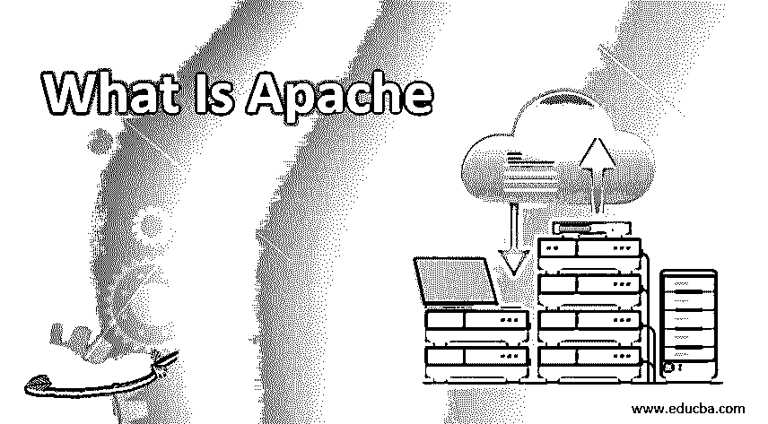
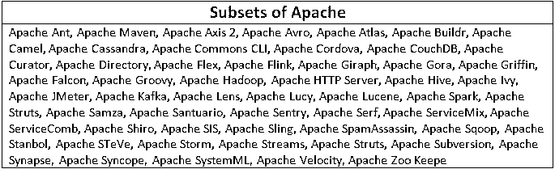

# 什么是阿帕奇

> 原文：<https://www.educba.com/what-is-apache/>

## Apache 简介

由 Apache Software Foundation 开发和维护的、与 web 服务一起使用的、允许用户在互联网上提供 web 内容的开放源代码、跨平台服务器称为 Apache 服务器。来自 web 服务器或数据库服务器的文件存储在物理服务器上，以便在需要时使用。Web 服务器存储来自 internet 的文件，并在物理服务器和客户机之间起作用，根据用户请求提供内容，并将其传递给 web 服务。服务器和浏览器之间的连接已经建立，Apache 可以在 Windows 和 UNIX 中工作来传送文件。

### 了解 Apache

*   它是开源社区开发人员的软件基础，是分散的，有一个中央存储库，所有的库和项目都可以方便地使用。它主要被称为应用软件，广泛用作 web 服务器。
*   这个服务器也称为 Apache HTTP 服务器。该服务器支持不同的跨平台操作系统，如 UNIX 和 Windows 也是用 C++和 C 编程语言写的。它有 350 多个开源项目由 Apache Software Foundation 维护。
*   它在分散的基础上有许多项目，在每个模块下有几个小组和地区，并有子项目。HTTP Server 是现有项目中最好、最顶尖的一个。这些项目组织得很好，按照它们的技术属性和工作流程或应用领域进行分组。
*   这一软件基础为我们提供了一个保护财务贡献和知识产权的既定框架，限制了所有项目贡献者面临法律风险的可能性。
*   软件基金会有一个被称为 Apache Way 的精英流程，该流程有 730 多个成员，7000 多名提交者成功合作开发了免费提供的生产级软件应用程序，这使世界上数百万用户受益，数千个高效的软件解决方案在许可下分发。
*   该社区还积极参与 Apache 软件基金会邮件列表、ApacheCon 和指导计划。该软件基金会还举办官方用户会议、博览会和培训。

### 它是如何让工作变得如此简单的？

它更容易使用，而且最重要的是，该服务器适合用于部署多个 web 应用程序。它通过提供现有的功能，使大多数复杂的功能能够容易地实现，并减少开发时间和资源的使用。项目或库可以作为依赖项或 jar 添加到项目中，并且可以基于软件应用程序的功能和需求来使用。

<small>Hadoop、数据科学、统计学&其他</small>

### 顶级公司

有几家顶级公司使用这些项目作为他们的基本库或 jar，以支持他们自己的应用程序或为他们的定制需求开发的产品。这是开源和免费软件；任何人都可以在他们的应用程序中免费使用这些项目。

### 各种子集

Apache Projects Foundation 中有很多子集。它已经将它的[软件开发项目](https://www.educba.com/what-is-software-development/)分成几个组或区域，称为顶层项目，以前也称为项目管理委员会。这些都叫子项目。在获得许可后，它拥有开发和发布其项目所需的知识产权。每个项目下都有不同的类别和子项目。

几个项目的子集

### 你能用 Apache 做什么？

*   它可以用于减少基础设施或项目设置活动，并且可以直接进行直接的软件开发活动。所有项目的设计和开发都采用了基于共识的协作开发流程，并采用了实用的、基于开源软件的许可版本。
*   每个项目都由一个独立的团队管理，该团队由某个技术领域的专家组成，他们是任何一个项目的积极参与者。该软件基金会是一个基于价值的会员基金会，只授予那些一直积极参与项目的志愿者或开源贡献者。
*   它被认为是第二代开源项目组织，也有一些商业支持，没有任何平台锁定的风险。该软件基金会的主要目标是协助为 Apache 项目工作的所有志愿者提供法律保护，并防止任何其他组织在未经 Apache 软件基金会许可的情况下使用 Apache 品牌。这个软件基金会每年都举办许多有用的技术会议，强调这些项目及其最新的相关技术。

### 使用 Apache

*   所有的 Apache 项目都在它的官方网站上有很好的文档记录，并且可以通过浏览它的文档和基于它的库实现项目来有效地使用。它有许多插件和支持特性，可以被任何类型的项目轻松支持。整个库的详细信息或 jars 信息可以很容易地在它的官方网站上找到，并且可以很容易地与其他项目集成。这个软件基金会以前叫做 Apache Group。
*   软件基金会于 1999 年以会员制非盈利公司的形式成立，目的是让志愿者个人参与 Apache 项目，超越项目级别的能力。由个人贡献者提交的演示可以具有协作性开源软件应用程序开发过程，其形式为持续贡献和参与其符合成员资格的项目。
*   所有的个人都被授予成员资格，这是基于大多数现有 Apache 软件基金会成员的提名和批准。这个软件基础也由直接服务于它的社区成员和它的项目中的协作成员管理。

### 优势

下面描述了几个优点:

*   它是免费和开源的，可用于任何类型的项目
*   它的项目可以与任何类型的项目集成。
*   它将通过利用其核心库的功能来简化开发过程。
*   它有很多特性，包括复杂的功能处理
*   更有效和高效地利用这些特征
*   它兼容几乎所有的项目和架构
*   还可以通过几种方式获得技术支持
*   它在 Apache 项目中有灵活而强大的投诉服务器
*   它可以与任何第三方模块一起使用，也与许多模块兼容

### 所需技能

Apache 所需的技能包括基本编程语言技能、Java 编程等。，而这里面的大部分项目都是基于 Java 语言的。在使用这些项目之前，建议使用任何基本的编程语言。即使没有编程，通过加载 jar 或二进制源文件，语言也可以在不同工具或产品的情况下使用。为了掌握这些技术，过程式或函数式或面向对象的编程语言是最受欢迎的必备技能。非程序员也可以使用 Apache 服务器等 Apache 项目的技术。，只需将其配置和设置为 web 服务器。

### 为什么要用 Apache？

它应该与许多软件应用程序一起使用，以便高效和有效地利用现有的开源和免费库。它支持服务器端和 CGI 模型，也与其他几个 HTTP 兼容等。它有许多共同的需求和非常重要的实用功能。例如，有 Apache Utils 和 Commons，它们是主要用于执行公共实用功能的 jar，它们主要用于任何自动化或大型项目，如处理大型数据操作或文件操作等。

### Apache 示波器

就兼容性和与几种交叉技术和平台的集成而言，其范围非常大，以便与多种技术一起使用。它几乎拥有开发自己的项目所使用的所有类型的技术、编程语言和框架，并且与许多外部应用程序兼容。该软件或项目在 Apache 网站上以二进制和源代码两种形式提供。它可以用作自己的内部服务器，也可以与任何其他 web 服务器一起使用。它在许多项目中有很大的范围，我们可以看到几乎所有的 web 项目都有 Apache Software Foundation 现有项目的依赖关系。

### 我们为什么需要这项技术？

它需要作为支持软件或库来开发任何其他定制应用程序或软件，以满足组织或公司的特定需求或业务需求。开发通用功能或已知复杂问题的已知解决方案所需的时间已经以现有项目的形式明确确定和解决。

### 谁是学习这项技术的合适受众？

这些技术的正确受众是开发人员和开源贡献者，他们愿意利用已经开发的复杂功能，并可以用来减少开发时间和提高生产率。任何具有技术背景和任何其他计算机背景的学生都是使用或学习这项技术的合适受众。几乎所有领域的任何开发人员都是这些 Apache 技术的合适受众。大多数情况下，软件开发人员或应用程序开发人员是这些 Apache 技术的合适受众。

### 这项技术将如何帮助你的职业发展？

这些项目中有许多子项目，并且在开源库的开发中涉及到各种各样的技术。这个项目中使用的技术几乎涵盖了所有类型的技术、框架、库，以及与多种跨平台技术或运行时环境的互连。这些项目及其技术非常受欢迎，尤其是与大数据相关的项目，或者与 [Hadoop 相关的](https://www.educba.com/uses-of-hadoop/)项目需求很大，这将轻松增加有志之士的机会。Apache 中有许多顶级项目，如大数据技术的[领域下的 Spark、Kafka、Hadoop，这些项目在 Apache Projects 网站上有很好的评级和很高的需求。](https://www.educba.com/big-data-technologies/)

### 结论

这是目前市场上最好的开源项目之一。几乎所有的软件应用程序或产品都在它们的软件开发生命周期中使用 Apache 项目或它们的子项目，以利用一些开源的、开发非常高效的标准工具。所有的项目都是由一群社区开发人员开发的，他们在开发应用程序方面有很高的技能和效率。参与开发这些项目的开发人员来自开源开发人员社区，甚至顶级公司也赞助这些项目的开发或维护，从而通过及时的发布或错误修复等实现稳定的维护。

### 推荐文章

这是关于什么是 Apache 的指南。这里我们已经讨论了 Apache 的优势、所需技能和子集。您也可以浏览我们推荐的其他文章，了解更多信息——

1.  [阿帕奇面试问答](https://www.educba.com/apache-interview-questions/)
2.  [Hadoop 与 Apache Spark 的区别](https://www.educba.com/hadoop-vs-apache-spark/)
3.  [Apache Solr |优势|应用](https://www.educba.com/apache-solr/)

