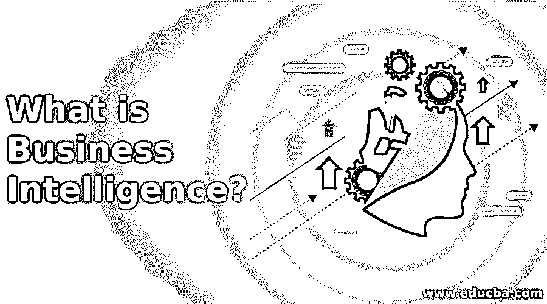

# 什么是商业智能？

> 原文：<https://www.educba.com/what-is-business-intelligence/>

## 商业智能简介

商业智能是系统、技术和过程的集合，这些系统、技术和过程将原始数据转化为有益于业务运营的有用的、有价值的信息。它是一个软件和服务套件，将数据转化为实用的智能和知识。BI 直接影响公司的政治、战术和组织决策。商业信息促进基于事实的决策，而不是使用历史数据的结论或福祉。术语 BI 也经常指基于可用信息提供关于企业当前状态的快速、易于理解的信息的若干资源。

### 什么是商业智能？

让我们用一个简单的例子来看看 BI 的重要性。

<small>Hadoop、数据科学、统计学&其他</small>

如果我们[考虑任何电子商务平台](https://www.educba.com/e-commerce-interview-questions/)如 Flipkart 或亚马逊，他们收到来自不同地理位置、年龄组、文化的数百万用户的需求，并有不同的要求。这里的 BI 域帮助公司基于各种数据，如以前的购买、以前的搜索等，实现客户需求。公司可以有效地向用户推荐他的需求。此外，它还允许公司保持其库存符合客户的要求，并实现所需的任何改进。

因此，我们可以推断 BI 列出了战略、有效的决策过程、技术等。，并支持企业制定业务运营决策。BI 将外部获得的数据和公司内部获得的数据结合起来，创建数据分析和报告，并帮助企业做出合理的决策。

### 商业智能如何让工作变得如此简单？

对于任何企业来说，BI 的主要目标都是在公司的智能洞察中构建和分析历史数据，为理性决策提供空间。BI 提供了有关绩效热点的信息，以及针对故障或无效流程的标记。BI 计划可以提供工具来衡量客户行为的活动和趋势，并帮助分配销售和营销战略方面的业务目标。

它还加深了企业对其客户的了解，并提供了提供全面卓越客户体验的机会。BI 提供了识别低效率瓶颈和改进现有业务策略和流程的潜力，从而提高生产力。从企业的角度来看，它旨在通过有效的数据分类、预测建模、销售预测等来加速整个公司的投资回报。

### 你能用商业智能做什么？

BI 可以在任何组织决策过程的战略规划中发挥关键作用，包括绩效进展、定量分析、报告、数据共享和了解客户洞察。BI 包括使用计算技术来识别、分析和预测客户观点。

它可以通过基于[传统客户数据](https://www.educba.com/customer-data/)分析各种参数的活力来帮助高效快速的决策过程，并帮助企业基于绩效指标提出有效的解决方案。它支持数据驱动的决策，以增加客户知识，帮助客户和企业之间的信任和关系的专业发展。此外，BI 消除了手动数据输入和解释的需求，并提供了快速报告功能和数据可视化。

### 使用 BI

使用 BI 工具可以揭示重要的销售信息，从而发现需要改进的痛点，以提高流程的生产率；它有助于我们确定可以降低库存成本的领域，从而帮助我们避免不必要的资源损失。BI 工具还帮助我们利用社交媒体智能来联系现有和潜在客户。

### 商业智能的优势

让我们列举一下 BI 的优势:

*   数据驱动的决策
*   消除浪费
*   发现机会
*   获得关于客户需求的宝贵见解
*   数据可视化功能
*   基准生产率
*   性能管理
*   简化操作

### 所需技能

有效分析和利用商业智能所需的技能如下:

*   数据分析能力是一项必备技能，因为商业智能的整个流程取决于分析师如何分析数据。区分好数据和坏数据的能力是商业智能的一个关键方面。
*   需要解决问题的方法，因为 BI 只会提示性能弱点；然而，分析师需要使用 BI 工具提供的数据驱动决策来确定此类问题的解决方案。
*   领域知识是一个额外的优势；这有助于我们更好地了解客户的需求。
*   良好的沟通和表达技巧。

### 为什么要用 BI？

商业智能帮助企业检测性能热点，并快速适应不断变化的客户需求环境。BI 有助于监控业务趋势并改进战略决策过程。除此之外，商业智能还帮助我们了解客户需求，并根据当前需求保持有效库存。

### 范围

BI 正在成为一项快速发展的功能，每天企业都在使用 BI 工具来增强客户界面。BI 在几乎所有主要领域都有其可行性，因为它涉及到使用遗留数据来增进客户关系。

### 我们为什么需要 BI？

BI 已经成为当前市场的热门话题，因为它结合了数据科学领域的所有现有技术改进，设计了一个 T2 预测建模界面和数据可视化环境，为提高交付管理能力、提高生产力、发现机会、消除浪费、增加客户信任提供了空间。

### 谁是学习 BI 技术的合适受众？

业务分析师和有抱负的客户关系经理是 BI 技术的理想受众，因为这些技术涉及解决问题的机会和以客户为导向的方法，以实现平稳有效的流程。

### 这项技术将如何帮助你的职业发展？

在当今复杂的商业运作世界中，商务智能有助于职业发展；用于研究和创新的时间很少。BI 为公司提供了超越竞争对手的竞争优势，因为客户更有可能转向对问题最有洞察力的解决方案。

### 推荐文章

这是什么是商业智能的指南？在这里，我们讨论了 BI 的工作、范围、技能、职业发展和优势。您也可以浏览我们推荐的其他文章，了解更多信息——

1.  [什么是大数据技术？](https://www.educba.com/what-is-big-data-technology/)
2.  [负债与费用](https://www.educba.com/liability-vs-expense/)
3.  [什么是大数据和 Hadoop？](https://www.educba.com/what-is-big-data-and-hadoop/)
4.  [什么是 SAS？](https://www.educba.com/what-is-sas/)

