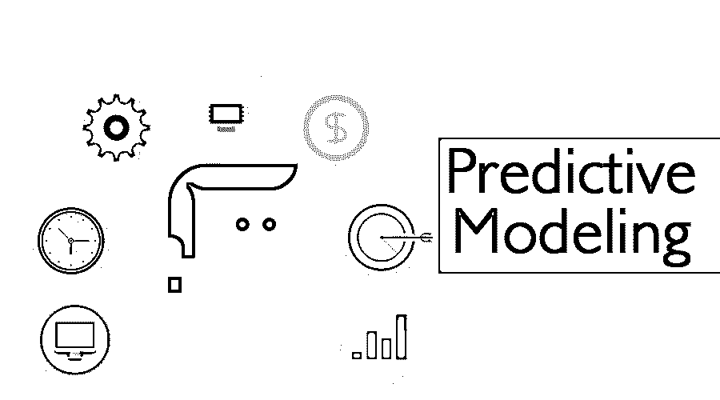

# 预测建模

> 原文：<https://www.educba.com/predictive-modeling/>

## 预测建模简介

预测建模有助于在一组分类问题中确定准确的洞察力，并且还允许在用户中进行预测。为了保持一种精神上的优势，对结果和未来事件的洞察力是非常重要的，这些结果和未来事件会与关键假设相冲突。

分析专家通常使用来自以下来源的数据来构建预测模型:

<small>Hadoop、数据科学、统计学&其他</small>

*   交易日期
*   CRM 数据
*   与客户服务相关的数据
*   调查或民意测验数据
*   经济资料
*   人口统计相关数据
*   通过机器产生的数据
*   关于地域代表性的数据
*   数字营销和广告数据
*   网络流量数据

### 预测建模的类型

有不同类型的回归技术可用于进行预测。

#### 1.描述性分析

与数据相关。例如，一家 Saas 公司在第二季度出售 3，000 个许可证，在第一季度出售 2，000 个许可证。描述性分析对这两个时间段之间的总销售额查询做出响应。

#### 2.诊断分析

描述性分析的原因在于诊断性分析。从上面的例子中，诊断分析进一步处理数据。它还可以预见销售的增加是否是因为销售人员的表现或某个社会的兴趣增加。

#### 3.预测分析

预测分析利用[数据挖掘和机器学习](https://www.educba.com/data-mining-vs-machine-learning/)方法来预测未来。这里的过程包括查看过去的数据和确定未来发生的情况。数据分析师可以根据所需数据构建预测模型。预测分析在很大程度上不同于数据挖掘，因为结论部分聚焦于挖掘这些变量之间的隐藏关系，而前一部分涉及一个模型，以得出一个可能的结果。一家 SaaS 公司可能会对每个地区过去营销支出的销售数据进行建模，以根据营销支出生成潜在收入的预测模型。

#### 4.规定性分析

说明性分析根据预测的结果提出建议。相对于历史数据可以建议行动。

### 建模方法

最广泛使用的预测建模方法如下:

**1。简单线性回归:**提及两个连续变量之间关系的一种统计方法。

**2。多元线性回归:**提及两个以上连续变量之间关系的一种统计方法。

**3。多项式回归:**残差与预测值之间的非线性关系将导致非线性关系。这可以通过[一个多项式回归](https://www.educba.com/polynomial-regression/)模型来实现。

`Y = β0 + β1X +β2X2 + … + βhXh + ϵ`

**4。支持向量回归:**支持向量机是另一种回归方法，它基于所有关键特征来刻画算法。[支持向量回归](https://www.educba.com/support-vector-regression/) (SVR)应用与 SVM 相似的原理进行分类，有一些微小的区别。

**5。决策树回归:**在这些决策树模型中使用树状结构来构建分类或回归相关的算法。在这里，决策树是通过将给定的数据集子集化成更小的块来增量开发的。

**6。朴素贝叶斯:**在机器学习中，它们是简单的概率分类器，通过[应用贝叶斯定理](https://www.educba.com/bayes-theorem/)以及独立假设来预测。

**i.** 朴素贝叶斯代码片段:

**代码:**

`from sklearn.naive_bayes import GaussianNB
classifier1 = GaussianNB()
classifier1.fit(X1_train, y1_train)
# Predicting of the Test set results
y1_pred = classifier1.predict(X1_test)`

预测生产率和库存。此外，可以使用过去的数据来确定生产故障。

**二。**相对于竞争对手的竞争优势，挖掘你拥有的客户数据可以为你提供客户选择竞争对手产品的原因信息；确定这些数据将有助于保持对客户的优势。

**三世。**降低风险和欺诈检测。

**四。**更好地了解客户期望。

更好的营销活动。

### 预测建模的优点和缺点

下面是提到的优点和缺点:

#### 优势:

生产效率的提高使公司能够有效地使用预测建模过程，这意味着统计数据和数据，以预测数据模型的结果。这些模型允许预测从电视收视率到体育、技术进步和公司收益的任何事情。

预测建模的另一种方式称为:

*   预测分析
*   预测分析
*   机器学习

#### 缺点:

*   在理解人类行为时，这些预测模型存在实际差距。
*   决策模型间接权力
*   轮询预测失败

### 结论

虽然被认为是一个数学问题，但预测建模总是公布用户的期望，以计划可能阻止他们获得所需数据的技术和组织障碍。从更大的角度来看，这种技术在数据世界的分析部分非常有用。

### 推荐文章

这是预测建模的指南。在这里，我们讨论类型和建模方法及其优缺点。您也可以浏览我们推荐的其他文章，了解更多信息——

1.  [什么是数据仓库？](https://www.educba.com/what-is-data-warehouse/)
2.  [数据可视化工具](https://www.educba.com/data-visualization-tools/)
3.  [数据科学简介](https://www.educba.com/introduction-to-data-science/)
4.  [大数据职业](https://www.educba.com/careers-in-big-data/)

