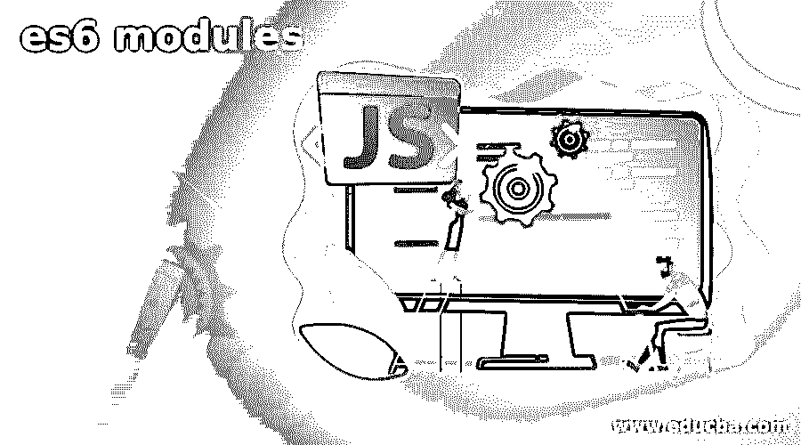
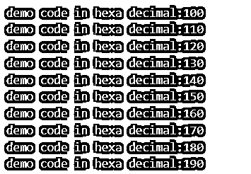
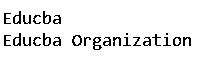
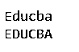

# ES6 模块

> 原文：<https://www.educba.com/es6-modules/>

## ES6 模块简介

ES6 代表 ECMAScript Standard 6thedition，它涉及到向现有的 JavaScript 编程语言添加一系列特性。javascript 中的模块系统有助于灌输目录和文件中可用的特性和代码，同时确保其他人可以根据需要轻松访问一段代码。此外，包管理器帮助安装满足高级依赖的工具和软件。在本文中，我们将大致了解 JavaScript 的 ES6 模块是什么，如何使用它，ES6 中可用的导出，以及 ES6 中模块的分类。

### 什么是 ES6 模块？

ES6 模块由包含 javascript 代码的文件组成。它不包含 module 关键字，也不使用严格的关键字，可以作为简单的脚本文件读取。ES6 模块与通常的脚本文件不同之处在于，默认情况下，严格模式会自动保持开启，我们不需要明确提到这一点。另一个区别是有一个内置的导入和导出模块的功能。

<small>网页开发、编程语言、软件测试&其他</small>

默认情况下，模块中声明的任何内容都是本地和私有的。为了使其公开，我们可以导出该特性，以便其他模块可以使用它。这可以通过使用 export 关键字的简单方法来实现。导出功能可用于顶级函数中包含的类、let、函数、常量或变量。我们可以编写普通的 javascript 代码，包括在全局级别使用的数组和对象，以及与 web 相关的对象，如 XMLHttpRequest 和 document。我们甚至可以在一个单独的文件中使用其他函数，然后将它们导入到模块中使用。

通过添加 import 语句，可以在模块顶部导入所有需要的文件及其函数。当您使用 import 时，所有导入的加载都已完成，然后模块体的执行以深度优先的遍历方式完成，就像依赖图一样。在这样做的时候，如果有任何循环，它们会被避免，并且已经执行的代码会被跳过。

### 如何使用 ES6 模块(代码)

如果您的系统上安装了编译器，如 Babel 或 Traceur，则可以使用 ES6 模块。关于如何使用编译器来使用 ES6 的完整参考和指导，你可以参考这个链接。此外，您可以使用 ES6 术语编写自己的代码，如导入和导出语句、使用 let、var 关键字的变量声明，以及使用一些循环语句，如 for 循环和模板字符串。

让我们考虑这个小代码片段，它使用 ES6 生成器并创建一个名为 createValue 的函数

`Function* createValue(begin, end, incrDecr){
For (var sample = begin; sample < end; sample += incrDecr ){
Yield sample;
}
}
// Using the created function
for( var demo of createValue(100,199,10)){
var educbaDiv = $(‘
’).attr ( ‘class’, ’color’).css({background-color: ‘#${demo}’}).append (‘demo code in hexa decimal: #${demo}’);
content$.append ( educbaDiv);
}
}`

执行代码时打印上述值的输出如下图所示

### 默认导出

我们可以对任何我们想要的对象文字、函数、值或类使用导出默认值。考虑到新标准是为了实现互操作性和现有的 AMD 和 CommonJS 而创建的。假设我们正在处理节点项目，并且我们已经使用 npm install lodash 命令安装了 npm lodash。当我们在 ES6 模块代码中使用它时，我们可以使用 lodash 中的函数，只需使用下面的 import 语句导入它们

`Import {educbaSampleFunc1, educbaSampleFunc2, each} from lodash;`

//使用上面的，导入的函数。

假设你错误地使用了 _。并且希望继续以这种方式使用它，而不是使用 each，或者使用下划线 _ 符号作为函数的名称，因为这在 lodash 中是必需的，那么您可以在 import 语句中做一些小的更改，作为 import _ from lodash，它代表 import default as _ from lodash。

默认情况下，AMD 和 CommonJS 模块存在于 ES6 模块中，并且在默认导出中可用，并且等同于我们通过在模块中使用 require()函数检索的内容，这将产生导出对象。

我们可以在 ES6 模块中同时导出几个东西。然而，只有在 CommonJS 的情况下，我们才得到默认的导出。

如果你需要在你的 ES6 模块中有你自己的默认导出，那么这很容易。你只需要导出你在程序中创建的变量或对象作为默认的东西。例如，参考下面的代码片段

`Let educbaObj = {
SampleField : sampleValue,
educbaField:educbaValue
}
Export { educbaObj  as default};`

或者上面的代码片段也有一个快捷方式，下面的替代代码片段也可以用于相同的目的

`Export default {
SampleField : sampleValue,
educbaField:educbaValue
};`

### es6 模块分类

ES6 模块分为两类，如下所述

*   默认导出——当我们只需要从模块中导出一个值时，我们可以使用默认导出。我们只能在一个模块中编写一个默认的导出语句。

让我们考虑一个例子来理解执行默认导出所需的步骤

**第一步—**

我们将创建一个名为 educba.js 的文件，其中包含以下代码

`Let sampleName = ‘Educba’
Let organization = {
getOrganization : function(){
return organization
},
setOrganization : function(updatedName){
organization = updatedName
}
}
Export default organization`

**步骤 2—**

我们将创建一个名为 myOrganization.js 的新文件，并将 educba.js 导入其中。

`Import sample from ‘./educba.js’
Console.log(sample.getOrganization())
Sample.setOrganization(‘Educba Organization’)
Console.log(sample.getOrganization())`

**步骤 3—**

我们现在将执行我们使用 HTML 创建的 es6 模块。我们将创建一个新的 HTML 文件，并提到属性 type ="module。"该文件将如下所示

`<!DOCTYPE html>
<html lang="en">
<head>
<meta charset="UTF-8">
<meta name="viewport" content="width=device-width, initial-scale=1.0">
<meta http-equiv="X-UA-Compatible" content="ie=edge">
<title>Document</title>
</head>
<body>

</body>
</html>`

上述代码的输出如下所示

*   命名导出——它们通过它们的名字来识别，我们可以从一个模块中导出多个命名导出语句。

对于命名导出，也将执行与默认导出相同的步骤。

**第一步—**

创建一个名为 educba.js 的文件

`let organization = "Educba"
let getOrganization = function(){
return organization.toUpperCase()
}
let setOrganization = function(updatedName){
organization = updatedName
}
export {organization,getOrganization,setOrganization}`

**步骤 2—**

创建一个新文件 organization.js

`import {organization,getOrganization} from './educba.js'
console.log(organization)
console.log(getOrganization())`

**步骤 3—**

创建一个 HTML 文件来呈现输出–

`<!DOCTYPE html>
<html lang="en">
<head>
<meta charset="UTF-8">
<meta name="viewport" content="width=device-width, initial-scale=1.0">
<meta http-equiv="X-UA-Compatible" content="ie=edge">
<title>Document</title>
</head>
<body>

</body>
</html>`

上述代码的输出是-

### 结论

我们可以使用 ES6 模块来扩展 javascript 编程语言的功能，并在模块中导入和导出组件。例如，我们可以通过在 ES6 模块中导出循环、变量、let 和 var 语句来利用这些功能。

### 推荐文章

这是 es6 模块的指南。这里我们讨论 JavaScript 的 ES6 模块，如何使用它，ES6 中可用的导出，以及分类。您也可以看看以下文章，了解更多信息–

1.  [JavaScript 模块](https://www.educba.com/javascript-modules/)
2.  [torch.nn 模块](https://www.educba.com/torch-dot-nn-module/)
3.  [可变服务模块](https://www.educba.com/ansible-service-module/)
4.  [可转换的窗口模块](https://www.educba.com/ansible-windows-modules/)

