# 分析软件

> 原文：<https://www.educba.com/analytics-software/>

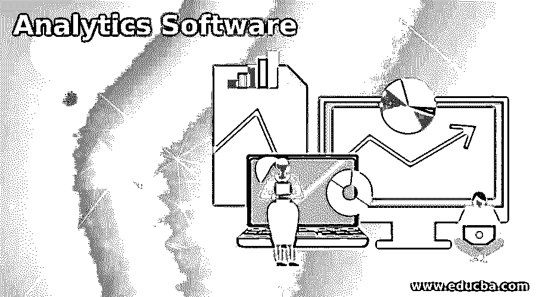

## 分析软件简介

**商业分析软件—**商业分析软件是世界上最受欢迎的软件。这个商业分析软件提供了营销人员发展业务所需的所有信息。商业分析软件也帮助商业人士优化他们的业务策略。

你可能知道它有很棒的功能。这是最好的分析应用程序之一，但在开始最大限度地使用它之前，只需知道在谷歌分析中有一些秘密途径可以发现。

<small>Hadoop、数据科学、统计学&其他</small>

从分析软件中，你可以得到一大堆可能让你感到困惑的统计数据。所以首先你要知道要去哪里，要找什么，要比较什么。如果使用正确的分析软件是一个伟大的工具，以改善您的网站，并增加您的转化率。

### 分析软件示例

这里有几个分析软件对你隐藏的例子，它们更令人困惑和矛盾。

1.  #### Domestic transportation

谷歌分析软件会告诉你有多少人访问你的网站，他们在你的网站上花了多少时间。作为网站所有者，您可能每天都会访问您的网站一次或多次。但是如果你有很多员工经常访问你的网站，那么这件事就是一个需要处理的大问题。Google Analytics 向您隐藏了一个事实，即访问者的统计数据和他们产生的其他数据不包括网站所有者、网站管理员、公司员工和其他经常访问您网站的人。如果这样的事情发生了，想想你的跳出率会有什么变化。

为了避免这样的事情，你可以包括一个需要从谷歌分析排除的 IP 地址。这可以通过下面这个简单的步骤来完成

去你的网站。点击配置文件设置–过滤器–新建过滤器

为您的过滤器提供一个名称，并从下拉框中选择排除选项，然后输入您需要排除的 IP 地址。

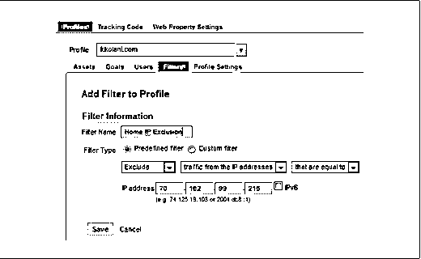

如果你不确定你的 IP 地址，那么你可以使用谷歌来找到它。如果你想排除一个 IP 地址范围，那么你可以使用 IP 地址范围工具。输入范围内的第一个和最后一个 IP 地址。下图清楚地显示了这一点。

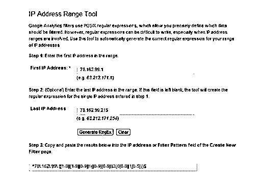

2.  #### Direct flow

下一个缺失的信息是[直接流量](https://www.educba.com/website-traffic/)。您可以通过以下方式前往指挥交通

流量来源–来源–所有流量(直接或无)

这是不从社交媒体、[搜索引擎](https://www.educba.com/popular-search-engines/)或任何引用的 URL 获得的流量。

站点通过以下方式获得直接流量

*   在浏览器的地址栏中直接键入网站 URL
*   当您的站点在浏览器的书签部分被加入书签时
*   当用户点击电子邮件或文档中的任何链接时
*   当从另一个与您的站点有非活动链接的站点访问该站点时。无效链接意味着它必须被复制并粘贴到浏览器的地址栏中
*   具有不允许引用 URL 传递到另一个网站的安全设置的人

直接流量的行为可以被谷歌分析跟踪，但你不会知道你从哪里得到这些流量。谷歌分析中也有其他流量类型。

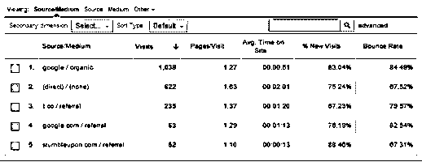

让流量直接流向你的网站没什么好处

*   它产生较小的跳出率
*   更长的平均现场时间
*   目标达成率越高

3.  #### Mobile traffic

谷歌分析让你知道关于移动用户的各种信息。它也给你关于移动和非移动用户的数据。

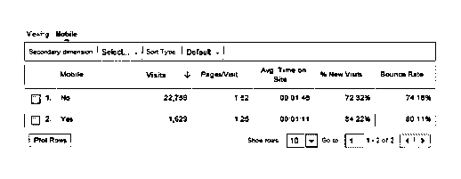

谷歌分析还允许你查看特定移动设备用户的信息。

谷歌分析不会给你一个大量设备的完整画面。它也无法跟踪移动设备的最新版本。但是 Google [Analytics 可以告诉你](https://www.educba.com/blogging-insights-your-analytics-can-tell-you/)所用移动设备的屏幕分辨率。

谷歌分析不跟踪来自[移动应用](https://www.educba.com/testing-of-mobile-application/)的流量。

4.  #### Private browsing traffic

现在大多数流行的浏览器都提供了使用隐私浏览的选项。如果用户使用隐私浏览选项，那么他们在网站上的活动将不会被任何工具跟踪，包括谷歌分析。

谷歌还为其用户提供一个插件，叫做谷歌分析选择退出浏览器插件。这个插件将保护用户，防止他们的数据被谷歌分析使用。要使用此附加组件，用户必须在其浏览器中下载并安装该附加组件。该插件也适用于其他浏览器，包括 Internet Explorer、Chrome、Firefox、Safari 和 Opera。

也有很多其他插件可用于特定浏览器，以阻止各种分析软件跟踪。所以通过这种方法，Google Analytics 肯定会漏掉一些数据。

5.  #### keyword flow

谷歌分析最近改变了它的算法。由于这种变化，有机搜索中的关键字数据会丢失。可以通过流量来源-来源-搜索-有机搜索去有机搜索

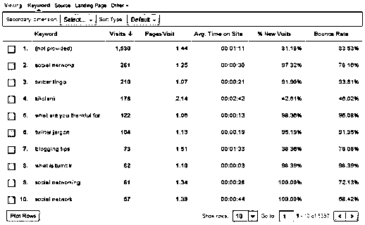

这一变化改变了用户通过谷歌搜索的方式。如果一个用户在登录他的账户时通过谷歌搜索，那么谷歌会认为他是在 SSL 模式下搜索。当用户通过这种方法进行搜索时，分析工具将无法看到用户用来搜索的关键词。这种方法为用户提供了更多的隐私。

谷歌做出这样的改变主要是为了保护用户隐私。但是，如果这些登录用户点击付费广告，那么它将显示在谷歌分析。

即使数据不能被谷歌分析网站管理员访问，但它仍然被跟踪。你可以查看你的网页历史来了解你的搜索行为，这是由谷歌收集的。

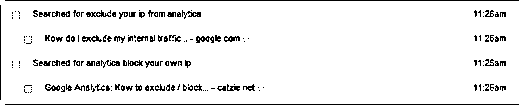

### 如何获取谷歌分析软件中隐藏的关键词？

未提供的关键字是没有推荐数据的关键字。推荐数据是一个告诉你从哪里来的流量被引导到你的网站。关键词推荐数据有两种——一种是有机关键词推荐数据，另一种是付费关键词推荐数据。

有机关键词推荐数据告诉你当一个人点击谷歌中的搜索引擎列表时。

谷歌提供了一个选项来隐藏 2011 年的有机关键词推荐数据。谷歌这样做是为了提供用户隐私和安全。

如果有机关键词推荐数据被搜索引擎隐藏，那么任何分析工具都无法跟踪它。谷歌分析将在其有机搜索流量报告中的关键词位置显示“未提供”。

但是还有其他方法来发现这样的关键词。下面列出了使用的方法

1.  #### Use Google Webmaster Tool

[谷歌站长工具](https://developers.google.com/)可以提供一些谷歌分析不会显示的关键词。这对你肯定有帮助。

2.  #### Enable website search

设置站点搜索将帮助你知道浏览器在你站点的搜索框中输入了什么。要激活此功能，请转到查看设置à站点搜索设置à跟踪站点搜索。网站搜索设置对话框如下图所示

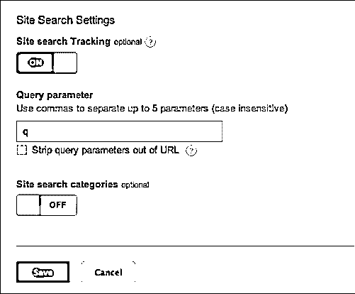

完成此对话框后，进入行为-网站搜索-搜索词，查看访问者在您的网站上搜索了什么。

3.  [T0】 Bing keyword data

Bing 并不被认为是最好的谷歌，因为与谷歌相比，它没有获得那么多的流量。但是它分享所有与你的网站流量相关的信息。

4.  #### Google Keyword Planner

谷歌已经停止了曾经用来做关键词研究的关键词工具。但是，你仍然可以使用谷歌关键词规划器来获得关键词推荐。要使用此选项，您需要创建一个 Adwords 帐户。创建一个 Adwords 账户非常简单。只需使用您的 Gmail 帐户并设置您的时区。

登录后找到关键字规划遵循提到的路径

转到工具和分析-关键字规划。关键词规划器会给你四个选项如下

*   搜索新的关键字和广告组创意-如果您选择此选项，您将看到如下图所示的对话框

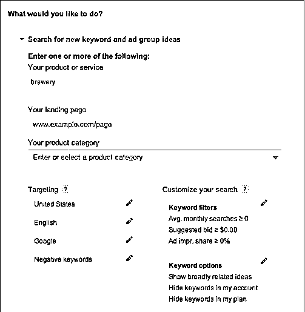

*   获取关键字列表的搜索量
*   获取关键字列表的流量估计
*   多个关键字列表，以获得新的关键字想法

5.  #### Google related search

谷歌会在搜索引擎结果页(SERPs)的底部提供一些推荐的搜索。这是找到相关关键词最简单快捷的方法之一。一个额外的优势是，相关的搜索已经在搜索引擎中流行，这就是为什么他们会显示在那里。所以这些搜索会增加你的流量。

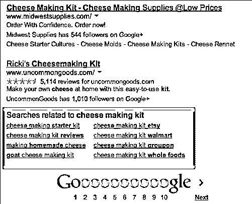

6.  #### Google Trends

品牌监控和话题创意——Google trend 是一款用于品牌监控的工具。你可以输入你的品牌名称来查看对你的企业的搜索。您还可以比较搜索结果。热门搜索将显示最近几天的热门搜索。

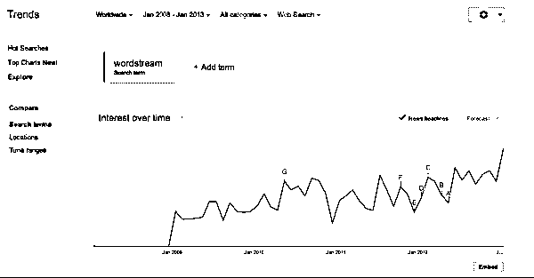

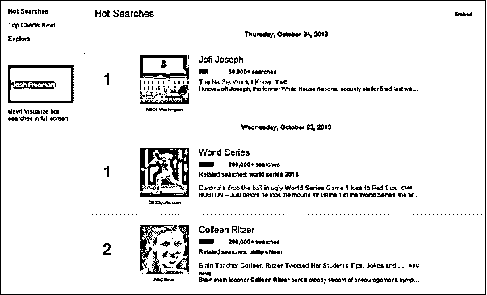

谷歌趋势中另一个有用的部分是“排行榜”。这一部分显示了最流行的搜索词类别。

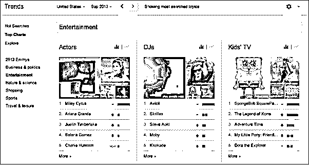

7.  #### Add PPC 【T1]

如果你在 Google Adwords 上使用付费广告，你可以获得隐藏关键词列表。谷歌分析称，他们出于隐私目的隐藏数据，但这种“未提供”的关键词通过 PPC 提供给付费用户。所以由此你可以理解，Adwords 用户可以充分利用关键词，而其他人则不能。PPC 的优势列举如下

*   用户从所有来源获得关键词流量数据
*   如今付费广告被赋予了更多的重要性
*   由于其广告扩展，谷歌已经开始更多地关注 PPC。所以显然你也应该开始关注点击付费。

8.  #### Create good content, and forget the keyword ideas

当然，你的大脑是最强大的分析工具。没有哪个搜索引擎能比你更了解你的受众。所以不用担心“未提供”这个关键词。继续相信会有新技术出现来克服这个问题。

**在没有关键词推荐数据的情况下有效使用有机搜索活动**

分析数据可以针对搜索活动进行优化，以找出“未提供”的关键词。因此，事实证明，我们也可以在没有关键词推荐数据的情况下生存，但这不会那么容易。以下是进行有机关键词搜索活动的步骤

**第一步**–进行关键词研究

**第二步**–为你通过关键词研究收集到的关键词开发内容

**第 3 步**–为这些关键词开发产品登陆页面

**第 4 步**–跟踪你的目标关键词的有机搜索排名

**第 5 步**–衡量页面的性能，而不是衡量关键词的性能。你可以使用谷歌分析中的页面价值指标来实现这一点。

页面价值=(产生的电子商务总收入+页面实现的目标的总价值)/转换前页面的独特浏览量。

**第 6 步**–如果您的登录页面表现不佳，您可以使用“登录页面优化选项”对其进行优化，以便进行转换

6.  #### Social media

谷歌分析通过它的高级功能将帮助你了解哪些社交媒体为你的网站带来了更多的流量。你也可以比较社交媒体流量和其他推荐流量。有几个应用软件 [Bitly](https://bitly.com/) 、[、Hootsuite、](https://www.hootsuite.com/)和其他软件会向你展示你在社交媒体网站上提供的链接的点击率数据。当你将这些数据与谷歌分析数据进行比较时，你会大吃一惊。因为数据不会匹配，Google Analytics 会将这些数据用于移动应用流量、直接流量或私人浏览产生的流量。

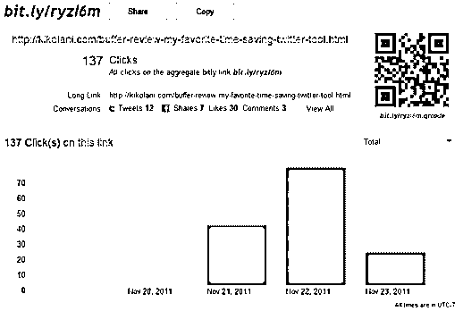

### 结论

因此，你应该充分理解这个概念，成为谷歌分析专家。希望这篇文章能帮助你获得关于分析的隐藏事实的知识。

### 推荐文章

这是分析软件的指南。这里我们讨论了基本概念，例子，如何获得谷歌分析软件中隐藏的关键字？.您可以阅读以下文章了解更多信息——

1.  [数据分析技术](https://www.educba.com/data-analytics-technique/)
2.  [网络分析工具](https://www.educba.com/web-analytics-tools/)
3.  [如何使用 Google Analytics？](https://www.educba.com/how-to-use-google-analytics/)
4.  [大数据分析](https://www.educba.com/big-data-analytics/)

