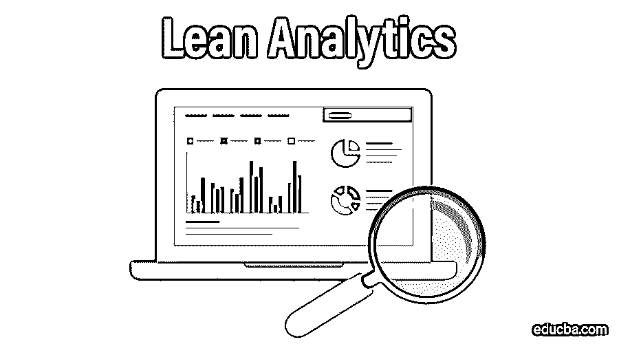
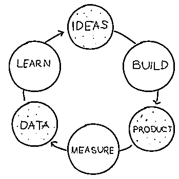
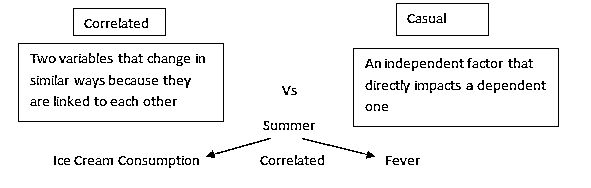
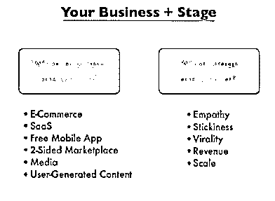
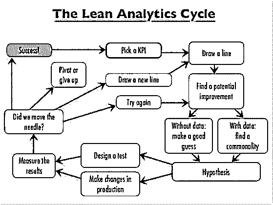

# 精益分析

> 原文：<https://www.educba.com/lean-analytics/>

## 什么是精益分析？

精益分析是精益创业方法的一部分，由三个要素组成——构建、测量和学习。这三个要素构成了产品开发的精益分析周期。这强调快速构建 MVP(最小可行产品)。借助精益分析的精确测量，您可以做出更明智的决策。

精益分析公司的主要目标应该是在短时间内最大限度地学习。使用精益分析的结果将是一个更加有效和敏捷的公司。

<small>Hadoop、数据科学、统计学&其他</small>

精益分析是精益创业方法的一个子类，只涵盖了周期的测量和学习部分。这意味着没有适当的测量，你不能做出任何决定。在应用这种方法之前，公司应该清楚地知道什么应该被跟踪，为什么应该被跟踪，以及用于跟踪的技术是什么。精益分析周期如下图所示。

### 认可一个好的度量标准

正如我们所知，精益分析周期是对既定目标的衡量。因此，一旦你确定了你的商业目标，你就需要知道实现目标的衡量标准。好的度量标准有几个特征。下面列出了它。

**1。可比的**–一个好的指标应该能够进行比较。使用您的指标，您应该能够回答以下问题

*   前一年或前一个月的指标如何？
*   你的转化率在提高吗？

使用群组分析可以最好地跟踪转化率。

**2。可理解的**–指标不应该更复杂或更复杂。每个人都应该很容易理解，这样他们就可以知道指标衡量的是什么。

**3。比率或比率**–指标中不应使用绝对数字。如果任何事情都用百分比来表示，那么在此基础上进行比较并做出决定会好得多。

**4。适应性**–好的指标应该改变你的业务变化的方式。如果指标在移动，而你不知道移动的原因，那么这不是一个好的指标。它应该一直跟着你走。

### 度量的类型

有两种类型的指标——定性和定量

定性方法是指与客户直接接触，例如，客户访谈和反馈。它为指标提供了详细的知识

量化是指标的数字形式。这种方法将帮助你向顾客提问。

定性的东西可以定量证明。

在定性和定量方法下，有虚荣和可操作的度量。

*   虚荣心指标不会改变你关注的行为
*   可操作的指标将会改变您所关注的行为
*   报告指标将帮助您了解您的企业在日常活动中的表现
*   探索性指标将帮助你发现你的业务中未被发现的事实
*   滞后指标会给你组织的详细历史
*   领先指标将帮助您做出未来预测

公司流失是滞后指标的一个例子。因为它会告诉您在特定时间段内取消订单的客户数量。客户投诉可能是主要指标，因为您可以预测客户的反应。

### 线索分析中的相关性和因果关系

对于任何企业来说，区分相关关系和因果关系是非常重要的。

例如，冰淇淋消费可能与发烧有关。吃冰淇淋的人越多，发烧的几率就越大。我们也不能得出只有冰淇淋会引起发烧的结论。这是因为发烧也可能因季节而发生，这也与冰淇淋的消费有关。发烧大多发生在夏季，这是人们吃更多冰淇淋的季节。这是一个相关性和偶然性交汇的点。

当我们说两件事是相关的，那么它意味着两个变量的变化相等，就像上面例子中的冰淇淋和发烧。这里的一个偶然因素是夏季，因为它们直接影响另外两个因变量，冰淇淋和发烧。这是因为夏季更容易吃冰淇淋和发烧。

相关性有助于预测未来，它会告诉你将要发生什么。

伤亡是一种超能力，它将帮助你改变未来

这个过程是这样的

*   找到数据中的相关性
*   伤亡测试
*   找到伤亡因素后，进行优化

### 精益分析框架

精益分析框架将帮助你找出你所处的业务和你的业务阶段。你的商业模式应该考虑顾客和他们的购买过程。在构建商业模式之前，你应该问自己几个问题，比如

*   顾客如何购买你的产品？
*   他们为什么从你这里购买？
*   他们处于您业务的哪个阶段？
*   你的客户的预算是多少？

不要复制别人的商业模式。构建自己的商业模式。你的商业模式应该最适合你的客户。下面给出的是代表商业模式的图片。

### 精益分析阶段

在精益分析阶段，公司需要通过一些关卡才能进入下一个阶段。

下图展示了精益分析的五个阶段及其关口。

*   在第一个精益分析阶段，你需要找出人们正在寻找解决方案的问题。这个阶段对于 [B2B 业务](https://www.educba.com/business-to-business-b2b/)更为关键。如果你已经发现了这样的问题，那么你就可以进入下一个阶段了。
*   在精益分析的第二个阶段，粘性，你应该为早期用户创造一个 MVP 产品。在这个阶段，你的目标应该是用户参与和保持。当人们开始使用你的产品时，你会发现这一点。你也可以从用户停留在你的网站上的时间来了解他们的参与度和保持度。如果用户停留的时间很长，那么就证明你提供了他们需要的东西。在这之后，你可以把它传递到下一个阶段，病毒式传播。
*   在第三个精益分析阶段，你需要以最具成本效益的方式获得更多客户。一旦你得到了客户，你就可以进入下一个阶段，收入。
*   在第四个精益分析阶段，您可以专注于计算您的收入，也可以做经济学工作。您可以专注于优化收入，并可以计算 LTV:CAC 比率。LTV 意味着从一个客户那里期望的收入，而 CAC 意味着获得该客户所涉及的成本。这个比率可以通过 LTV 除以 CAC 得到。如果 LTV 是你的 CAC 的三倍，你可以假设你的利润是好的。现在，计算完你的收入后，你可以进入最后一个阶段，规模。
*   在这个精益分析阶段，你可以采取必要的行动来发展你的业务。你可以制定计划，在哪些方面更加专注，以便[增加业务](https://www.educba.com/marketing-strategies-plan/)的增长并扩大业务。

### 一个重要的指标(OMTM)

仅仅了解度量标准是不够的。您应该知道在业务的哪个阶段使用哪个指标。焦点是精益分析的重要资源。如果你将你的注意力分散在不同的指标上，那么你将被引导到学习的前面。每个阶段都需要一个你需要努力的特定指标。在做了研究之后，选择一个度量标准并确定你的目标。你可以通过研究竞争对手的战略和基准来确定目标。

例如，一家公司的衡量标准是客户流失率。他们的目标是将流失率保持在 4%以下。所以如果流失率小于等于 4%，就说明他们的目标达到了。如果流失率超过 4%，那么就意味着公司出现了问题，他们需要采取措施降低流失率。

因此，要建立一个有竞争力的企业，你和你的整个公司应该专注于一个重要的指标(OMTM)。

### 精益分析周期

上图代表了精益分析周期。这一过程包括四个主要步骤，下面将详细讨论

#### 1.找出需要改进的地方

你应该先了解你的业务，因为精益分析周期不会在这方面帮助你。你应该知道你的业务的重要方面，应该知道在哪些方面需要改变。

在这第一步，精益分析周期需要其他商人的帮助，找出你的指标。精益分析周期将有助于找到与您的业务相关的指标。你也可以根据你的商业模式找出一个衡量标准。

选择一个指标并将其连接到 KPI(关键绩效指标)后。例如，如果您的 KPI 是购买您产品的人数，那么指标就是转换率。

因此，第一件事是写下三个重要的业务指标，以及您需要为每个指标衡量的 KPI。

#### 2.形成假设

这是你需要更有创造力的阶段。假设给你的答案是“如果我执行 _____，我相信 _____ 会发生，结果会是 ____”

这是你需要灵感的阶段。你可以通过两种方式找到答案

一件事是当你有数据时，另一件事是当你没有数据时

如果你有数据，那么你可以很容易地找出是什么导致了这种差异。

如果你没有数据，那么你可以尝试不同的东西。例如，你可以研究市场、做调查、使用竞争对手的策略、遵循最佳实践等等。

底线是假设将通过提问或理解他们的行为来帮助你在观众的心目中占有一席之地。

#### 3.进行实验

在构建了一个假设之后，现在你需要将它转化为一个实验。为此，你需要问自己三个问题

*   你的目标受众是谁？–你希望谁来做事？他们是合适的观众类型吗？你如何能联系到他们？
*   你希望他们做什么？–观众是否理解你希望他们做什么？对他们来说容易做吗？有多少人表现出了你的期待？
*   你为什么认为他们应该这样做？–你是否在激励观众去做事？你的哪种策略最适合你？他们在为你的竞争对手做事吗？

这三个问题将帮助你[更深入地了解你的客户](https://www.educba.com/customer-support/)。精益分析阶段被称为客户开发。

创建一个实验可以用一句话来定义，比如

“世卫组织会做什么，因为什么，为了提高您的 KPI，以实现既定的目标”

如果你有一个伟大的假设，那么你就可以创造一个好的实验。

因此，一旦你有了一个实验，建立你的精益分析来衡量关键绩效指标。然后继续你的实验。

#### 4.衡量你的结果并决定做什么

在这个精益分析阶段，你可以知道实验的结果。

*   如果实验成功，那么您的指标就完成了。找出下一个要使用的指标。
*   如果实验失败了，那么你需要修改你的假设。此外，尝试找出失败的原因。
*   如果实验偏离了既定的目标，那么你需要定义一个新的实验。你可以有同样的假设，只是对你的实验做些改变。

所以这个过程是聪明的，快速的，迭代的。它可以用简单的词来定义——识别、假设、测试，最后做出反应。

### 结论

希望这篇文章能帮助你学习精益分析的基础知识，这将有助于你发展和扩大你的业务。今天就开始吧

### 相关文章

在本文中，我们讨论了如何使用精益分析原则来建立一个强大的公司，以及优点和缺点。你也可以阅读精益分析周期和阶段-

1.  [5 个精益工具整合成 6 个适马](https://www.educba.com/six-sigma-concepts/)
2.  [6 个精彩的精益制造工具和技术(最新)](https://www.educba.com/lean-manufacturing-tools-techniques/)

