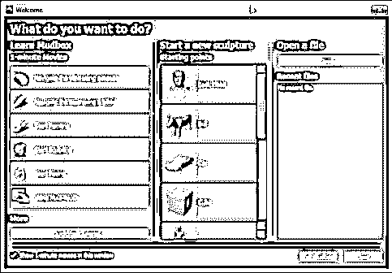
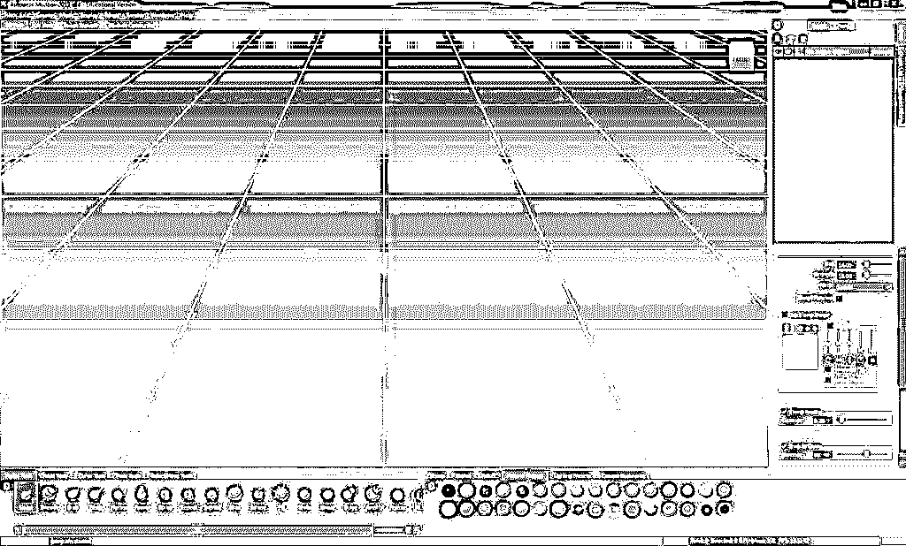
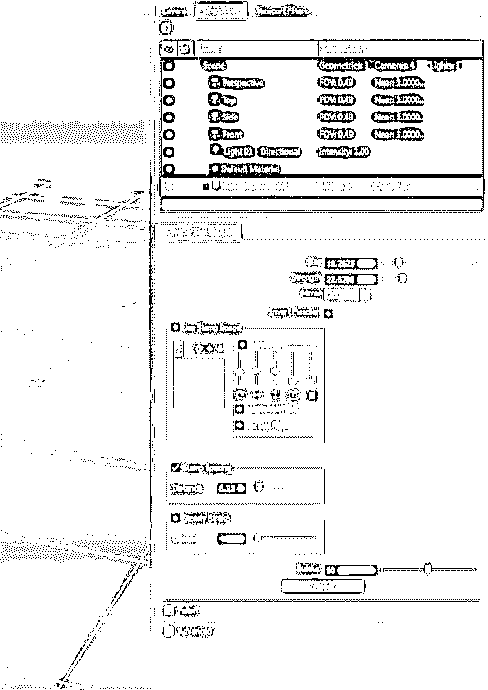
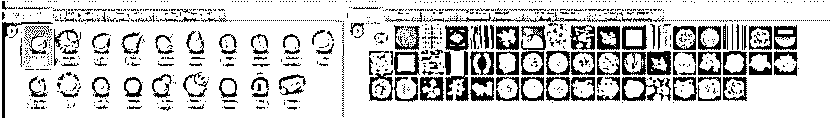
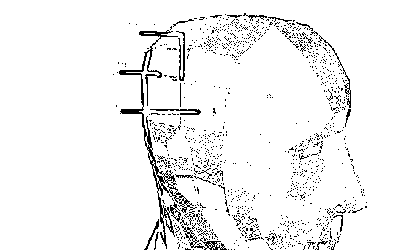
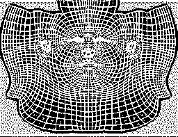
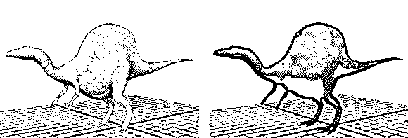
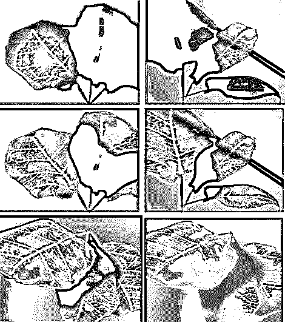
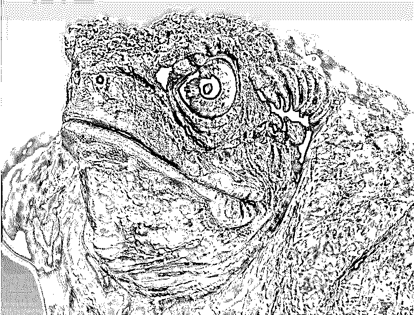

# Mudbox 软件

> 原文：<https://www.educba.com/mudbox-software/>

## Mudbox 软件简介

数字雕塑是一个平台，让你有能力创造出你想象之外的任何东西。Mudbox 软件是一个功能强大的应用程序，可以帮助您以前所未有的简单和引人入胜的方式建模、绘画、雕塑和创建环境。与市场竞争对手 ZBrush 相比，这款软件有利有弊。但是，Mudbox 软件界面易于访问，并且与 [Maya](https://www.educba.com/course/maya-3d-modeling-series-module-4-create-complete-character/) 具有强大的兼容性和工作流程。

这篇文章旨在给出一个关于 Mudbox 软件的重要元素的整体概念。初学者和想要成为数字雕刻家的人将利用这篇文章来选择如何开始他们的 Mudbox 软件之旅。我们希望这篇文章能激发你学习 Mudbox 软件和数字雕刻的兴趣。

<small>Hadoop、数据科学、统计学&其他</small>

### Mudbox 软件入门

让我们开始使用 mudbox 软件。

#### 1.Autodesk Mudbox 软件的硬件和软件要求

*   **显卡**

这是一个综合性的三维和数字雕刻平台。为了满足软件的要求，您的计算机应该有适当的配置。的配置列表的更新副本可在 [Autodesk 网站](https://www.educba.com/autodesk-vs-autocad/)上获得。

使用它需要有一个认证的显卡，因为该软件使用 OpenGL 作为其渲染引擎。经过认证的 Nvidia Quadro 或任何型号都可以帮助您提高机器的性能。

*   **内存**

决定机器性能的下一个重要方面是内存。它在细分模式下处理复杂的 3D 对象。在处理实时雕刻和高分辨率 3D 模型时，您的机器应该将数据保存在内存中，这一点很重要。虽然要求可能提到 2GB，但为了增强体验，建议使用 4GB 到 16 GB 之间的内存。

您应该仔细研究的另一个重要要求是足够的硬盘空间来处理大文件。最后，你可能需要一个类似 Wacom 的平板电脑来改善你的雕刻细节。

#### 2.Mudbox 工具工作流程

它被用于生产流水线的各个阶段。它用于快速雕刻概念设计，绘画和设计角色和属性，雕刻动画的混合形状，等等。

它也可以作为一个独立的应用程序，用它你可以开始从原始设计到雕塑的高级渲染。然而，许多工作室在制作流程中使用该软件来满足雕刻和绘画需求。

#### 3.Mudbox 用户界面

它很受欢迎，因为它易于访问的界面，这是令人鼓舞的习惯，也便于更快的工作流程。当你打开软件的时候，你会发现欢迎屏幕上有各种各样的元素供你使用。该欢迎屏幕的目的因用户的熟练程度而异。如果你是初学者，有一分钟的教程电影让你熟悉软件的基本原理。如果您以前有过使用 Maya 或 3DS Max 软件的经验，您将会熟悉 Mudbox 工具的一些基础知识。

建议初学者浏览一下 Mudbox 为你准备的电影列表。对于其他人来说，欢迎板有助于快速浏览您正在处理的文件。

#### 4.主视窗

一旦你看完电影，或者选择用一个新文件开始你的项目，或者打开一个现有的文件，你将到达主视口，在那里剩下的工作将继续进行。

像往常一样，菜单栏位于屏幕的顶部，在这里您可以访问软件中的每个功能和工具。状态栏位于屏幕底部，通过它可以找到关于场景、当前动作、工具和错误消息的信息。

视口可以进一步调整为多种模式，如平视显示、3D 视图等等。在处理特定任务时，每个视图都具有同等的重要性。例如，如果您正在从[开始处理一个模型，或者开始](https://www.educba.com/scratch-programming-examples/)雕刻一个导入的模型。您可能喜欢在 3D 视图上工作，因为它为设计用途提供了最大的空间，并减少了与其他工具共享屏幕空间的混乱。然而，初学者需要更多的时间来适应 3D 视窗，因为他们必须掌握在这个屏幕上使用热键。

#### 5.东框架窗

在 Mudbox 工具中，东框架窗口在平滑工作流方面起着重要作用。它分为两个部分，其中部分又分为多个选项卡。

东框窗的顶部分为

*   **层标签:**用于创建和管理绘画和雕刻层。

*   **对象列表标签:**它包含了从 3D 对象、材质、灯光和摄像机开始的场景中每个对象的列表。您可以从该列表中轻松选择和管理工具，而不会感到困惑。

*   **视口过滤器选项卡:**它控制 3D 视图的渲染外观。

东框架窗口的底部有属性窗口，显示选定对象或工具的属性。

#### 6.南框架托盘

它包含预设、书签、工具、图章、模板，这些在雕刻和设计一个对象时都很有用。默认情况下，它的托盘中装有许多物品。但是也可以通过添加和省略来创建自己的项目列表。

按住鼠标中键的同时拖动托盘上的现有项目可以重新排列它们，或者在使用手写笔的情况下使用后退按钮。

南部框架再次细分为两个部分。在它的左边，你会找到你的工具，在右边，有模板库。通过向四个方向移动分隔符，您可以轻松管理两个部分之间的空间。

*   **工具托盘:**你可以访问雕刻工具、绘画工具、姿势工具，从这里选择[移动工具](https://www.educba.com/move-tool-in-photoshop/)

*   **库托盘:**你可以从这个部分访问图章，模板，衰减，材质预设，灯光预设，相机书签。

#### 7.Mudbox 偏好设置

对话框是另一个重要的部分，用来改变你的 Mudbox 软件的外观和行为。如果你习惯于根据自己的方便转换软件，深入查看首选项对话框是很重要的。

您可以通过首选项自定义视口的外观，默认情况下您想要的线框级别，更改颜色设置，绘制，渲染等等。

#### 8.雕刻

无论你将在 Mudbox 工具中学习什么样的雕刻水平。你应该从一个基础网格开始，要么在 Mudbox 中创建，要么从其他 3D 软件中导入。多边形基础网格通常被认为是雕刻和动画制作的最佳模型。下面的工具将帮助你了解在 Mudbox 中创建一个好的 3D 对象应该学习哪些工具。

**基础网格**

网格的基本组件从一个简单的顶点开始，通过连接到另一个顶点形成一条边。这些边相互连接形成面。在 Mudbox 工具中，这些面最少可以有三条边，最多可以有 16 条边。

Mudbox 工具可以处理所有类型的网格模型，如三角形、四边形、极点、N 边形。但是，始终建议创建一个四边面(四边形)网格，以支持管道每个阶段下的清晰子划分和更简单的工作流程。

#### 9.UV 布局

u，V 是在多边形的二维坐标上排列的点的名称。它用于附加纹理贴图或绘制 3D 对象。

从复杂的多边形模型中提取 UV 坐标，并展开成平面 UV 图。在提取 UV 坐标时，应该确保网格内没有重叠部分。然后，应该按照纹理要求展开和切割顶点。

3D 雕刻软件可以直接在网格上绘制，而不需要在这个级别提取 UV。这些地图可以在以后通过导入到 [Maya 或其他 3D 软件](https://www.educba.com/maya-vs-inca/)应用程序中来创建。

#### 10.命名和组织您的模型

3D 生产流水线是一个庞大的过程，涉及许多阶段和成百上千的人。无论您正在处理的是哪一级别的管道，以一种其他部门可以容易地识别您的模型元素的方式创建您的模型部分是至关重要的。除此之外，命名和正确组织您的模型可以帮助您节省大量时间，并使您的工作变得容易。

在这种情况下，您可以通过双击对象列表中的几何体名称并给它一个新名称来轻松命名您的对象。如果你从 [Maya 软件](https://www.educba.com/maya-vs-houdini/)导入一个现有的网格，你可以选择将你给模型起的名字导入 Mudbox 软件。

从 Maya 中，选择“文件>导出选择选项”中的“启用组”选项。

#### 11.肌理绘画

Photoshop 多年来一直是领先的纹理绘制软件。它提供了广泛的画笔、效果和遮罩功能，有助于获得超逼真和高质量的纹理效果。

但这个过程的问题是，艺术家必须从 3D 平台转移到 2D 平台才能获得结果。此外，工作流程并不是一个无缝的体验，因为你必须一次又一次地在 Photoshop 和 3D 软件之间保存和检查 3D 模型的更新。虽然软件很复杂，但工作流程一直是个问题。

Mudbox 提供了直接在 3D 对象上绘制纹理的优势。除了高端数字雕刻功能，它还配备了极其有用的纹理绘制功能。

不需要像 Photoshop 这样的 UV 贴图和绘画软件，你可以直接开始跨越 UV 接缝在你的模型上绘制模型。该过程是实时的，当您在模型上绘画时，可以立即看到结果。这是一个巨大的时间节省，并给艺术家很大的控制和创造性的优势。-

#### 12.材质着色器

世界上的每个物体都有材质阴影。大理石、木材、玻璃、人的皮肤每一样东西都有它独特的遮光材料和它的特性。3D 软件基于数学算法开发着色器。在大多数情况下，它允许用户使用现有的基础着色创建新的着色器。

类似地，Mudbox 有四个着色器，用户可以将它们应用于材质。它们是 Mudbox 材质，简单 Blinn，CgFX，光照球体。由于 Mudbox 不是一个高端的纹理和着色软件，你不能创建复杂的着色网络，也没有高度复杂的加载着色器。但是 Mudbox 材质着色器可以用于几乎每个对象，使其看起来很好。该软件的另一个优点是实时显示着色结果。

#### 13.数字雕刻

**了解数码雕刻**

数字雕刻将 3D 行业的现实范围推向了一个新的高度。为了达到令人兴奋的效果，你应该有一台我们在本文开始时讨论过的高端电脑。除此之外，你可以通过以下几个方面的知识来获得对数字雕塑的正确理解

*   美术背景
*   人体和动物解剖学观察
*   雕刻或泥塑

如果你不知道以上任何一个，你可以选择开始你的研究，或者在网上或艺术学院上一些课。这些研究的影响肯定会显示出它们对你的数字雕塑的影响，并最终通过你的高质量作品表现出来。

**在你造型之前做好计划**

有时候，你可能会直接点击电脑，找到一个好主意来设计和塑造你的角色。但这种情况很少见，你不能指望每次都发生。创造力需要更多的滋养才能变得更好。同样，在开始研究模型之前，你应该给你的大脑提供更多的研究信息。查看游戏角色、照片，阅读书籍寻找灵感和想法，画草图，看电影，做任何你认为可以帮助你和启发你的事情。

#### 14.重要工具和属性

雕刻 Mudbox 是一个过程，涉及到许多工具，功能，画笔和方法。由于实际上不可能列出你可以在数字雕刻中使用的所有工具，我们给你一个工具和属性的列表，你应该集中精力来掌握这个过程。

*   尺寸和强度
*   反转功能
*   快捷键
*   压降曲线
*   镜像几何图形
*   邮票图像和邮票间距
*   稳定冲程
*   积聚和泛滥
*   更新平面和整个笔划
*   雕刻工具

这就引出了本文的结论。我们试图向你介绍复杂的数字雕刻软件，并给予我们真诚的努力，带你通过最重要的部分，可以帮助你开始学习 Mudbox 软件。

### 推荐文章

这是一个 Mudbox 软件的指南。在这里，我们已经讨论了 Mudbox 软件的基本概念和 14 个重要元素，并给出了详细的解释。您也可以阅读以下文章，了解更多信息——

1.  [Mudbox vs Zbrush](https://www.educba.com/mudbox-vs-zbrush/)
2.  [Maya vs 3Ds Max](https://www.educba.com/maya-vs-3ds-max/)
3.  [玛雅 vs 搅拌机](https://www.educba.com/maya-vs-blender/)
4.  [AutoCAD 和 AutoCAD LT](https://www.educba.com/autocad-vs-autocad-lt/)

