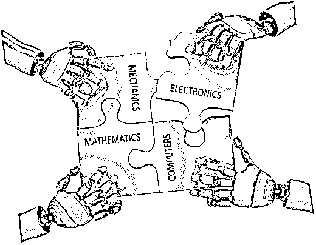
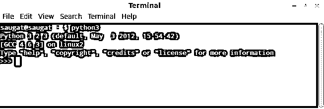
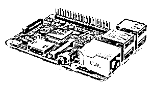

# 机电一体化项目

> 原文：<https://www.educba.com/mechatronics-projects/>

 

## 机电一体化项目介绍

是的，你没看错。这不是拼写错误。当我开始学习这个的时候，我甚至不知道有这样一个术语存在。仅仅是为了它，我曾经告诉人们我是一个机电一体化工程师，人们曾经大笑，因为这到底意味着什么？后来我发现这是一个真实的词，我是对的。那么，到底什么是机电一体化项目呢？它与其他工程术语有什么关系，成为机电一体化工程师需要什么？让我们一个接一个地完成这一步。

### 机电一体化项目有哪些？

我将用我以前简单的术语来定义它。机电一体化项目只是多个东西的组合。你不需要一个学位或任何证书。它是当你用纯知识发展你的技能，并从不同领域培养多种技能的经验。迷茫？让我搞清楚。

<small>Hadoop、数据科学、统计学&其他</small>

在我的大学时代，我想成为一名程序员。一个纯粹的程序员。我开始学 C，C++，然后是 Python，Haskell，Scheme 编程等等。但后来才知道，这些只是说明。代码是一个简单的指令，说明某样东西应该如何工作。但是如果没有合适的工具，或者正确的说法应该是硬件。因此，没有合适的硬件，它根本就不会工作。举例来说，如果我正在建造一架四轴直升机，如果我只是用 C++编写代码来控制网卡，它就不能工作。你需要知道转子如何工作，它们以什么速度开始运转，你是否需要一个步进电机或高速电机。有计算。现在你可能会想，我正在走向机器人工程领域。但这是不对的。机电一体化项目是电子、机械、黑客、编码、数学和类似东西的结合。不胜枚举。简而言之，它是你所学一切的结合。

### 如何入门？

这是一个我一直在等待回答的问题。机电一体化项目不是你可以从 5 级或 10 级级或其他级别开始学习的东西。对此没有年龄限制。但既然我们都不是托马斯·爱迪生或爱因斯坦，让我们看看如何从机电一体化基础开始。

最好的起点是学习 Python，然后买一台能遵循你的代码集的微型计算机。像英特尔或 AMD 这样的现代计算机和处理器可能会很难。这就是我要求从微处理器开始的原因。即使在购买微处理器之前，我也建议你学习一下 Linux 及其命令。主要原因是因为在 Linux 中开始使用要容易得多。此外，Linux 是你唯一的选择，因为它在各种平台上非常容易移植，除非你可以在 ARM 架构上移植任何版本的 Microsoft Windows，我想你不知道，因为我们在这里谈论的是初学者的努力。嘘！那是一个很长的句子。

让我为你把这变得更简单。以下是我将在本博客中进一步讨论的主题，以便你至少掌握 Linux、Python 和微处理器的基础知识。现在，如果你想知道从哪里可以得到这个微处理器，你不需要担心从你的旧电脑上拆下来。市场上有很多出售微处理器的公司。但是今天我们会更关注树莓 Pi 2。所以，以下是今天的主题:

1.  Linux 基础知识
2.  用于 LED 配置的 Python basic
3.  树莓派

### Linux 基础知识

因此，为了让您入门，我建议您下载一个 Linux 发行版，并在虚拟机上使用它。VBOX 或 VMWare 等虚拟机可以虚拟化您的计算机，您可以在其中使用两个操作系统。人们推荐的最简单的 Linux 发行版是 Ubuntu，但是我宁愿不支持他们。对于一个初学者来说，我会推荐下载 Linux Mint。Ubuntu 的当前版本是 15.10，Mint 是 17.2 拉斐拉。你可以下载其中任何一个。两者都有庞大的社区，而且非常稳定。唯一的问题是，如果你有一个图形卡，你可能会遇到 Ubuntu 与 Unity 的故障诊断问题。Linux Mint 的基础有点类似于 GNOME 3 桌面环境，现在被称为 Cinnamon。所以回到我们的主题，一旦你安装了这些，下面是一些你需要知道的命令，这样你就可以在 Linux 环境中动手了。

| **命令** | **用途** |
| 限位开关（Limit Switch） | 查看当前目录的内容 |
| 激光唱片 | 更改目录 |
| 显示当前工作目录 | 查看当前目录 |
| cp，mv | 复制或移动某物 |
| rm, rmdir | 删除文件或目录 |
| 猫 | 读取文件内容 |
| 毫微；纤（10 的负九次方） | 在终端中打开文本编辑器 |
| 须藤 | 获得超级用户权限 |
| 因此 | 获得 root 访问权限 |
| 光盘。 | 向上移动一个目录 |
| 顶端 | 显示 CPU 和内存使用情况 |
| 地图 | 扫描端口、操作系统和服务 |
| 嘘 | 通过隧道访问另一台机器 |
| 可做文件内的字符串查找 | 搜索纯文本数据 |

这些只是一些基本的。当然，您也可以通过图形用户界面来完成所有这些操作，但是这些操作非常快，而且当您使用 ssh 时，您将无法使用 GUI，除非您有 VNC 连接。一旦有了这些命令，就可以继续下面的 Python 部分了。

### Python 基础

一旦你有了以上基础，你就可以直接安装 python 了。你也可以在 Mac 或者 Windows 上安装它，但是因为我们在这里使用 Linux，安装它非常容易。只需键入:

$sudo apt-get 安装 python3

(注意:$符号表示终端。实际键入命令时不要使用它)

一旦你安装了它，你可以简单地在你的 Linux 终端输入 python3 来启动它。最有可能的是，你甚至不需要安装它。大多数 Linux 发行版都预装了 Python 3.4 或最新版本。

以下是 Python 的基础知识，您可以开始在终端中输入。运行在 Linux 终端的 Python 看起来是这样的:

 

如果你得到 3 个像上面那样的箭头，那么你可以开始输入下面的命令:

> > >打印(“Hello world”)

它在终端打印出 Hello world。

>>>3+4

它将在终端中打印出 7

> > >进口 XYZ

它将导入 XYZ 模块

> > >来自 XYZ ABC 进口公司

它将从 ABC 模块导入 XYZ

(注:ABC 和 XYZ 仅供参考。您需要插入一个特定的模块名来让它工作)

> > >如果为真:

打印(“真”)

否则:

打印(“假”)

这将检查条件是否为真，如果是，那么它将把语句打印为真，否则它将打印为假。

现在让我们编写一段简单的可移植代码。在 Linux 的任何文本编辑器中写这个，例如:Gedit 或 Leafpad，并保存为文本文件

#!/usr/bin/python

print("欢迎使用 Python 编程")

在这里，您可以用任何名称保存它，只要确保您将扩展名更改为。py。完成后，在终端中键入，

$chmod +x test file.py

Chmod +x 将更改权限并使其可执行。只是要确保你是在正确的目录下，否则它会给你一个错误没有发现。例如，如果测试文件. py 在桌面上，您可以输入以下内容。

$chmod +x /Desktop/test file.py

完成后，您可以通过键入以下命令来运行该文件:

$。测试档案

这将在您的终端上打印语句“欢迎使用 Python 编程”。您甚至可以双击它并执行它，而无需再次进入终端。你可以在任何一台 Linux 电脑上使用它。您只需在您使用的任何一台计算机上运行 chmod 命令。您也可以使用命令提示符在 windows 中运行它，或者使用 SourceForge 上的 py2exe 软件将它转换为 testfile.exe。py“文件也是”。请执行。

就是这样。您现在知道如何使用 python 了。

### 微型计算机–树莓派

现在，对于微型计算机部分，您需要购买树莓 Pi。确保你购买的是最新的。截至我写这篇博客的时候，最新的一个是树莓派 2。看起来是这样的:

 

*图片来源:pixabay.com*

它有 4 个 USB 端口，一个 microSD 卡插槽，支持高达 64 GB 的 10 类 emmc。它由 900 MHz 处理器组成，到目前为止，我已经通过使用 3 个铜散热器将其超频到 1.2 GHz。它有大约 1 千兆字节的内存，40 个 GPIO 引脚，完全支持 HDMI，3.5 毫米音频-视频插孔，一个摄像头接口和显示接口，图形处理单元是 Videocore IV 3D。如果你问我，这对于在其中运行任何 Linux 发行版都绰绰有余。

默认情况下，如果您购买整个套件，它包括一个 10 级 microSD 卡，预装 NOOBS。使用 noobs，你可以安装内置的 Raspbian 操作系统。据我尝试，你可以安装包括 Android KitKat 在内的几乎任何操作系统。然而，也有其他的微型计算机，但我更喜欢覆盆子。一旦安装了 Raspbian，您就可以启动 python(默认情况下再次安装),并开始摆弄 GPIO 引脚和几个 led，这非常有趣。如需了解更多信息，您可以随时访问 GitHub 和 raspberry pi 官方页面[www.raspberrypi.org](https://www.raspberrypi.org)获取博客、机电一体化项目和更新。

所以，我认为这将是你在机电一体化基础领域的开始。关于你能用这些东西做什么，你的想象力是无限的。一旦你掌握了这些东西，我会推荐你去看一看 Arduino 板，如果你打算在这方面包括机电一体化项目和机器人，它也很有趣。

第一张图片来源:pixabay.com

### 推荐文章

这是机电一体化项目指南。这里我们分别从 Linux 和 python 的基础开始讨论基本概念，如何入门。您也可以浏览我们推荐的其他文章，了解更多信息——

1.  [方案编程语言](https://www.educba.com/scheme-programming-language/)
2.  [软件工程师职业](https://www.educba.com/careers-as-a-software-engineer/)
3.  [机器学习领域的职业](https://www.educba.com/careers-in-machine-learning/)
4.  [机器学习 vs 神经网络](https://www.educba.com/machine-learning-vs-neural-network/)

