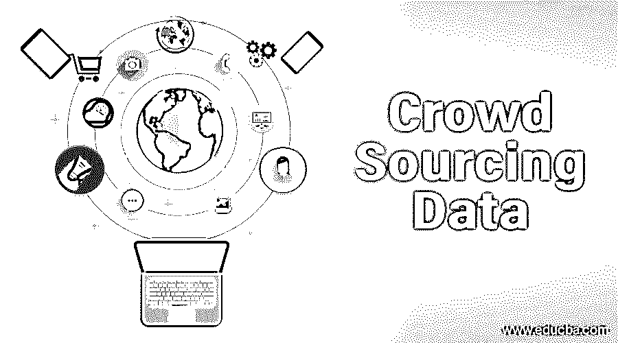

# 众包数据

> 原文：<https://www.educba.com/crowdsourcing-data/>

## **什么是众包数据？**

很久以前[企业创造想法](https://www.educba.com/internet-based-business-ideas/)，推出产品或服务，并在市场上推出。成功与否取决于消费者对它的接受程度。也许，为了强调消费者或用户的力量,《时代》杂志将“你”选为 2006 年度人物。这是为了表彰数百万匿名为维基百科、脸书、YouTube、网站和博客提供丰富内容的用户。

开源软件运动也相信用户可以通过向任何愿意使用它的人免费提供源代码来使用操作系统内核和应用程序。Linux 也是这场全球用户协作运动的受益者。这给微软视窗等专有操作系统带来了巨大的挑战。

<small>Hadoop、数据科学、统计学&其他</small>

它继续证明，企业已经认识到全球消费者或用户的集体智慧，以获得创意，创建内容，开发新产品或流程，或将部分工作外包给一大群人。“众包”一词是由《连线》杂志的特约编辑杰夫·豪在 2006 年 6 月创造的。

### 众包数据内容的成功

这里有一些通过众包数据内容获得成功的方法，进行新的研究，开发新的想法，外包工作和提高生产力。

#### 1.你的目标必须是众包数据友好的

如果你想产生新的想法，公司内部必须定义你想要达到的目标和结果。例如，如果许多消费者关注座椅设计和高度，那么目标就是确定最合适的设计，以及每种型号的座椅应该放置在什么高度。由于更好的或符合人体工程学的座椅设计，结果应该是更多的销售。

并不是所有的问题都可以通过众包数据解决，尤其是当有如此多的组件或复杂性与。洗碗机托盘的新设计可能比要求人们重新设计它的马达更容易。

#### 2.慈善始于家庭，向内看以获得灵感

很多时候，公司未能挖掘组织内部的潜在潜力，无论是内容创意、产品创意和研究建议，还是改进现有产品或流程。通过这种方式，可以创建一个知识库，以便与最高管理层共享。

如果使用电子邮件分享和转发的传统方法，可能会导致繁琐的程序和跟踪困难。现在有几个应用程序可用，其中一些是免费的，如知识管理模板，可用于创建内部和外部的内容。这些应用程序是可定制的，对高利贷者友好。斯莱克，155 和 LearnCore。后者使员工能够创建带有评估问题的课程，使公司的内容创建者能够为博客和文章提出新的想法。

#### 3.挖掘客户的创新想法

许多公司与他们的客户保持联系，以获得对他们的产品和服务的反馈，但这种沟通也可以用来获得他们对他们可能感兴趣的新服务或产品的看法。

与其直接问一个他们可能感兴趣的话题，不如举行一次调查，了解他们的痛点。反过来，这将对产品开发以及[集客营销](https://www.educba.com/inbound-marketing-strategy/)产生影响——你可以获得关于新博客文章、文章和其他内容的想法。使调查易于完成和提交。

保持[沟通渠道](https://www.educba.com/different-methods-of-communication/)的畅通，只有这样，他们才能被告知他们的想法的实施进度或他们需要更多支持的领域。除非向客户展示他们如何从分享想法中受益，否则他们可能不会有兴趣参与众包项目。

**推荐课程**

*   [品牌在线认证课程](https://www.educba.com/course/brand-management-courses/)
*   [促销认证培训](https://www.educba.com/marketing/courses/market-research-course/)

#### 4.与商业伙伴合作

商业伙伴可以是原材料供应商、营销伙伴或公共关系顾问。他们可能是公司想法和思想的主要来源，因为他们非常熟悉这个行业，知道市场的脉搏。他们也对你的业务发展有浓厚的兴趣，因为他们也会从中获益。营销人员可以从客户反馈中找出产品的弱点，或者了解更多我们的服务未能解决的客户痛点，从而开发新产品或流程。

#### 5.创建一个收集想法的网站

有时是为了接触更多的受众，包括行业利益相关者、消费者、专家和匿名人士。对于这样的倡议，拥有一个网站可能是正确的策略。消费品、IT 行业、玩具、服装、食品等几个行业已经凭借[众包数据](https://www.educba.com/crowdsourcing-marketing/)取得了成功。

一家电气产品制造商为其利益相关者(电工、发明家和承包商)创建了一个网站，以贡献他们的想法和创新。领先的玩具品牌美泰(Mattel)和乐高(Lego)已经使用微型网站收集如何制作新玩具和设计的想法。美泰公司报告称，尽管该调查仅针对儿童，但计算机工程师芭比和女主播芭比获得了大量儿童、男性和女性的投票，位居榜首。

IT 公司也可以使用专门的网站来获得新的网页设计，服装公司可以获得新的图案或设计。在网页设计中，99design 是一个例子，而在服装设计中，Threadless。不仅仅是新的设计或产品创意可以从众包工具中产生，甚至[营销和广告创意](https://www.educba.com/advertising-techniques/)都可以发生。最好的例子是福特 2013 款福克斯 st 的电视广告。该车进行了特技演示，并要求观众提交活动视频。最终的广告基于该公司收到的数千个视频片段。

#### 6.利用社交媒体接触大量受众

随着社交媒体的日益流行——[Twitter](https://twitter.com/?lang=en)、[脸书](https://www.facebook.com/)、 [Linkedin](https://www.linkedin.com/) 、 [Pinterest](https://www.pinterest.com/) 、Google +，现在可以在这些平台上更有效地进行众包数据。

Dunkin Donuts 能够通过“创造 Dunkin 的下一个甜甜圈”创造新产品，邀请粉丝设计他们自己最喜欢的糕点。他们在 Coolatta 上跟进，要求粉丝们识别哪些歌曲适合 Coolatta 口味。它帮助该公司在 FB 上创造了超过 30 万粉丝，并创建了一个专门播放 Coolatta 音乐的 Pandora 频道。

2010 年，可口可乐有效地利用其食品与饮料页面创造了一种新口味的维生素水，名为“连接”。超过 40，000 名 FB 用户提交了他们的设计和口味，参加了游戏和问答比赛。可口可乐还提供众包工具来设计和开发新产品。这有助于他们创造自己热爱的东西。这些例子证明了社交媒体在众包数据、新想法和设计方面的有效性。

Twitter 可以在很多方面提供帮助——网络广告公司总裁兼首席执行官霍利斯·托马斯。vantage 通过创建一个标签 HollisTwitterArmy，每天花一个小时写《Twitter 营销》这本书，向对分享案例研究感兴趣的人寻求帮助。这有助于她获得有价值的信息并按时完成项目。她说，研究众包项目、调查、健康试验患者的识别都可以通过 Twitter 完成。

对于一家公司来说，从通过 Linkedin 或脸书提交的申请中筛选出最佳人才可能是个问题。如果几个人力资源专家像 NotchUp 一样分析这些条目并创建 50 个最佳个人资料会怎么样。这是在 1200 名星探的帮助下实现的。

除了社交媒体之外，还有很多讨论网站，如 Quora、雅虎问答或 Linkedin Answers，上面有许多观众提出的问题和与之相关的答案。这种论坛使公司知道消费者有兴趣了解什么，以及如何得到回答。许多与健康、职业、教育、消费品、财富创造、投资、融资、技术相关的话题都在这样的论坛上得到讨论，让行业了解全球数百万人的痛点。

#### 7.激励措施可能有助于众包数据

如果没有激励措施，众包数据可能不会产生太大的反响。但如果有金钱奖励，它不应该太低，虽然更高的金额可能会使其具有竞争力，但 3 万至 5 万美元的奖励就足够了。有时，许多大公司宣布设计一个标志的奖励，建议一个新的品牌名称或产品名称。在这里，激励不应该显得太低或太高，以劝阻参与者。此外，锻炼的持续时间也很重要，比如 30-45 天。如果提交的最后日期太远，人们可能会推迟或忘记提交他们的作品。

#### 8.衡量众包项目的影响

有时，脸书邀请参加竞赛或发送产品改进建议可能不会涉及巨额成本，但会耗费时间和精力来分析提交的内容和结果。

最终，该计划应导致新产品或服务的开发，并对底线产生影响。

#### 9.微任务更好

一个大的任务可以被分解成几个易于管理的部分，以便几个人合作。如果有 500 个主题要写和编辑，那么几百个人每人得到一点激励会产生更好的结果。众包数据对于成千上万需要标题的照片来说是有效的。你会在哪里找到最大的鸟类记录收藏——国家公园、国家地理、探索频道还是鸟类保护区？它位于 Xeno-Canto，一个分享鸟类记录的在线平台。它开始于 2005 年的一个小项目，收集南美鸟类的记录。他们都是由 VU 大学的数学生物学家 Bob Planque 众包的

#### 10.利用众包工具获得客户反馈

没有适当的客户反馈，任何公司都无法进步。一些公司，如 getting Satisfaction，提供众包工具，通过发布问题、关注点和评论来吸引客户，并回复调查。在线调查众包工具帮助公司将其整合到社交媒体中。这使得能够以可承受的成本实时共享反馈和可操作的报告。以创造性的方式与客户接触有助于提高客户满意度，并有助于提高利润。

### 结论

众包数据是一种有效的方式，通常通过互联网寻求大量受众的帮助，以收集关于如何解决公司问题的信息，产生新的想法和创新。随着社交媒体的普及，现在可以以更低的成本接触到大量受众。有很多[人群分享](http://mindsharing.info/locales/)平台可以获得各种领域的新想法——比如 IT、金融、健康、布料设计、玩具等等。Fiverr.com 帮助人们写简历或求职信，只需 5 美元，而 iStockPhoto.com 帮助摄影师在网上出售他们的照片，并为客户提供各种主题和话题的摄影选择。就连大学学习的题目也在一个名为 Source Hero 的平台上众包了。

众包工具不是用来解决高度技术性和复杂的问题的，因为它们不能由没有太多贡献动力的人群来完成。人群不在你的工资单上，他们不能被操纵或控制。然而，DuPont 和 Eli Lily 利用在线研究和技术专家解决了困扰他们很长时间的 R& D 问题。它可以提高公司的生产力和创造力。

一些学术众包项目也通过众包数据进行，如谢菲尔德大学的 Tim Birkhead 所做的海鸟研究。众包数据还可以用于为某项事业筹集资金(众筹)，分享劳动力或专业知识。

对于一家习惯于自上而下方法的传统公司来说，转移到一个共享思想的平台可能会涉及一个重大的文化变革。众包项目是基于人多力量大的原则。不管业务需求如何，众包平台上总会有一个可用的解决方案。

### 推荐文章

这是众包数据的指南。这里我们讨论了一些通过众包数据内容获得成功的方法。您也可以看看以下课程，了解更多信息——

1.  [外包如何降低成本](https://www.educba.com/how-does-outsourcing-reduce-cost/)
2.  [促销类型|策略](https://www.educba.com/sales-promotion-types/)
3.  工作中的快乐！
4.  [数据仓库](https://www.educba.com/data-warehousing/)

