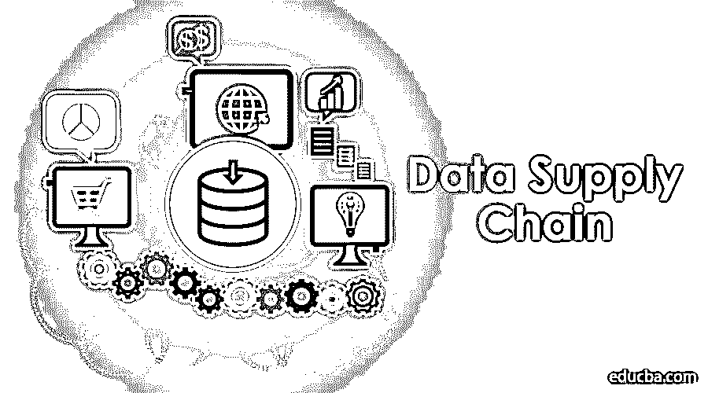
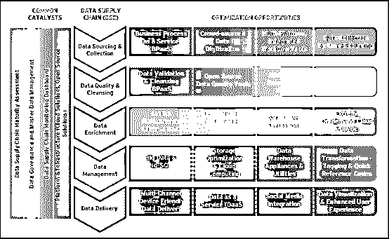

# 数据供应链

> 原文：<https://www.educba.com/data-supply-chain/>

## 数据供应链简介

数据已经成为企业最大的资产。数据越大，处理起来就越复杂。管理和分析数据并从数据中获得理想的业务理解变得更加困难。主要目标是使商业人士能够基于对巨大数据集的分析做出更好的决策。如果数据流不正确，那么企业将无法从数据中获得最大收益。数据应该很容易在组织及其生态系统中流动。因此，创建一个数据供应链，使数据朝着业务目标运行，并创建一个环境来帮助实现这些目标，这一点非常重要。

### 什么是数据供应链？

大数据供应链是一个过程，通过这个过程，某些东西进入组织，经历转变，并成为可供人们使用的有价值的东西。

<small>Hadoop、数据科学、统计学&其他</small>

它也与任何其他供应链一样，从系统的一端输入数据，然后在下一步使用分析进行转换。最后，它是作为一组关于组织的有用见解交付的，可用于业务的任何进一步改进。供应链分析师将进入组织的数据来自各种来源，如网站、社交网络、移动应用、博客、CRM 等。更多的是和数据的标准化有关。

### 利益

主要优势如下所列

*   优化运营效率
*   提高业务灵活性
*   减少数据延迟
*   易于容纳新的数据源
*   可调整以处理未来的大量数据
*   提高数据质量，同时满足客户需求
*   它有助于发现数据作为资产的新的货币化模式
*   快速处理数据
*   通过帮助他们做出更好的决策来增加公司的收入。
*   增强客户关系

### 为什么构建大数据供应链更重要？

下面提到一些重要性:

#### 数据的质量比数量更重要。

这是提高任何组织效率的最简单的方法。因此，公司应该始终关注数据的质量，并找到更多可以获得高质量数据的来源。

#### 更多的数据非常重要。

许多公司都在寻找更多的数据。除此之外，公司还应该尝试创建自己的数据。创建新的数据源对公司来说是一大优势。

#### 专注于你的商业目标

最重要的是，公司的所有人，从职员到 CIO，都应该知道业务目标。数据应该面向业务目标。大数据供应链将有助于做到这一点。

#### 数据的广泛使用

从各种来源获得的大数据供应链应在组织内得到正确使用。为此，公司不得不使用各种策略和技术。

### 成分

重要组件如下所示。

*   **数据来源和收集**——这包括业务流程即服务、业务流程外包和[众包](https://www.educba.com/crowdsourcing-marketing/)。众包被认为是传统外包方法的替代品。这里的人群是指有共同兴趣的人。他们为了组织的利益共享解决方案，这被称为众包者。
*   **数据质量和清理**–高质量的数据是提高用户体验的非常宝贵的资产。为了改善这种体验，公司应该使用定制的解决方案和供应商来提供最佳结果。数据质量即服务(DQaaS)必须构成数据质量的主要部分，因为它遵循集中式方法。开源工具最适合处理杂乱的数据集。
*   **数据丰富**–使用 Hadoop 等大数据工具，数据丰富组件可以更快地处理数据，并提供更快更好的结果。
*   **数据管理**–高级数据仓库特性超越了传统数据仓库，提供了成功的商业智能。它们既简单又实惠。像 HDFS 和其他开源集群文件系统可以解决数据供应链的一些最大的挑战。
*   **数据交付**–数据交付包括数据可视化、数据库分类、社交媒体集成、用户友好型数据交付和数据即服务(DaaS)

### 数据供应链分析师

Data supply chain analyst 是现代数据供应链流程的架构。如果方法得当，数据供应链分析师将让公司利用更多的数据源，并在很大程度上改进数据发现。数据供应链分析师将帮助组织面对三大局限。我们将在数据供应链分析师主题下对其进行讨论:

#### 活动

为了深入了解数据，企业需要从各种来源获取数据，然后使用适当的处理和存储系统。移动数据时，不应该丢失哪怕是一个数据，而加速有助于做到这一点。它为组织带来准确的数据，并确保可以快速处理这些数据。

#### 处理

数据的处理主要取决于数据的数量和类型。组织将期望系统比以往更快地对数据进行计算。数据供应链分析师技术将有助于预处理收到的数据，并将数据与组织的现有数据进行整合，以帮助做出更明智的决策。数据加速通过改进硬件和软件组件来帮助快速处理数据，并帮助提高效率。

#### 交互性

交互性意味着数据的可用性。有许多解决方案可以帮助从给定的查询中获得预期的结果。现在有了新的编程语言来支持这些系统。数据加速有助于用户弥合基础设施和应用程序之间的鸿沟。这也有助于快速传递查询结果。

### 打造链条的 5 个步骤

这里列出了建立一个链的 5 个步骤。

#### 1.数据服务平台

创建数据供应链的第一步也是最重要的一步是，首先选择一个数据服务平台，帮助公司在需要时轻松访问各种来源的数据。通过这个数据平台，用户可以直接访问大量数据。数据平台可以从供应商处购买。它可以是单一的数据平台，也可以是不同厂商提供的各种平台的组合。

如今，也有独立的数据平台帮助从一个特定的来源获取数据。但是所有这些平台都通过一个通用的标准访问协议工作。最近，许多组织已经开始使用 API 管理平台。

#### 2.加速供应链中的数据传输

这个过程的下一步是整合来自不同来源的数据。过去，公司会区分经常使用的信息和不太相关的数据。相关性较高的数据存储在高性能系统中，相关性较低的数据存储在性能较低的系统中。但是现在，组织可以提高数据的速度。组织中的人员可以快速访问数据，这有助于从数据中获得更多知识。

#### 3.推进数据发现

传统的 BI 方法需要从数据科学家或数据分析专业人员那里获得更多细节，以获得规定业务问题的答案。但是现在，因为有了数据发现工具，甚至在公司开始质疑之前，他们就能辨别出自己的问题，这些问题是公司在详细了解数据后预计会出现的。

#### 4.实现数据价值

数据供应链的最后阶段已经转变，现在可以共享和访问。公司可以更好地理解数据，并从中获得知识。他们可以根据数据做出决定。为了增加数据的价值，可以与公司的供应商、合作伙伴和客户共享数据。

#### 5.认知计算

认知计算是一种方法，在这种方法中，机器被教会利用数据，从中学习，并找出可以用它做什么。数据供应链提供了一个长期的解决方案。在旧的方法中，可以为特定的任务或单个业务案例找到解决方案。但是通过机器学习系统可以从数据中获得更多的知识，就像经验一样，它可以被存储，并且它们可以在未来存在相同情况时使用它。

### 构建更好的数据供应链

拥有捕获、处理、分析和跨供应链分发数据的基础设施的组织将能够管理其库存，而不会失去任何商业机会。现在顾客很难预测。因此，许多企业转向需求驱动的生产。能够识别和响应业务需求的数据供应链将帮助他们实现生产计划、分销模式、确定营销策略等等。

它必须保持简单和完整。数据的一大挑战是访问和分析不同格式和结构的数据，这些数据是在本地应用程序中还是在云中。从长远来看，这是数据分析师面临的最大挑战。数据科学家或数据分析师应该熟悉 SQL，以弥补这些挑战之间的差距，并解决数据中的复杂问题。

供应链决策者也更加依赖高质量的数据。高质量的数据有助于根据可用的准确信息做出明智的决策。组织应该确保供应链决策过程中使用的数据是干净和准确的。为了最大化数据的潜力，供应链领导应该遵循这些简单的步骤。

#### 使用准确、实时的数据。

供应网络的主要因素是数据的一致性。缺乏数据一致性是大多数公司面临的主要问题。获得准确数据的一个重要方法是分析 MRP 数据进入组织的时间。公司还可以使用数据捕获和验证工作流来查找系统中不完整的记录。也可以进行频繁的审计来找出数据中的任何错误。

移动技术有助于增强实时数据并将其与供应网络集成。移动设备可用于随时随地即时发送和接收数据。

#### 消除不必要的数据和流程

不完整和不必要的数据在供应链流程中是浪费时间。公司应该有独立的 AP 自动化解决方案来检查数据进行三方匹配。找出不必要数据的一种方法是评估供应网络中使用多种流程将数据流入集成系统的区域。这将有助于在整个企业中分割不必要的数据，并定期分割有价值的数据。因此，数据将更加一致和可靠，以便做出更好的决策。

#### 集中式数据解决方案

数据供应链网络的主要挑战是每天不断增长的信息量。事实是，更多的数据并不意味着更好的数据。由于[合并](https://www.educba.com/merger-vs-amalgamation/)和收购，数据供应链网络频繁增长。因此，组织必须找到方法来组合来自各种来源和大量供应商的数据。

最好的解决方案是实施一个供应链协作系统，帮助您战略性地查看您的数据。这个视图可以帮助将数据分类到必要的部分，并生成实时信息的报告。

### 结论

数据供应链将是未来几年许多企业关注的焦点。选择数据供应链的正确关键要素和服务将有助于提高生产力，并针对市场的任何变化优化业务。

### 相关文章

这是什么是数据供应链的指南？在这里，我们还将讨论构建数据供应链的 5 个步骤以及优势和组成部分。你也可以阅读大数据供应链-

1.  [供应链管理](https://www.educba.com/supply-chain/)
2.  [数据科学家 vs 数据工程师](https://www.educba.com/data-scientist-vs-data-engineer/)
3.  [数据科学家 vs 业务分析师](https://www.educba.com/data-scientist-vs-business-analyst/)
4.  [数据挖掘 Vs 数据分析](https://www.educba.com/data-mining-vs-data-analysis/)

