# 什么是 Minitab？

> 原文：<https://www.educba.com/what-is-minitab/>

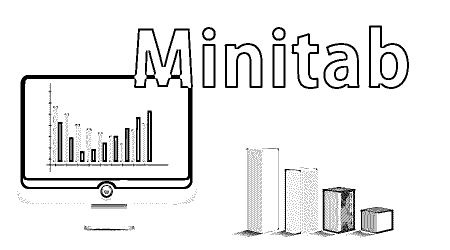

## Minitab 简介

由一些研究人员开发的帮助六西格玛专业人员分析和解释数据以帮助业务流程的统计软件包称为 Minitab。数据输入被简化，以便可以很容易地用于统计分析，它也有助于操纵数据集。如果给出了趋势、模式和图表，就对它们进行分析和解释，从而得出最终结论。答案是给定的，并且这些答案随着给定的产品或服务而被放大，以有助于业务。有了 Minitab 工具，解决问题变得更加简单快捷。

这是一个持续的过程(如下图所示):

<small>Hadoop、数据科学、统计学&其他</small>

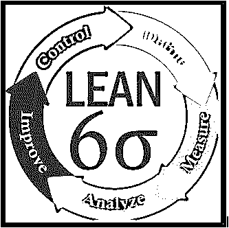

**预计将有六名适马专业人士**:

1.  确定现有流程中的难点。
2.  使用各种工具和数据格式达成最佳解决方案
3.  实施商定的战略。
4.  监控变化。

**它帮助专业人士在**:

1.  简化[统计分析](https://www.educba.com/top-10-free-statistical-analysis-software/)的数据输入
2.  操作数据集
3.  识别趋势和模式
4.  推断产品/服务现有问题的答案

各种元素都是可用的，如散点图、箱线图和直方图，它们共同帮助六西格玛专业人员提供问题的描述性统计。简而言之，使用 Minitab 解决问题变得更容易、更快捷。

### 一个问题出现了:我们不能用 MS excel 吗？为什么我们更需要 Minitab？

1.MS Excel 很擅长汇总和分析数据。您可以执行排序、突出显示等操作。给你。

但是涉及到统计和具体的数学函数，就只能这样选择了。即使是特定于统计上下文的可视化，它也以更好的方式提供。你唯一需要做的就是，提供干净的原始数据，点击几下就能得到漂亮的图表。

例如[帕累托图](https://www.educba.com/pareto-chart-in-tableau/)。在 MS excel 绘图中，这是一个噩梦，但在 Minitab 中，这很容易实现。

2.当您有许多工作表和图表时，在 MS Excel 中会显得杂乱无章。而它有一个“项目管理器”选项，可以帮助你在电子表格、图表和统计输出之间切换。

3.MS Excel 是一个通用工具，可以灵活地用于各种应用程序。然而，它的重点领域是在统计、[假设检验](https://www.educba.com/hypothesis-testing-formula/)、统计可视化等的帮助下临时提高过程/产品/服务的质量。

4.任何想要理解数据或者想要执行一些基本步骤的人都可以使用 MS excels。另一方面，它是一个强大的统计软件包，可以被统计学家或一些分析人员很好地使用。

### Minitab 打开时，通常有三种类型的窗口

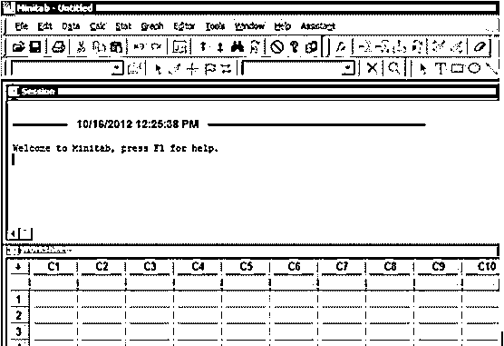

1.  **会话窗口**:这是最顶层的窗口，它将显示您请求的统计分析的输出。
2.  **工作表窗口**:这是底部窗口，在这里数据被复制粘贴到工作表中。
3.  **图形窗口**:这是打开时看不到的窗口类型。这仅在要求绘制某些东西时出现，例如[散点图](https://www.educba.com/scatterplots-in-r/)，直方图等。这是图形窗口。

### Minitab 的主要功能

以下是下面提到的 8 个关键特性:

**1。基本统计**:这个特性涵盖了所有种类的统计测试、描述性统计、相关性和协方差。

统计->基本统计

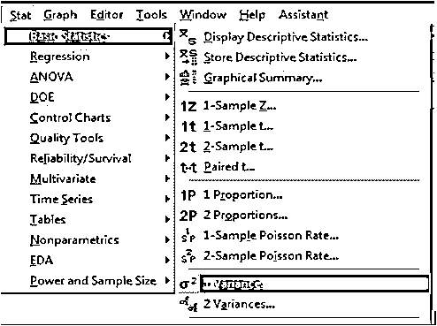

**2。图形**:这使用户能够绘制[各种统计图形](https://www.educba.com/graphs-vs-charts/)，如散点图、直方图、箱线图、矩阵图、边际图、气泡图等。

图形->字符图形

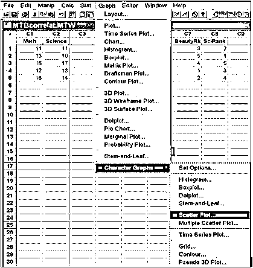

**3。回归**:这个特性使用户能够找到变量之间的关系(这是任何统计工具的一个关键特性)。[回归有线性](https://www.educba.com/regression-vs-anova/)、非线性、序数、[名义](https://www.educba.com/nominal-vs-real-interest-rates/)等形式。

统计->回归

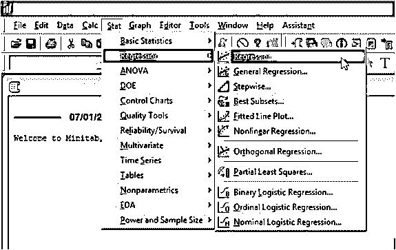

**4。方差分析**:方差分析，即使用 ANOVA 来分析组均数之间的差异。

Stat -> ANOVA

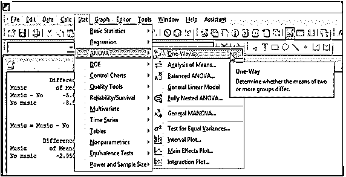

**5。统计过程控制**:该功能帮助您创建因果图、变量控制图、多变量控制图、时间加权图等。

**6。测量系统分析** : MSA 是一种数学方法，用于确定测量过程中存在的变化量。流程中的可变性会直接影响流程的总体[方差。](https://www.educba.com/variance-vs-standard-deviation/)

统计->质量工具->量具研究

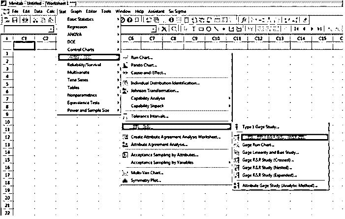

**7。实验设计**:这个功能帮助你识别因果关系。这有助于通过记录所有相关输出来创建和试验各种设计。这有助于您最终确定某个方法并优化它。

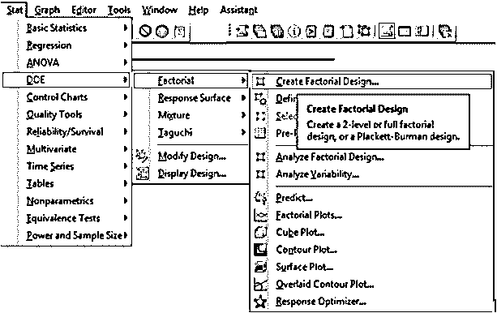

**8。可靠性/生存性**:它使您能够选择建模数据的最佳分布。它可以帮助您确定哪个函数最能描述您的数据。

统计->可靠性/存活率

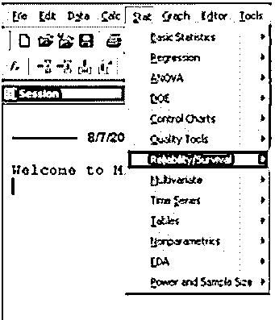

### 数据类型

数据类型解释如下。

它可以识别文本、数字和日期/时间。当在 Minitab 中输入数据时，它会自动识别其数据类型。尽管我们可以灵活地改变数据类型。

1.  Numerical:要执行所有的统计计算，数据列需要采用数字格式。
2.  文本:计算不是通过文本格式完成的
3.  日期/时间:它可以识别日期和时间数据类型，但是它在内部将它们存储为一个数字。

### Minitab 的程序

让我们来看一下执行基本统计要遵循的程序。

1.  首先，您需要将数据值放入 Minitab 工作表的某一列中。
2.  将变量名放入灰色框中。
3.  点击“统计”，然后点击“基本统计”，然后点击“显示描述性统计”。
4.  选择需要基本统计数据的变量。点击“选择”。
5.  单击“统计数据”框，然后选中您想要查看的每个统计数据旁边的框。

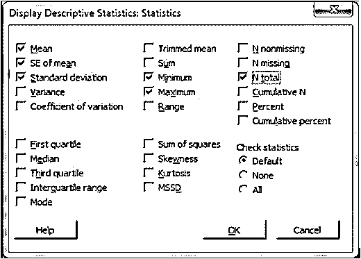

6.  在该窗口中单击“确定”，然后在下一个窗口中单击“确定”。
7.  您选择的所有统计值应该出现在会话窗口中。

简而言之，它帮助[组织和机构](https://www.educba.com/joining-a-professional-organization/)通过从数据中获取有价值的见解，以快速有效的方式可视化和分析趋势，从而解决某些问题。

### 推荐文章

这是一个什么是 Minitab 的指南？.这里我们讨论了 Minitab 的基本概念、程序、数据类型和不同的关键特性。您也可以看看以下文章，了解更多信息–

1.  [Minitab 面试问题](https://www.educba.com/minitab-interview-questions/)
2.  [数据科学家 vs 机器学习](https://www.educba.com/data-scientist-vs-machine-learning/)
3.  [五大精益工具六大适马概念](https://www.educba.com/six-sigma-concepts/)
4.  [了解 Excel 的有趣功能](https://www.educba.com/ms-excel-countif-function/)