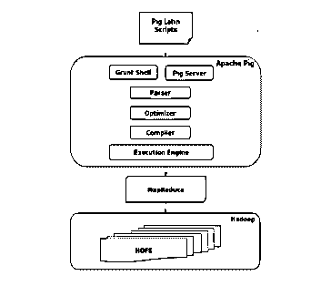

# Pig 命令

> 原文：<https://www.educba.com/pig-commands/>

## Pig 命令介绍

Apache Pig 是一个工具/平台，用于分析大型数据集和执行一系列数据操作。Pig 是[配合 Hadoop](https://www.educba.com/hadoop-administrator-jobs/) 使用的。所有 pig 脚本在内部被转换成 map-reduce 任务，然后被执行。它可以处理结构化、半结构化和非结构化数据。[养猪专营店，其结果变成了 HDFS](https://www.educba.com/hdfs-vs-hbase/) 。在本文中，我们学习了更多类型的 Pig 命令。

以下是一些特征:

<small>Hadoop、数据科学、统计学&其他</small>

1.  **自优化:** Pig 可以优化执行作业，用户可以自由关注语义。
2.  **Ease to Program:** Pig 提供了被称为 Pig Latin 的高级语言/方言，易于编写。Pig Latin 提供了许多运算符，程序员可以使用它们来处理数据。程序员也可以灵活地编写自己的函数。
3.  **可扩展:** Pig 便于创建自定义函数，称为 UDF(用户自定义函数)，使程序员能够快速轻松地实现任何处理要求&。Pig 脚本运行在一个叫做 grunt 的外壳上。

### 为什么是猪命令？

不擅长 Java 的程序员通常很难用 Hadoop 编写程序，例如编写 map-reduce 任务。对他们来说，非常像 SQL 语言的猪拉丁语是一个福音。它的多查询方法减少了代码的长度。所以总的来说，这是一种简洁而有效的编程方式。Pig 命令可以调用许多语言的代码，比如 JRuby、Jython 和 Java。

### Pig 命令的体系结构

**<u>

</u>** 

所有在 grunt shell 上用 Pig-Latin 编写的脚本都会被解析器用来检查语法和其他各种检查。解析器的输出是一个 DAG。该 DAG 然后被传递给优化器，优化器然后执行逻辑优化，例如投影和下推。然后编译器编译逻辑计划以映射 Reduce 作业。最后，这些 MapReduce 作业按照排序后的顺序提交给 Hadoop。这些作业被执行并产生预期的结果。

Pig-Latin 数据模型是完全嵌套的，它允许复杂的数据类型，如 map 和 tuples。

猪拉丁语言的任何单个值(不考虑数据类型)被称为原子。

### 基本清管器命令

让我们看看下面给出的一些基本 Pig 命令:-

**1。Fs:这将列出 HDFS 中的所有文件**

咕噜声> fs–ls

**2。清除:这将清除交互式咕哝外壳。**

咕噜声>清除

**3。历史:**

该命令显示了到目前为止执行的命令。
咕哝>历史

**4。读取数据:假设数据驻留在 HDFS，我们需要将数据读取给 Pig。**

grunt > college _ students = LOAD ' HDFS://localhost:9000/pig _ data/college _ data . txt '

使用 PigStorage('，')

as ( id:int，名字:chararray，姓氏:chararray，电话:chararray，

城市:chararray)；

PigStorage()是将数据作为结构化文本文件加载和存储的函数。

**5。存储数据:存储操作符用于存储处理/加载的数据。**

grunt >使用 PigStorage('，')将 college_students 存储到' HDFS://localhost:9000/pig _ Output/'中；

这里，“/pig_Output/”是需要存储关系的目录。

**6。转储运算符:该命令用于在屏幕上显示结果。它通常有助于调试。**

咕噜>甩大学生；

7 .**。描述操作符:它帮助程序员查看关系的模式。**

grunt >描述大学生；

**8。解释:该命令有助于检查逻辑、物理和 map-reduce 执行计划。**

grunt >解释大学生；

**9。说明操作符:这给出了 Pig 命令中语句的逐步执行。**

grunt >图解大学生；

### 中间清管器命令

**1。Group:** 该命令使用相同的键对数据进行分组。

grunt> group_data =按名字对大学生分组；

**2。COGROUP:** 它的工作方式类似于组操作符。Group & Cogroup 运算符的主要区别在于，Group 运算符通常与一个关系一起使用，而 Cogroup 则与多个关系一起使用。

**3。Join:** 用于合并两个或多个关系。

示例:为了执行自连接，假设关系“客户”是从两个关系客户 1 和客户 2 中的 HDFS tp pig 命令加载的。

grunt> customers3 =按 id 加入 customers1，按 id 加入 customers2。

连接可以是自连接、内部连接、外部连接。

**4。Cross:** 该 pig 命令计算[两个或多个关系的叉积](https://www.educba.com/matlab-cross-product/)。

grunt> cross_data =交叉客户，订单；

**5。Union:** 它合并了两个关系。合并的条件是关系的列和域必须相同。

grunt> student = UNION student1，student 2；

### 高级命令

让我们看看下面给出的一些高级 Pig 命令:

**1。Filter:** 这有助于根据某些条件过滤掉不相关的元组。

filter_data =按城市过滤学院 _ 学生= = ' Chennai

**2。Distinct:** 这有助于从关系中删除冗余元组。

grunt> distinct_data = DISTINCT 大学生；

该过滤将创建一个名为“distinct_data”的新关系

**3。Foreach:** 这有助于基于列数据生成数据转换。

grunt > FOREACH _ data = FOREACH student _ details 生成 id，年龄，城市；

这将从关系 student_details 中获取每个学生的 id、年龄和城市值，并将其存储到另一个名为 foreach_data 的关系中。

**4。Order by:** 该命令根据一个或多个字段按排序顺序显示结果。

grunt > ORDER _ BY _ data = ORDER college _ students BY age desc；

这将按年龄降序排列“大学生”关系。

**5。Limit:** 该命令从关系中获取有限数量的元组。

grunt > LIMIT _ data = LIMIT student _ details 4；

### 提示和技巧

以下是不同的提示和技巧

#### 1.对输入和输出启用压缩

将 input.compression.enabled 设置为 true

将 output.compression.enabled 设置为 true

上面提到的代码行必须在脚本的开头，这样才能使 Pig 命令读取压缩文件或生成压缩文件作为输出。

#### 2.加入多个关系

为了对比方说三个关系(输入 1、输入 2、输入 3)执行左连接，需要选择 SQL。这是因为 Pig 不支持两个以上表的外连接。

相反，你执行左加入两个步骤，如:

数据 1 **=** **加入**输入 1 **按**键**左**，输入 2 **按**键；

数据 2 **=** **加入**数据 1 **按**输入 1::键**向左**，输入 3 **按**键；

这意味着两个地图缩减作业。

为了更有效地执行上述任务，可以选择“共组”。Cogroup 可以连接多个关系。缺省情况下，Cogroup 进行外部连接。

### 结论

Pig 是一种过程化语言，通常由数据科学家用于执行特别处理和快速原型制作。这是一个伟大的 ETL 和大数据处理工具。其他语言可以调用这些脚本，反之亦然。因此，Pig 命令可以用来构建更大更复杂的应用程序。

### 推荐文章

这是 Pig 命令的指南。这里我们已经讨论了基本的和高级的 Pig 命令以及一些即时命令。您也可以阅读以下文章，了解更多信息——

1.  [Adobe Photoshop 命令](https://www.educba.com/photoshop-commands/)
2.  [Tableau 命令](https://www.educba.com/tableau-commands/)
3.  [备忘单 SQL(命令、免费提示和技巧)](https://www.educba.com/cheat-sheet-sql/)
4.  [VBA 命令-收尾工作](https://www.educba.com/vba-visual-basic-commands-finishing-touches/)
5.  [与元组相关的不同操作](https://www.educba.com/tuples-in-python/)
6.  [Pig 数据类型指南](https://www.educba.com/pig-data-types/)

