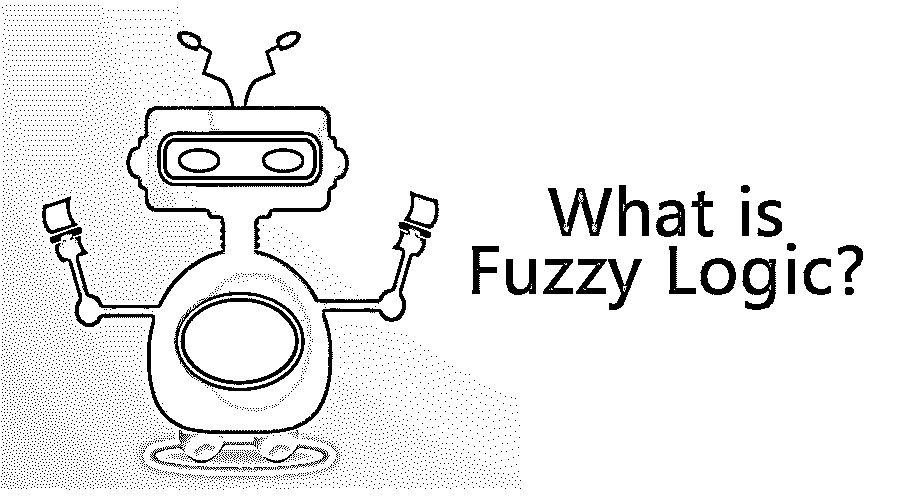
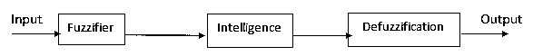

# 什么是模糊逻辑？

> 原文：<https://www.educba.com/what-is-fuzzy-logic/>

## 模糊逻辑导论

它是一种推理方法，由人类做出涉及数字值是或否的决策。它使用模糊集和使用自然语言的模糊逻辑计算机处理。它们被应用在基于规则的自动控制器中，建立非线性映射，并且被消费者认为是设计的方法。该系统的工作原理是基于输入状态分配给个体输出的概率。模糊这个词意味着精确到不精确。它由四个部分组成，即模糊化器、规则、推理机、反模糊器。在模糊中，真实的陈述变成了程度的问题。

它被定义为一种控制逻辑，假装使用输入和输出的程度来评估人类推理与基于规则的实现的集成。用于操纵不需要的信息或事实的技术，包含一定程度的不确定性。

<small>Hadoop、数据科学、统计学&其他</small>

### 谅解

在理解之前，最好先了解基本术语。首先，语言变量是输入或输出变量，其值是单词，而不是数字。示例温度(t)作为变量。接下来，隶属函数是用于映射非模糊值的依赖于上下文的函数。

例如，作为温度变量的例子，隶属函数包括:

t(温度)= {冷、保持、暖}

它有连接词，如连接词和析取词来表示隐含的程度。并且有一套推理规则来做出决策语句。它们有助于表现某种人类专长。

### 它是如何让工作变得如此简单的？

在某些情况下，构建数学模型来处理非线性系统。最近，人们关注的焦点是以更低的成本实现它们，这导致了模糊逻辑的更新。非常复杂的系统需要几个迭代步骤来找到一组规则。它与神经网络一起工作，使聚类集尽可能简单。模糊逻辑的概念是基于人类的推理；这就是为什么它使工作变得非常容易。

### 你能用模糊逻辑做什么？

它是一种基于规则的现象，依赖于人工智能软件，人工智能软件也被认为是人工智能的一个子集。它们可以应用于工程应用，并且出现在非工程应用中，如医疗诊断和股票应用；一般来说，它们几乎适用于所有具有输入和输出逻辑的系统。

### 工作

它基于集合的概念工作，输出决策基于假设。模糊集的取值范围为{0，1}。它们基于模糊规则工作，即 if-then 规则。其中的推理是最重要的事情，真值给 1，假值给 0。和部分值的不精确性。所有这些模糊动作被组合在一起形成一个系统输出。

例如，让我们举一个例子:

*   星期六是周末吗？模糊答案是 1，真。
*   星期天是工作日吗？模糊答案是 0.9。

首先，使用隶属函数和语言术语将输入数据集分组并转换为模糊集。这个过程被称为模糊化。然后，基于组织的规则集，进行推理。最后，在去模糊化步骤中，产生的模糊输出在隶属函数的帮助下被映射到清晰输出。

例如，在空调系统中，模糊逻辑系统通过声明温度的语言变量、定义隶属集(0，1)和通过模糊化过程的规则集来发挥作用，模糊集和评估类似 and，或者推理引擎执行操作规则，最后，使用去模糊化将期望的输出转换成非模糊数。

### 优势

*   它承认商业和实用方法方面的工作。
*   它们因其简单性和灵活性而被应用于各种工程产品。例如，它有助于构造非线性函数。
*   模糊系统背后的算法和数学概念非常简单自然。
*   它简化了传统的系统实现，并且他们的工作很容易理解。

### 为什么要用模糊逻辑？

在很多技术上更容易理解，更容易使用。他们推广了被称为可能性程度的二元分布。工业界人士和学术界代表正在探索模糊逻辑的必要性及其相关技术，以解决一个不确定的信息方法。这些研究人员最近出现，因为他们非常适合控制系统应用，这有助于中国的天气和地震预报。

#### 1.范围

如今，你可以在摄像、电信、洗衣机、汽车、空调等应用中找到模糊逻辑系统。它们被广泛应用于信道均衡、信号检测、信号处理等领域。在汽车系统电视、高保真音响、微波炉等一些领域，它发挥着至关重要的作用。在航空航天领域，它们用于卫星控制和航天器的高度决策。

#### 2.我们为什么需要它？

它有助于实现人工智能。它们充当商业部门经理的决策支持工具。它有助于用不精确的概率计算自然语言。所有模糊逻辑的实际应用都涉及语言变量(精度的概念)。他们在医药等领域和其他冲突局势中拥有很高的权力。

#### 3.这个工具对你的职业发展有什么帮助？

用最新最好的技术来解决商业问题总是令人兴奋的。信息技术对就业的影响越来越大。沉迷于学习模糊概念的专业人士有一个不断增长的市场。你可以在机器学习、人工智能和数学领域的专业化领域找到职业。这些专业人士在制造业、机械、金融和会计行业找到了自己的角色。

### 结论

总之，我们已经完成了这个系统的基础工作，这将有助于你理解实时环境中模糊的范围。这可能会分散他们的可见性和接受性。他们在研究和发展中占有广泛的地位；准确地说，这些应用可以在数学和科学著作中找到。还有许多其他的应用需要开发。在未来几年，它在实际应用程序的开发中扮演着重要的角色。

### 推荐文章

这是一个什么是模糊逻辑的指南？这里我们已经讨论了模糊逻辑的工作、使用、范围、需求、优势和职业发展。您也可以阅读以下文章，了解更多信息——

1.  [模糊逻辑的应用](https://www.educba.com/applications-of-fuzzy-logic/)
2.  [模糊逻辑系统](https://www.educba.com/fuzzy-logic-system/)
3.  [什么是 Selenium Web 驱动？](https://www.educba.com/what-is-selenium-web-driver/)
4.  [了解僵尸网络的概念](https://www.educba.com/what-is-botnet/)

