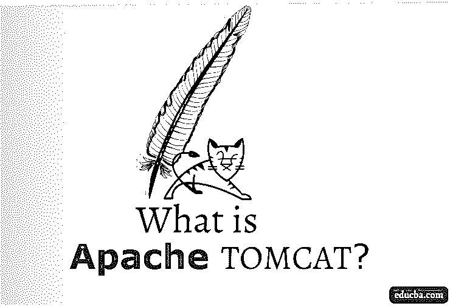

# 什么是 Apache Tomcat？

> 原文：<https://www.educba.com/what-is-apache-tomcat/>

## Apache Tomcat 简介

Apache Tomcat 是由 Apache 软件基金会开发和维护的用于 Java 编程的开源 web 服务器软件。Apache tomcat 软件最初的想法是托管和部署 Java servlet，它是服务器端的 Java 代码，管理来自使用 Java 构建的客户端应用程序的 HTTP 结果。它充当 web 服务器，而不是包含数据持久性和负载平衡功能的成熟应用服务器。Apache Tomcat 为相关的 servlets 提供了 web 服务器处理的基本特性。它支持 java servlet 生命周期，即 init()、service()和 destroy()阶段。它是 Java 实现的首选 web 服务器软件 tomcat 版本 9.0.21 的最新稳定版本，于 2019 年 6 月 7 日日发布。

Apache tomcat 可以被定义为一个 web 服务器(也称为 web 容器/ servlet 容器)，它处理 servlet、JSP(通过在内部将 JSP 转换为 servlet ),并呈现 JSP。

<small>Hadoop、数据科学、统计学&其他</small>

请注意，web 服务器不同于应用服务器。让我们了解一下这两者之间的区别。

### 为什么说 Tomcat 是 Web 服务器而不是应用服务器？

1.  打包应用程序时，可以将其打包为. war 或。ear Tomcat 被归类为 web 服务器，因为它只能处理。战争档案。
2.  web 服务器负责处理 servlet 和 JSP，而应用服务器应该能够处理 sturts、EJB(企业 Java Beans)、JSF (Java Server Faces)以及 servlet 和 JSP。Tomcat 只能处理 servlets 和 JSP，因此它是一个 web 服务器。
3.  web 服务器通常被认为是应用服务器的一部分，因为应用服务器展示了 web 服务器拥有的所有特性。它还包含负载平衡、数据持久性和消息传递等属性。然而，反之则不适用。
4.  Web 服务器只能通过 HTTP 协议运行，而应用服务器可以通过各种 CGI 协议运行，包括 HTTP 协议。应用服务器主要用于处理大型企业版应用程序。因为 tomcat 只在 HTTP 协议上运行，所以它属于 web 服务器。

### 为什么我们需要使用 Apache Tomcat？

网页本身就是静态的 HTML 文件。因此，客户端不能与静态网页交互。为了使我们的网页具有动态功能，需要一个网络服务器。为了能够将一个人的应用与网络服务器接口，提供了预定义的 API(应用编程接口)。Servlet 就是由 Java Platform Enterprise Edition 提供的一个这样的 API，旨在与 web 服务器一起工作。监视服务器接收的客户机请求不是 servlet 的工作，而是 web 服务器的工作。

### Apache Tomcat 是如何工作的？

当从事 [web 应用程序开发](https://www.educba.com/what-is-web-application/)时，Tomcat 被 web 开发人员广泛使用。从高层次的角度来看，apache tomcat 负责为 servlets 提供运行时环境。它提供了一个可以运行 java 代码的环境。

更具体地说，tomcat 负责:

1.  侦听来自客户端的所有传入请求。
2.  使用 servlet 映射(来自 web.xml 文件)加载各自的 servlet 类，以处理传入的客户端请求。
3.  执行 servlet 类和。
4.  最后，卸载 servlet 类。

从加载 servlet 类到卸载 servlet 类，servlet 负责通过执行其各种生命周期方法来处理客户机请求，并以 JSP 页面的形式向 tomcat 提供必要的响应。然后，Tomcat 通过呈现 JSP 将响应返回给客户机。

### Servlets 生命周期中会发生什么？

servlet 生命周期由三种主要方法组成:

**1。init()** :这个方法用于初始化 servlet。servlet 仅在服务器启动时或由客户机使用各自的 URL 调用时初始化一次。

**2。service()** :一旦创建了 servlet 的实例，tomcat 就会调用 servlet 的服务方法。服务方法负责为 tomcat 传递给它的传入请求生成响应。这个方法调用服务器端的其他资源，这些资源是从数据库获取数据并向 tomcat 提供响应所必需的。

**3。destroy()**:Tomcat 在所有清理相关活动结束时调用 destroy 方法，比如关闭数据库连接、释放资源用于垃圾收集等。

### Apache Tomcat 的优势

1.  apache tomcat 最大的优点是它是开源的。使用这个软件不需要付钱。人们可以很容易地从互联网上下载并配置它，然后开始使用它。
2.  Apache 软件基金会提供定期更新，使其与其他软件版本兼容，并提供错误修复，从而使开发人员更容易使用。
3.  Tomcat 支持 SSL(安全套接字层),因此可以使用 SSL 证书对其进行配置[,通过提供安全连接来保护敏感数据。](https://www.educba.com/what-is-ssl-certificate/)
4.  Tomcat 也可以配置为在不同的端口上运行多个 web 应用程序。例如，它可以在 8080、8081、9090 端口号上运行三个应用程序。默认情况下，Apache tomcat 使用端口号 8080。
5.  它也是跨平台兼容的，即可以在 Windows、Mac OS、Linux 操作系统上使用。
6.  据说重量很轻。也就是说，它在内存和资源利用方面消耗较少，因此允许应用程序在大多数系统上平稳运行，而没有特定的系统要求。

### 结论

Apache Tomcat 是当今 web 应用程序开发人员中最广泛和最常用的软件。研究表明，超过 60%的 java 应用程序使用 apache tomcat。有许多关于如何使用和配置 apache tomcat 的文档和教程，使得新的 web 应用程序开发人员使用 apache tomcat 更加容易和可行。

### 推荐文章

这是关于什么是 Apache Tomcat 的指南。在这里，我们讨论它是如何工作的，为什么我们需要使用它，Servlets 的生命周期及其优势。您也可以浏览我们推荐的其他文章，了解更多信息——

1.  [什么是 RDBMS？](https://www.educba.com/what-is-rdbms/)
2.  Apache hbase
3.  [大数据分析](https://www.educba.com/big-data-analytics/)
4.  [什么是 ExpressJS？](https://www.educba.com/what-is-expressjs/)

