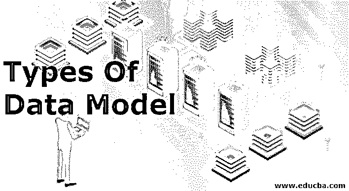
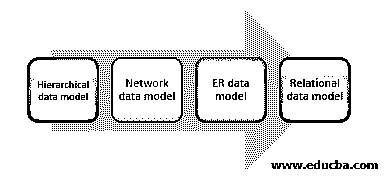
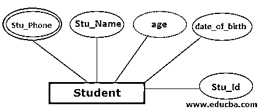

# 数据模型的类型

> 原文：<https://www.educba.com/types-of-data-model/>

## 数据模型类型介绍

对于任何数据库的创建，数据模型被认为是用于创建数据库的逻辑结构。数据模型包括实体、属性、约束、关系等。数据模型用于表示数据及其在数据库中的存储方式，以及如何在数据库管理系统中访问和更新数据。数据模型有四种类型:层次模型、网络模型、[实体-关系模型](https://www.educba.com/entity-relationship-model/)、关系模型。这些模型根据不同的用例有进一步的分类。

### 不同类型的数据模型

有 4 种不同类型的数据模型:

<small>Hadoop、数据科学、统计学&其他</small>

#### 1.层次模型

在这种类型的数据模型中，数据被组织成具有单个根的树状结构，并且数据被链接到根。在这个模型中，[主层次结构从根开始](https://www.educba.com/hierarchy-in-tableau/)，它像一个有子节点的树一样展开，并以同样的方式进一步展开。在这个模型中，子节点有 on；单个父节点，但一个父节点可以有多个子节点。由于数据像树结构一样存储在这个数据模型中，所以当检索数据时，从根节点开始遍历整个树。分层数据模型包含各种类型数据之间的一对多关系。数据以记录的形式存储，并通过链接连接。

**例如-** 有一个组织要求存储其员工的信息。该表包含以下属性:雇员姓名、雇员代码、部门名称和姓氏。公司为每个员工提供一台电脑。因此，需要将信息存储在一个单独的表中。计算机表存储员工代码、序列号和类型。根据分层数据模型，可以将雇员表视为父表，将计算机表视为子节点。

#### 2.网络模型

网络模型是一种数据库模型，它是基于表示对象和对象之间存在的关系的灵活方法而设计的。模式在网络数据模型中非常重要，网络数据模型可以以图形的形式表示，其中使用边来表示关系，使用节点来表示对象。层次模型和网络模型之间的基本区别在于，在层次数据模型中，数据以层次的形式表示，而在网络模型中，数据以图形的形式表示。网络模型的一个优点是，基本连接也在这个数据模型中表示。在这个数据模型中可以存在不同类型的关系，例如一对一、多对多等。将[与其他数据模型](https://www.educba.com/data-model-in-cassandra/)进行比较，如层次模型，数据访问变得简单。父节点和子节点总是连接的，因为在父-子节点之间总是存在关系。并且数据不依赖于其他节点。这种模式的一个主要缺点是这个系统不能适应变化。这意味着当需要对系统进行一些修改时，需要改变整个系统，这需要付出很大的努力。在这个模型中，维护数据是很困难的，因为每个记录都是通过一些指针连接起来的，这使得维护很困难，也使得系统很复杂。

#### 3.E-R 模型

ER 模型用于使用实体关系图来描述数据库结构。E-R 模型就像是数据库的蓝图，用来实现数据库。在实体集中，存在可以使用 ER 图显示的关系。实体集由相似类型的实体组成，这些实体由属性组成。

ER 模型的组件是关系集、实体集和属性。实体是数据的组成部分，在 ER 图中表示为矩形。例如，有两个实体学院和学生，存在一个太多的关系，因为可以有一个以上的学生可以上大学。

不能通过属性识别并且需要关系的实体被称为弱实体。为了表示弱实体，实体用双矩形表示。例如，有一个银行帐户，但在银行名称不为该银行帐户所知之前，它无法与之相关联，该帐户被称为弱实体。

属性用于表示实体的属性。在 ER 图中，属性表示为椭圆形。有不同类型的属性，如键属性、复合属性、多值属性和派生属性。例如，学生是一个实体，学生实体的相关属性是学生姓名、学生年龄、学生编号、学生地址等。

这种关系在 ER 图中用菱形表示。这些关系存在于实体之间。有多种类型的关系，如一对一、一对多、多对一和多对多。

#### 4.关系模型

在这个数据模型中，数据表用于将一组元素收集到关系中。在这个模型中，关系和数据用相互关联的表来表示。在表中，有多行和多列，其中列表示实体的属性，行用于表示记录。在这个数据模型中，存在不同的主键，用来区分表中的每条记录。并且为了检索数据元素，使用 SQL(结构化查询语言)。对于使用关系数据模型，主键作为基本工具发布。对于数据集中的每个条目，它需要是唯一的。数据表不应包含任何类型的不一致，因为它会在数据检索时产生问题。关系数据模型的另一个问题是数据重复、不完整的数据和用于连接数据的不适当的链接。

### 结论

为了表示数据库，存在用于表示数据库结构的不同类型的数据模型。每个数据模型都有其优点和缺点，数据模型的使用取决于用例。

### 推荐文章

这是一个数据模型类型的指南。在这里，我们讨论根据不同用例使用的不同类型的数据模型和类别的基本概念。你也可以看看下面这篇文章。

1.  [数据库管理系统中的数据模型](https://www.educba.com/data-models-in-dbms/)
2.  [什么是数据建模？](https://www.educba.com/what-is-data-modeling/)
3.  [数据建模面试问题](https://www.educba.com/data-modeling-interview-questions/)
4.  [层次数据库模型](https://www.educba.com/hierarchical-database-model/)

