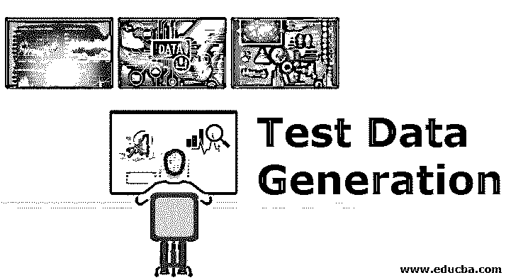

# 测试数据生成

> 原文：<https://www.educba.com/test-data-generation-rules-advantages/>

## 测试数据生成简介

测试数据是给机器学习模型的任何输入，以测试其性能和可靠性。为了获得性能优异的机器学习模型，对于数据科学家来说[很重要](https://www.educba.com/what-is-a-data-scientist/)用所有可能的数据变化来训练它，然后测试同一个模型，甚至更多样、更复杂但包罗万象的数据。通常很难将所有场景和变化包含在列车测试拆分后获得的测试数据中。因此，创建一个包含所有用例的数据集变得很重要，它可以最好地度量我们的模型性能。生成这种数据集的过程称为测试数据生成。

### 机器学习中的测试数据生成规则

在当今世界，随着复杂性与日俱增，交付时间跨度不断缩短，数据科学家需要尽快准备好性能最佳的模型。然而，被创建的模型只有在所有可能的场景中被测试过之后，才会成为性能最好的模型。数据科学家不可能拥有所有这些场景，因此他可能需要创建一些合成数据来测试模型。

<small>Hadoop、数据科学、统计学&其他</small>

因此，要创建这些合成数据集，您必须牢记某些规则或准则:

*   您必须观察原始或真实数据集中每个要素的统计分布。那么相应地，我们需要创建具有相同静态分布的测试数据。
*   我们需要理解这些特征之间的相互作用或对因变量的影响。我们的意思是说，我们需要保持变量之间的关系。看看单变量和双变量的关系，并在创建测试数据时尝试使用相同的关系。
*   产生的数据最好是随机的和正态分布的。
*   在分类算法的情况下，我们需要控制每一类中的观察值的数量。我们可以让观察值平均分布以使测试变得容易，或者在一个类中有更多的观察值。
*   可以将随机噪声注入到数据中，以测试 ML 模型的异常。
*   我们还需要保持测试数据特征的值和变化的比例，即特征的值应该被正确地描述。例如，年龄值应该在 0-100 之间，而不是以千为单位。
*   我们将需要一个极其丰富和足够大的数据集，它可以覆盖所有的测试用例场景和所有的测试场景。设计不良的测试数据可能无法测试所有可能的测试或真实场景，这会妨碍模型的性能。
*   我们需要生成足够大的数据集，以便对模型和软件平台进行性能和压力测试。

### 如何生成测试数据？

通常，测试数据是以编程方式生成的数据的存储库。这些数据中的一些可用于测试[机器学习模型](https://www.educba.com/machine-learning-models/)的预期结果。该数据还可以用于测试机器学习模型处理作为模型输入给出的异常值和看不见的情况的能力。了解需要生成什么样的测试数据以及出于什么目的是很重要的。

一旦我们知道了这一点，我们就可以按照以下任何一种方法来生成测试数据:

*   我们可以根据我们对该领域的了解以及我们需要在特定机器学习模型上进行的测试类型来手动生成测试数据。我们可以使用 excel 来生成这类数据集。
*   我们还可以尝试复制生产环境中可用的大量数据，对其进行必要的更改，然后在相同的环境中测试机器学习模型。
*   市场上有许多免费或付费的工具，我们可以用它们来创建测试数据集。
*   测试数据集也可以使用 R 或 Python 生成[。有几个像 faker 这样的软件包可以帮助你生成合成数据集。](https://www.educba.com/r-vs-python/)

### 测试数据生成的优势

尽管测试数据是通过某种方式生成的，并且不是真实的，但它仍然是一个固定的数据集，具有固定数量的样本、固定的模式和固定的类分离度。测试数据生成仍然有几个好处。

*   许多组织可能不愿意与服务提供商共享用户的敏感数据，因为这可能违反安全或隐私法律。在这些情况下，生成的测试数据会很有帮助。它可以复制真实数据的所有统计属性，而不会暴露真实数据。
*   使用生成的测试数据，我们可以将我们还没有面对的场景合并到数据中，但是我们期望或者可能在不久的将来面对。
*   如前所述，生成的数据将保留变量之间的单变量、双变量和多变量关系，同时只保留特定的统计数据。
*   一旦我们获得了生成数据的方法，就很容易创建任何测试数据，并节省了搜索数据或验证模型性能的时间。
*   测试数据将为团队提供急需的灵活性，以便在需要时调整生成的数据，从而改进模型。

### 结论

总之，精心设计的测试数据让我们能够识别并纠正模型中的严重缺陷。获得高质量的数据集来测试你的机器学习模型，将极大地有助于创建一个强大而简单的人工智能产品。合成测试数据集的生成在当今世界是一个福音。

### 推荐文章

这是测试数据生成的指南。这里我们讨论规则以及如何利用它们的优势生成测试数据。您也可以看看以下文章，了解更多信息–

1.  [模糊测试](https://www.educba.com/fuzz-testing/)
2.  [数据科学工具](https://www.educba.com/data-science-tools/)
3.  [大数据技术](https://www.educba.com/big-data-technologies/)
4.  [测试数据生成工具](https://www.educba.com/test-data-generation-tool/)

