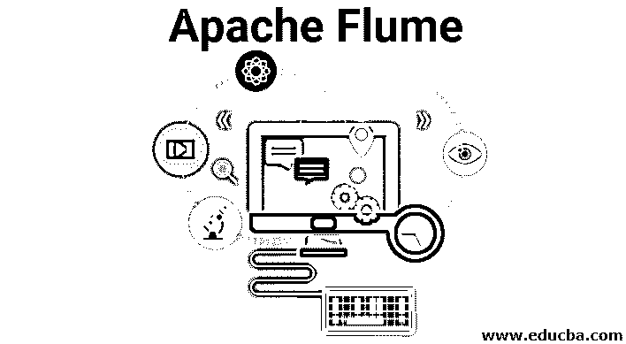
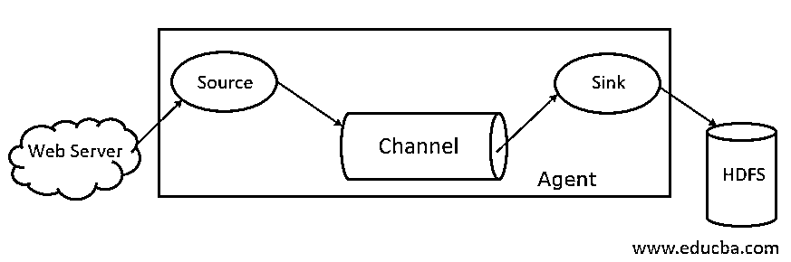

# 阿帕奇水槽

> 原文：<https://www.educba.com/apache-flume/>

## 阿帕奇水槽介绍

Apache Flume 是一个数据摄取框架，它将基于事件的数据写入 [Hadoop 分布式文件系统](https://www.educba.com/what-is-hdfs/)。Hadoop 处理大数据是众所周知的事实，一个问题出现了，不同 web 服务器产生的数据如何传输到 Hadoop 文件系统？答案是阿帕奇水槽。Flume 是为基于事件的数据的 Hadoop 的大容量数据摄取而设计的。

考虑一个场景，其中多个 web 服务器生成日志文件，这些日志文件需要传输到 Hadoop 文件系统。Flume 将这些文件作为事件收集起来，并将其吸收到 Hadoop 中。虽然 Flume 是用来传输到 Hadoop 的，但是并没有硬性规定目的地必须是 Hadoop。Flume 能够写入其他框架，如 Hbase 或 Solr。

<small>Hadoop、数据科学、统计学&其他</small>

### 水槽建筑

总的来说，Apache 水槽架构由以下组件组成:

*   水槽源
*   水槽渠道
*   水槽
*   水槽代理
*   水槽事件

让我们简单看一下每个水槽组件

#### 1.水槽源

Flume 源出现在像 Face book 或 Twitter 这样的数据生成器上。Source 从生成器收集数据，并以 Flume 事件的形式将数据传输到 Flume 通道。Flume 支持各种类型的源，如 Avro Flume Source—连接到 Avro 端口并从 Avro 外部客户端接收事件，Thrift Flume Source 连接到 Thrift 端口并从外部 Thrift 客户端流、假脱机目录源和 Kafka Flume 源接收事件。

#### 2.水槽渠道

缓冲由 Flume Source 发送的事件直到它们被 Sink 使用的中间存储称为 Flume Channel。信道充当信源和信宿之间的中间桥梁。水槽渠道本质上是交易性的。

Flume 提供对文件通道和内存通道的支持。文件通道本质上是持久的，这意味着一旦数据写入通道，即使代理重新启动，数据也不会丢失。在内存中，通道事件存储在内存中，因此它不是持久的，但本质上非常快。

#### 3.水槽

水槽存在于像 HDFS、HBase 这样的数据仓库中。Flume sink 使用来自 Channel 的事件，并将它们存储到像 HDFS 这样的目的地商店。没有规则规定接收器应该将事件传递给存储，相反，我们可以这样配置它，接收器可以将事件传递给另一个代理。水槽支持各种水槽，如 HDFS 水槽，蜂巢水槽，节俭水槽，Avro 水槽。

图 1.1 基本水槽结构

#### 4.水槽代理

Flume agent 是一个长期运行的 Java 进程，它运行在源-通道-接收器的组合上。Flume 可以有多个代理。我们可以把 Flume 看作是分布在自然界中的相互连接的 Flume 代理的集合。

#### 5.水槽事件

事件是在 Flume **中传输的数据单位。**Flume 中数据对象的一般表示称为事件。该事件由一个字节数组的有效负载和可选的头组成。

### 水槽作业

Flume agent 是一个 java 进程，以其最简单的形式由源-通道-接收器组成。源以事件的形式从数据生成器收集数据，并将其传递给通道。一个来源可以根据需要向多个渠道交付。扇出是一个过程，其中单个源将写入多个通道，以便它们可以传递到多个接收器。

事件是在 Flume 中传输数据的基本单位。信道缓冲数据，直到它被接收器接收。Sink 从 Channel 收集数据，并将其传送到集中式数据存储，如 HDFS，或者 Sink 可以根据需要将事件转发到另一个 Flume 代理。

Flume 支持事务。为了实现可靠性，Flume 使用从源到通道和从通道到接收器的独立事务。如果事件未被提交，则事务被回滚，稍后重新提交。

为了理解 Flume 的工作，让我们举一个 Flume 配置的例子，其中源是假脱机目录，接收器是 Hdfs。在这个例子中，Flume 代理是最简单的形式，即使用 java 属性文件配置的单源-通道-接收器拓扑。

`agent1.sources = source1
agent1.sinks = sink1
agent1.channels = channel1
agent1.sources.source1.channels = channel1
agent1.sinks.sink1.channel = channel1
agent1.sources.source1.type = spooldir
agent1.sources.source1.spoolDir = /tmp/spooldir
agent1.sinks.sink1.type = hdfs
agent1.sinks.sink1.hdfs.path = /tmp/flume
agent1.channels.channel1.type = file`

在上面的配置示例中，代理是我们定义其他属性的基础。source1 和 sink1 和 channel1 分别是源、汇和信道的名称，它们的类型和位置也相应地被提及。

### 阿帕奇水槽的优势

 ***   Flume 本质上是可伸缩的、可靠的和容错的。这些属性将在下面详细讨论
*   可扩展——Flume 是水平可扩展的，也就是说，我们可以根据需要添加新的节点
*   可靠——Apache Flume 支持事务，确保数据传输过程中不会丢失任何数据。它从来源到渠道和从渠道到来源有不同的交易。
*   Flume 是可定制的，并为各种源和[接收器提供支持，如 Kafka](https://www.educba.com/what-is-kafka/) 、Avro、spooling directory、Thrift 等。
*   在 Flume 中，单个源可以将数据传输到多个通道，这些通道又将数据传输到多个接收器，因此单个源可以将数据传输到多个接收器。这种机制称为扇出。Flume 也支持扇出。
*   Flume 提供稳定的数据传输流，即如果数据读取速度增加，那么数据写入速度也会增加。
*   虽然 Flume 通常将数据写入集中存储，如 HDFS 或 Hbase，但我们可以根据自己的需求配置 Flume，以便 Sink 可以将数据写入另一个代理。这显示了水槽的灵活性
*   Apache Flume 本质上是开源的。

### 结论

本文详细讨论了水槽的组成和水槽的工作原理。Flume 是一个灵活、可靠、可伸缩的平台，可以将数据传输到像 HDFS 这样的集中存储。它能够与 Kafka、Hdfs、Thrift 等各种应用程序集成，这使它成为数据摄取的可行选择。

### 推荐文章

这是一个阿帕奇水槽指南。这里我们讨论 Apache Flume 的架构、工作和优点。您也可以看看以下文章，了解更多信息–

1.  [什么是阿帕奇 Flink？](https://www.educba.com/what-is-apache-flink/)
2.  [阿帕奇卡夫卡与 Flume 的区别](https://www.educba.com/apache-kafka-vs-flume/)
3.  [大数据架构](https://www.educba.com/big-data-architecture/)
4.  [Hadoop 工具](https://www.educba.com/hadoop-tools/)
5.  [学习不同的 JavaScript 事件](https://www.educba.com/javascript-events/)
6.  Apache Solr |它是如何工作的？|需要

**