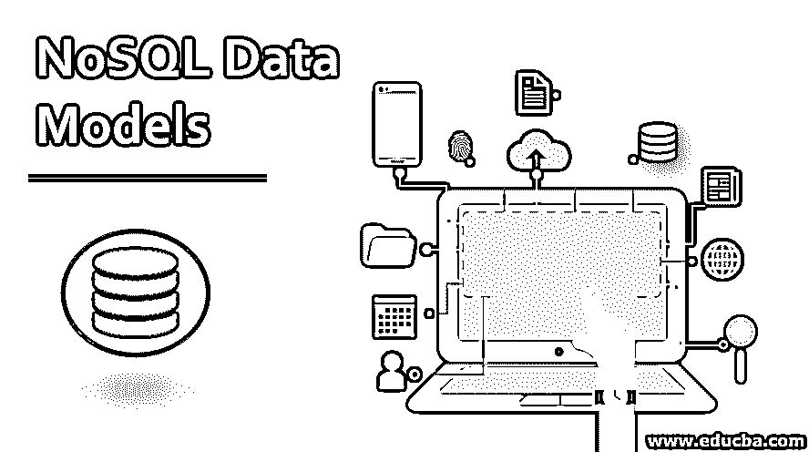
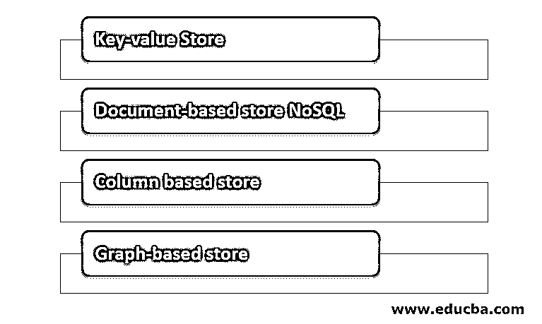

# NoSQL 数据模型

> 原文：<https://www.educba.com/nosql-data-models/>

## NoSQL 数据模型简介

在我们开始讨论数据模型之前，让我们先了解一下 NoSQL 的意思。NoSQL 意味着不是唯一的 SQL，这意味着我们将从非关系数据库中检索和存储数据。现在让我们看看什么是数据模型？数据模型定义了 DBMS 的逻辑[结构。这基本上意味着它告诉我们数据是如何相互连接的，各种实体之间的关系以及它们是如何被处理的。关系数据库和非关系数据库的数据建模技术是不同的。主要区别在于，与 SQL 相比，NoSQL 数据模型具有更多特定于应用程序的查询。](https://www.educba.com/what-is-dbms/)

### 带参数的语法

通过示例给出了编写 NoSQL 查询的语法。在本例中，我们将检索所有被指定为经理的雇员的姓名和年龄。

<small>Hadoop、数据科学、统计学&其他</small>

`{
"object": "employee",
"q": {
"designation" : " Manager"
},
"fields": ["name", "age"] }`

在上面的例子中我们已经用 JSON 的[表单编写了一个查询,“object”关键字被用来分配一个表名，关键字“q”被用作 WHERE 条件。在我们的例子中，条件必须应用于指定，因为我们只想要指定为经理的员工。关键字“field”是我们希望根据“q”中的条件检索的列的名称。在我们的例子中，列是姓名和年龄。](https://www.educba.com/what-is-json/)

如果将上述 NoSQL 查询转换为 SQL，将如下所示:

`SELECT name, age
FROM employee
WHERE designation =’ manager’;`

我们可以编写的最短的查询是一个普通的 NoSQL 选择查询，如下所示:

`{
"object": "String",
"q": "Expression"
}`

上面的查询是一个普通的选择查询。

### NoSQL 数据模型的类型

现在让我们了解不同类型的 NoSQL 数据模型。

一般来说，NoSQL 有四种不同类型的数据模型。它们如下，我们将逐一讨论。

现在让我们一个一个地看一下。

#### 1.键值存储

*   顾名思义，键值存储只是使用键值在数据库中存储数据。键值对中的键必须是唯一的。对于什么样的键可以设置规则，键的长度和大小取决于数据库。例如，在 Redis 中，密钥的最大大小是 512mb。即使是空字符串也是有效的键。
*   这里键的大小很重要，因为长键会导致性能问题，而太短的键会导致可读性问题。键值对中的值可以是从字符串到图像的任何东西。您也可以在这里指定值的数据类型。
*   键值数据库模型对于存储产品类别、产品细节等电子商务数据非常有用。这些广泛用于大数据分析。我们甚至可以存储完整的 URL，因为 URL 名称可以作为键，实际的 URL 作为值。应用键-值对的数据库的例子有 Oracle NoSQL 数据库和 Redis。

#### 2.基于文档的商店 NoSQL

*   在这种类型的数据库中，记录及其相关数据存储在单个文档中。所以这个模型不是完全非结构化的，而是一种半结构化的数据。
*   文档和键值对之间的区别在于，在文档类型存储中，当在文档中存储数据时，提供了某种类型的编码，[它可以是 XML](https://www.educba.com/what-is-xml/) 编码或 JSON 编码。
*   下面的示例显示了一个可以存储在文档数据库中但编码不同的文档。让我们看看 XML 示例。

`<employee>
<employeename>Srikanth</<artistname>
<designation> Engineer</designation>
<DOJ>Febuary</DOJ>
</employee >`

*   传统数据库和基于文档的数据库的区别在于，这里的数据不像传统数据库那样存储在表中，而是存储在文档中。
*   使用上述数据模型的数据库示例有 MongoDB 和 Couchbase。这些[类型的数据库](https://www.educba.com/types-of-database/)被广泛使用，尤其是在大数据分析中。

#### 3.基于列的存储

*   在这种类型的数据库中，重点是列而不是行，因为数据存储在列而不是行中，这是大多数关系数据库的情况。因为数据存储在按列分组的单元格中，所以所有读写都是使用列而不是行来完成的。
*   有趣的问题是为什么使用列而不是行？这个问题的答案是，当您将数据存储在列中时，您可以进行快速搜索、快速检索和聚合，因为它将一列中的所有单元格存储为连续条目，这样就可以更快地进行访问。
*   例如，如果我们想从百万篇文章中查询标题，在基于列的数据模型中很容易得到，因为用一个磁盘条目我们就可以很容易地得到文章的标题，而在关系数据库中，它必须访问每个位置才能得到标题。基于列的商店数据库的例子是 HBase、Big Table、Cassandra。

#### 4.基于图形的存储

*   顾名思义，用图形表示代替表格或列表示。这种数据模型的重要特征是节点和边的存在。例如，这两个节点通过一些关系连接，这里的关系由边表示。
*   此外，使用这种基于图形的 NoSQL 数据模型，您可以有效地将数据从一个模型转换到另一个模型。有两种常用的基于图的数据库，即 InfoGrid 和 Infinite Graph。InfoGrid 还提供了 MeshBase 和 NetMeshbase 两种图形数据库，用户可以根据自己的需求进行选择。

### 结论

在本文中，我们讨论了 [NoSQL 数据库](https://www.educba.com/what-is-nosql-database/)和不同类型的 NoSQL 模型，并分别讨论了这些模型。不同类型的数据库可用在[每种类型的数据模型](https://www.educba.com/data-model-in-cassandra/)。NoSQL 数据库因其速度和效率而与日俱增。

### 推荐文章

这是 NoSQL 数据模型指南。这里我们讨论 NoSQL 数据模型的类型以及带参数和解释的语法。您也可以浏览我们推荐的其他文章，了解更多信息——

1.  [NoSQL 的优势](https://www.educba.com/advantages-of-nosql/)
2.  [是 MongoDB NoSQL](https://www.educba.com/mongodb-nosql/)
3.  [什么是大数据技术？](https://www.educba.com/what-is-big-data-technology/)
4.  [什么是数据分析](https://www.educba.com/what-is-data-analytics/)

