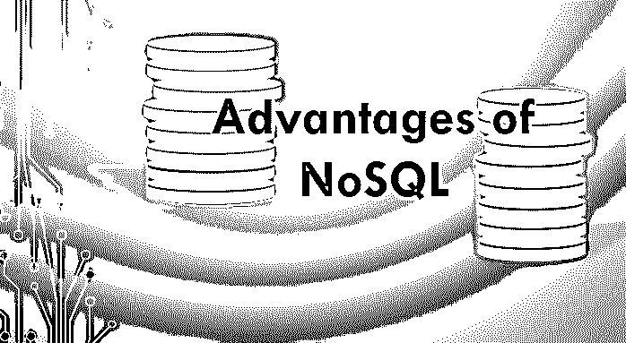
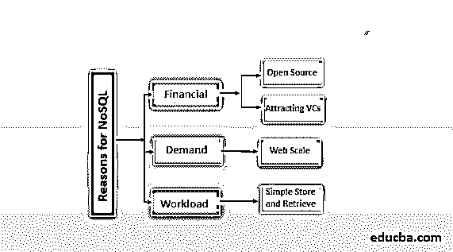

# NoSQL 的优势

> 原文：<https://www.educba.com/advantages-of-nosql/>

## NoSQL 优势介绍

NoSQL 优于任何其他数据库方法，有几个重要原因，包括易于适应未来升级的变化，不需要依赖 SQL 函数或操作。如果需要，它还可以包含 SQL 和基于 OOPS 概念的大部分功能，这提供了更多的灵活性。它不太需要 ETL，因为它可以利用 JSON/ XML 格式的二进制对象或数据文件。当项目开发采用敏捷方法时，它会缓和工作流程。与其他类型的数据库相比，这些优势赋予了 NoSQL 数据库独特的地位。

### 分布式体系结构

*   许多 NoSQL 数据库将许多商用服务器联合在一起。
*   它提供冗余存储。
*   它提供地理分布。
*   避免出现“单点故障”

#### 支持 NoSQL

<small>Hadoop、数据科学、统计学&其他</small>

我们正在研究财务标准，这是相当新的。实际上，我们将审查系统的需求或负载问题，以及系统需要承担的工作类型和工作量。现在在金融方面，我们将会有一些相当新颖的结论。第一个是两个中不太新颖的，那就是开源软件的经济性本身可能会为 NoSQL 创造一个强有力的支持。

现在，如果你能把这些因素与真正的技术支持因素结合起来，例如，你在一个网络规模的场景中，你正在做简单的存储和检索，那么现在你真的有了一个全垒打，因为现在你正在应用正确的技术，你有一些政治和财务原因，只会增加你的选择。

所以，你看，如果你不是在那种需求或工作量的情况下，那么就你的诚信而言，利用 NoSQL 来吸引风投可能有点破产，最有可能的是，聪明的风投可能会认识到这一点。但如果你处于正确的情景区域，那么最重要的是，如果你采用 NoSQL 模式，你可能会有更好的筹资体验和更可控的整体成本。

**云:**云计算和 NoSQL 数据库经常重合。

**微软**

*   蓝色桌子
*   Azure/Hbase 上的 Hadoop

**亚马逊**

*   SimpleDB
*   DynamoDB
*   弹性 MapReduce

### NoSQL 的优势

让我们看看 NoSQL 最突出的优势如下。

#### 1.带写(无模式)数据库的模式

如果您想要维护包含分布式特征的未标识结构的文件，这是非常重要的，我们已经使用它来存储和查询事件，这些事件通常包含时间戳、标签数组以及包含元数据对象的值，事实上，这些事件已经在此函数中发生。

#### 2.(与初始阶段相关)动态模式

与用数据库操作 ALTER TABLE 语句相比，它可以通过大量千兆字节的内容材料更容易地处理数据结构。

#### 3.嵌套对象结构

如果你专注于面向对象的语言，它使你能够避免大量的连接，并且比关系和表“感觉更有机”。

#### 4.增量过程

应用实例非常简单，包括读者视图的计数器等等，而不需要围绕数据库的多个读/写过程。

#### 5.可编入索引的数组特征

这似乎是可能非常有效的基本特征，它使您能够用多个标签来标记文件，并快速发现它们应用这些标签。

#### 6.向外扩展

数据库横向扩展多年来，数据库管理员依赖于纵向扩展关系数据库来提高效率。纵向扩展意味着订购更大的服务器，如负载增加或向现有机器增加硬件资产向上爬会体验到它的局限性。

一台机器最多可以管理特定数量的硬资产。由于主要与连接操作相关的技术限制，横向扩展对于关系数据库不可行。横向扩展意味着将数据库分布在多台计算机上，因为随着时间的推移，负载会增加。随着数据的大量涌入，大数据这一新术语已成为趋势的象征，因为如今大数据纵向扩展的[范围](https://www.educba.com/what-is-big-data/)并不具有成本效益。

向外扩展可能只是采用新的数据库来帮助向外扩展的方法，它们可以被称为 NoSQL 数据库。

#### 7.较少管理

关系数据库非常依赖于数据库管理员(也称为 DBA)。尽管多年来我们的 DBMS 领域取得了巨大的发展，但这种情况是真实的。然而，NoSQL 数据库通常是从头开始构建的，不需要管理、自动修复、数据分发以及更简单的数据模型会降低管理和性能要求。

#### 8.灵活的数据模型

对于需要谨慎处理数据模型的关系数据库来说，变更管理相当具有挑战性。模式变更会导致程序停机。NoSQL 数据库对数据模型的限制要宽松得多，有时这种限制是不存在的。

一般来说，NoSQL 数据库使应用程序能够每天维护几乎任何结构，以元素更加严格地描述 NoSQL 数据库同样使新列变得容易产生，如果有 NoSQL 数据库，模式变更不需要像困难的变更产品那样处理。

#### 9.总结

对于程序员来说，它是通用的，使用起来非常简单，因为您将关注于被称为文件的“类对象产品”。它肯定经历了个人的怪癖，因此一定要彻底选择与您的用例最匹配的，而不是选择“MongoDB 可以是 webscale”。

#### 11.在云中，这可能无关紧要:

如果您正在向云迁移，并且在许多网络规模的场景中，这将是一个很好的去处，那么不同的许可经济学可能会沉默，因为[云计算平台的工作方式](https://www.educba.com/cloud-computing-platforms/)是您主要支付费用，并且许多费用往往与您的数据库大小相当，您实际上并没有购买许可证。

所以比较苹果和苹果很重要。平台是一个服务数据库，甚至不包含每台服务器的成本。你在为你的数据库付费。数据大小对成本影响最大。

#### 12.提供资金

NoSQL 可能会做好风险投资业务。对其可扩展性的认知可能有助于让投资者相信你的轨迹和准备情况。

这是一个热门词汇——许多 NoSQL 公司也接受风险投资。Groupthink 适用！

### 推荐文章

这是 NoSQL 优势的指南。这里我们讨论什么是 NoSQL？以及 NoSQL 的 14 大优势。您也可以看看以下文章，了解更多信息–

1.  [数据挖掘的优势](https://www.educba.com/advantages-of-data-mining/)
2.  [什么是数据湖？](https://www.educba.com/what-is-a-data-lake/)
3.  [什么是 HBase？](https://www.educba.com/what-is-hbase/)
4.  [HTML 的优势](https://www.educba.com/advantages-of-html/)

