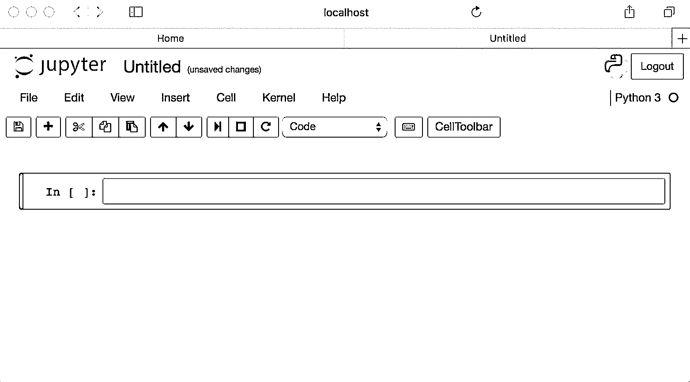
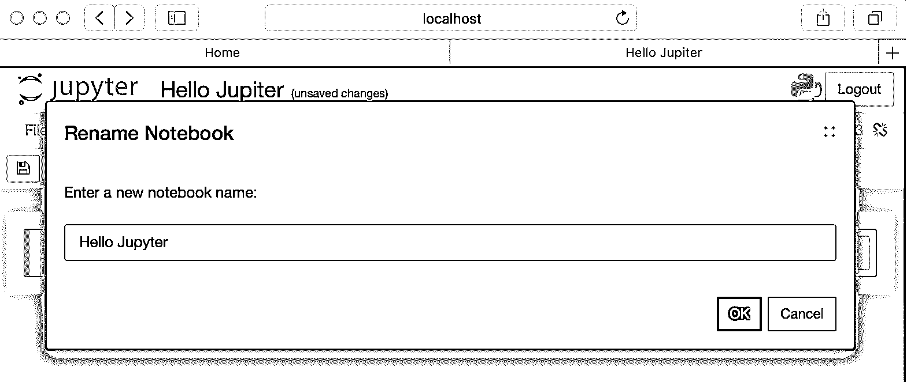
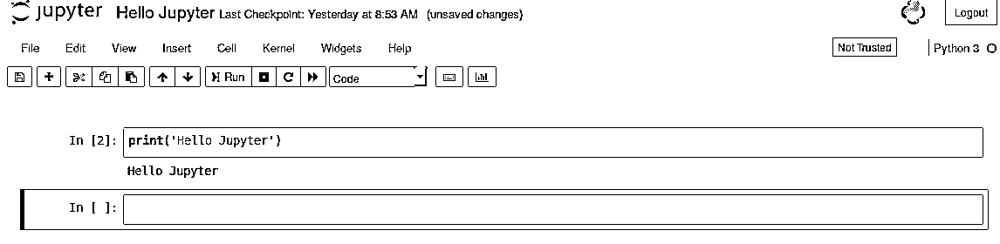

# Juypter 笔记本是什么？

> 原文：<https://www.educba.com/what-is-juypter-notebook/>

## Juypter 笔记本简介

一个允许文档共享的[网络应用](https://www.educba.com/what-is-web-application/)，这些文档包含方程式、文本，甚至是实时代码，project juypter 负责维护一个 juypter 笔记本。这种语言支持的关键语言是 Julia、 [Python 和 R](https://www.educba.com/r-vs-python/) 。在这里，所有这些代码输出、代码片段和其他可视化元素都可以包装在同一个文档中。对于 [python 安装](https://www.educba.com/install-python/)，这是一个免费的发行版，附带一个 anaconda。

### 了解木星笔记本

以下几点有助于我们理解 juypter 笔记本:

<small>Hadoop、数据科学、统计学&其他</small>

#### 1.新笔记本创建

通过点击“新建”按钮，可以创建笔记本。我们可能需要在隐含的语言类型的可用选项中进行选择。

#### 2.命名

在这一页的顶端是“无题”这个词。这表示当前笔记本的标题名称。将鼠标移动到无标题短语上并勾选该文本，会出现一个名为重命名 Juypter 笔记本的对话框。我们可以在这里提到一个描述性的名字来定义当前的书。

#### 3.运行单元

Juypter Notebook 的单元在创建时会使用代码，而内核选择启动的 Notebook 被认为是执行引擎。如果我们用 python 3 内核开始我们的笔记本，那么我们可以在里面写 python 代码。由于原始笔记本中只有一个未填充的单元格，笔记本实际上不能做任何事情，所以向单元格中添加代码内容并执行它，选择特定的单元格并单击 run 按钮将执行单元格中的代码片段。甚至可以在两个不同的单元之间共享变量和功能。单元格左侧的一组大括号表示代码执行的顺序。

#### 4.菜单

可用于与笔记本互动的主要菜单选项如下:

*   **文件:**它包含创建、打开、关闭或重命名一个已存在的笔记本的选项。甚至可以使用 checkpoint 选项放置检查点，并在需要时执行回滚。
*   **编辑:**提供编辑功能，用于复制、粘贴、剪切单元格；此外，还可以执行删除、合并和单元格拆分等功能。
*   **视图:**该选项主要用于切换目的；它有助于切换标题、工具栏甚至行号。
*   **单元格:**单元格菜单允许删除一个单元格、一组甚至所有单元格。它也有助于改变细胞类型。这个菜单中以前有用的特性是清晰显示单元格输出的能力。这在需要与其他用户共享笔记本以便清空单元格中的内容的情况下非常有用。
*   **内核:**这个用于在内核上工作，内核在后台运行；这不像其他选项那样经常被操纵。
*   **微件:**允许清除微件的状态并保存。
*   **帮助:**此处提供了关于笔记本的所有其他详细信息。

#### 5.导出笔记本

总是需要将结果导出给不同的人；nbconvert 工具允许将笔记本导出并转换为 Latex、HTML、PDF 等格式。;笔记本文件使用神牙模板转换成其他格式。

#### 6.笔记本扩展

在 Juypter 笔记本前端，这些扩展被加载。笔记本支持的四个主要扩展是内核笔记本、笔记本服务器和 python 内核。甚至他们自己的扩展也可以用 javascript 构建[。](https://www.educba.com/uses-of-javascript/)

### 为什么选择 Juypter 笔记本？

[Juypter 笔记本是 MathJax 的](https://www.educba.com/what-is-juypter-notebook/)升级版。他们致力于基于网络的技术；它们包含通过 MathJax 的数学方程的 LaTeX 支撑，math jax 是对展示数学的 web 浏览器的改进。它们允许一种灵活的方式到达一个检查点，并以 [JSON 格式](https://www.educba.com/what-is-json/)分享给其他用户。Juypter 笔记本可以通过查看器技术查看，GitHub 通过该技术扩展了其支持。此外，因为这些笔记本环境是用于开发代码的，所以它们提供了许多可以在独特的 ide 中获得的细节，比如代码完成和容易获得的帮助。

### 木星笔记本的优势

*   单个片段可以在这里灵活地重新运行。
*   在执行之前，可以对这些代码片段应用即时版本。
*   文化编程的范例。
*   帮助测试想法和片段。

### 木星笔记本的观众

*   有兴趣学习 python 的观众。
*   愿意提升 python 和面向 IDE 技能的专业人士。
*   木星笔记本有助于推进专业方面和技术技能的专业人士谁也打算这样做。

### 结论

Jupyter 笔记本比 salt 更允许共享数据；他们在教学中起着举足轻重的作用。此外，它允许将整个笔记本内容以幻灯片的形式呈现，而无需从用户端进行任何安装。

### 推荐文章

这是一本关于什么是 Juypter 笔记本的指南？在这里，我们讨论了 Juypter 笔记本的介绍、基本理解、受众以及优势。您也可以浏览我们推荐的其他文章，了解更多信息——

1.  [Joomla 是什么？](https://www.educba.com/what-is-joomla/)
2.  [什么是 Appium？](https://www.educba.com/what-is-appium/)
3.  [Python 中的 NLP](https://www.educba.com/nlp-in-python/)
4.  [人工智能的优势](https://www.educba.com/advantages-of-artificial-intelligence/)

