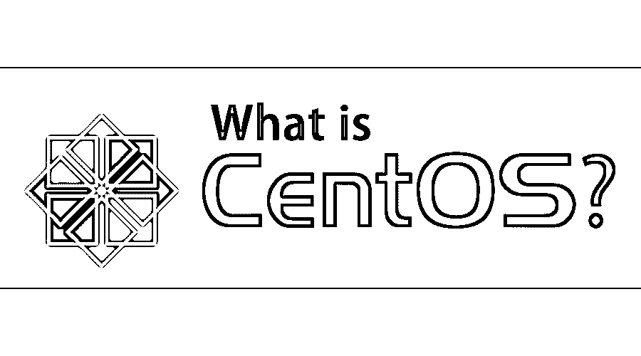

# 什么是 CentOS？

> 原文：<https://www.educba.com/what-is-centos/>

## CentOS 简介

CentOS 代表 Community Enterprise Operating System，是由 Gregory Kurtzer 创建的 Linux 发行版之一，它提供了一个企业级的免费开源操作系统，在功能上与它的上游源代码 Red Hat Enterprise Linux (RHEL)兼容。RHEL 是企业级操作系统，但需要付费订阅。CentOS 开发人员使用 RHEL 源代码，并创建了一个非常类似的产品。这方面的技术支持仅通过社区和门户网站提供。

“yum”是 CentOS 的软件包管理器。在它上面运行的任何东西都可以在 RHEL 平台上运行。CentOS images 是亚马逊云和 Azure 云中使用最多的操作系统之一。

<small>Hadoop、数据科学、统计学&其他</small>

### 体系结构

它还遵循与任何其他 Linux 发行版相同的体系结构，并且仅支持 x86-64 体系结构，这意味着它支持 32 位和 64 位机器

*   最底层是硬件或物理设备，如计算机、存储设备和网络设备。
*   在此之上是内核，它是操作系统的核心组件，直接与硬件交互。
*   内核之上是外壳，作为用户和内核之间的接口。
*   在所有这些层之上是应用层，它与外壳和内核交互来完成一些用户定义的任务。应用程序包括您的网络浏览器，文本编辑，文件浏览器，媒体播放器等。

### CentOS 的工作

这里有一组命令可以帮助你工作。

1.  **ls**–列出目录内容。
2.  **CD–**用于更改目录或导航至当前文件夹以外的文件夹。
3.  **mv–**这是移动命令。这有助于将文件从一个目录移动到另一个位置，或者重命名文件。
4.  **man–**这是获取操作系统中使用的任何其他命令的手册的命令。
5.  **mkdir–**该命令用于创建新目录(以及子目录)。
6.  **rmdir–**这是删除目录的命令。添加–RF 将递归地删除上述目录中的文件和文件夹。
7.  **触摸–**该命令创建一个空文件。这也称为生成文件命令，就像生成目录命令一样。
8.  **rm–**就像 rmdir 删除目录一样，RM 也会删除文件。
9.  **locate–**这个命令将帮助你在整个存储器中定位一个文件。
10.  **清除–**这是清除终端屏幕的命令。
11.  **sudo yum update—**这将更新所有已安装的软件包。
12.  **sudo yum install <包名>**——这个命令将安装提到的包。

人们可以在一个扩展名为**的文件中，按照要完成的任务序列来编写命令集。sh 并通过运行。通过使用命令 sh <文件名>，生成 sh 文件(被称为“外壳脚本”)。嘘**

您还可以在这个 shell 脚本中创建自己定义的命令(当然，这完全是一个单独的领域，超出了本文的范围),并将其用于不同的目的。

### 优势

以下是使用它的一些优点。

1.  它重量轻、可靠且快速。
2.  它是免费和开源的，并且是企业级的。
3.  随之而来的，还有 Apache Web、CUPS、MySQL 等开源服务器软件。像 git 这样的版本控制工具是默认安装的。
4.  出色的社区支持，提供直接向 bugs.centos.org 报告错误的条款
5.  最新的 CentOS 还包括虚拟机管理程序和虚拟化技术，如 Docker、oVirt、Xen 等。
6.  它拥有商业红帽企业版 Linux 95%的特性。而且这个是免费的！
7.  与其他开源和免费的 Linux 发行版相比，CentOS 因其稳定性和较低的软件包更新频率而广受青睐(甚至超过 Ubuntu)。

### 如何学习 CentOS？

嗯，学习它的最好方法是获得一些操作它的实际经验。

*   你可以从 centos.org 下载它，安装在你的笔记本电脑上作为运行操作系统。
*   如果您有 Windows 操作系统，那么您可以安装一些第二类虚拟机管理程序，如 Virtual Box，并在其上安装 CentOS。
*   接下来，通过参加 Red Hat Inc .提供的几门认证课程来探索操作系统。

#### 将来的

*   IBM 收购 Red Hat Inc .会对 CentOS 产生任何影响吗？
*   不，鉴于 CentOS 的自由和开源性质，CentOS 的存在和发展将继续以现在的方式进行。

### 这项技术将如何帮助你的职业发展？

*   如果你正在寻找 Linux 管理员领域的职业机会，那么在 CentOS 上工作的专业知识会让你对招聘人员有吸引力。
*   除此之外，作为一个免费的开源项目，为这样的项目做贡献对你来说是很有价值的。
*   此外，人们可以期待做大量的软件开发，保持它作为他们的底层平台。
*   熟练使用它也能让你轻松地使用几乎任何 Linux 发行版。

### 结论

凭借 ISO 映像在云平台上的所有企业级特性、能力和可用性，它形成了一个非常好的操作系统，可以了解并用于企业级软件开发。

### 推荐文章

这是什么是 CentOS 的指南？.在这里，我们讨论工作、架构、优势、未来以及这项技术将如何塑造你的职业发展。您也可以浏览我们推荐的其他文章，了解更多信息——

1.  [什么是云计算？](https://www.educba.com/what-is-cloud-computing/)
2.  [Ubuntu 与 Centos 的最大差异](https://www.educba.com/centos-vs-ubuntu/)
3.  [什么是 MySQL 模式？](https://www.educba.com/what-is-a-mysql-schema/)
4.  [CentOS 与 Debian 的差异](https://www.educba.com/centos-vs-debian/)

