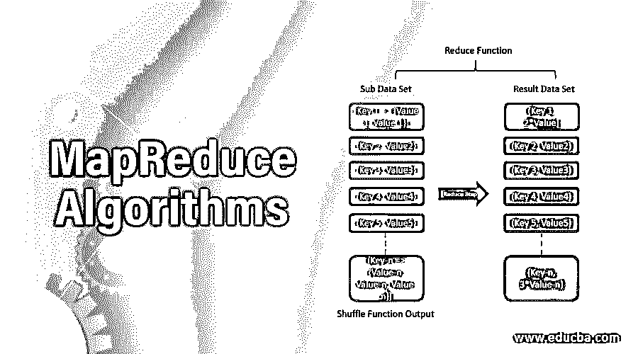
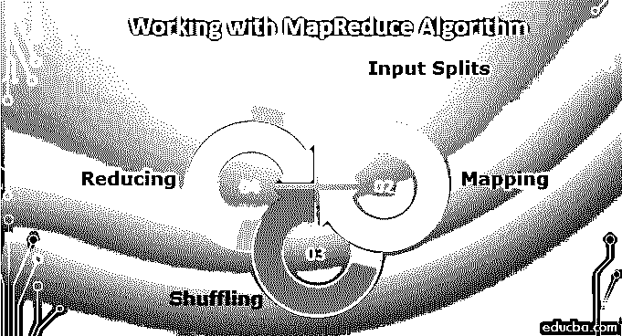

# MapReduce 算法

> 原文：<https://www.educba.com/mapreduce-algorithms/>

## 什么是 MapReduce 算法？

MapReduce 算法主要受函数式编程模型的启发。用于处理和[生成大数据](https://www.educba.com/what-is-big-data/)。这些数据集可以同时运行，并分布在一个集群中。一个 [MapReduce](https://www.educba.com/what-is-mapreduce/) 程序主要由 map 过程和一个 Reduce 方法组成，用于执行汇总操作，如计数或产生一些结果。MapReduce 系统在并行运行的分布式服务器上工作，管理不同系统之间的所有通信。该模型是有助于数据分析的分离-应用-组合策略的特殊策略。映射由 Mapper 类完成，reduce 任务由 Reducer 类完成。

### 谅解

MapReduce 算法主要分三步工作:

<small>Hadoop、数据科学、统计学&其他</small>

*   [地图功能](https://www.educba.com/javascript-map-function/)
*   洗牌功能
*   减少功能

让我们讨论一下每个功能及其职责。

#### 1.地图功能

这是 MapReduce 算法的第一步。它获取数据集并将其分配到更小的子任务中。这进一步分两步完成，分割和映射。分割获取输入数据集并划分数据集，而映射获取这些数据子集并执行所需的操作。这个函数的输出是一个键值对。

#### 2.洗牌功能

这也称为组合功能，包括合并和排序。合并会合并所有的键值对。所有这些都有相同的密钥。排序接受来自合并步骤的输入，并利用键对所有键-值对进行排序。这一步也将返回到键值对。输出将被排序。

#### 3.减少功能

这是这个算法的最后一步。它从 shuffle 中取出键值对，减少了运算。

### MapReduce 算法如何简化工作？

关系数据库系统有一个帮助存储和处理数据的中央服务器。这些通常是中央集权的系统。当多个文件进入画面时，处理是乏味的，并且在处理多个文件时产生瓶颈。MapReduce 映射数据集并转换数据集，其中所有数据被划分为元组，Reduce 任务将从该步骤中获取输出，并将这些数据元组组合成更小的集合。它在不同的阶段工作，并创建可以分布在不同系统上的键值对。

### 你能用 MapReduce 算法做什么？

MapReduce 可用于各种应用程序。它可以用于基于分布式模式的搜索、分布式排序、网页链接图反转、网页访问日志统计。它还可以帮助创建和处理多个集群、桌面网格、志愿者计算环境。人们还可以创建动态云环境、移动环境以及高性能计算环境。谷歌利用 MapReduce 重新生成了万维网的谷歌索引。通过使用它，旧的特别程序被更新，并且它们已经运行不同种类的分析。它还集成了实时搜索结果，而无需重建完整的索引。所有的输入和输出都存储在分布式文件系统中。临时数据存储在本地磁盘上。

### 使用 MapReduce 算法

要使用 MapReduce 算法，您必须了解它如何工作的完整过程。摄取的数据经过以下步骤:

**1。输入分割:**任何进入 MapReduce 作业的输入数据都被分割成相等的部分，称为输入分割。它是一个可以被任何映射器使用的输入块。

**2。映射:**一旦数据被分割成块，它就进入 map-reduce 程序中的映射阶段。该分割数据被传递给产生不同输出值的映射函数。

**3。Shuffling:** 一旦映射完成，数据就被发送到这个阶段。它的工作是合并前一阶段所需的记录。

**4。Reducing:** 在这个阶段，来自洗牌阶段的输出被聚合。在这个阶段，所有的值都被混合并通过聚合集合在一起，以便返回一个输出值。它创建完整数据集的摘要。

### 优势

使用 MapReduce 的应用程序具有以下优势:

1.  它们具有收敛性和良好的泛化性能。
2.  可以通过使用数据密集型应用程序来处理数据。
3.  它提供了高可伸缩性。
4.  统计每个单词的出现次数很容易，并且有大量的文档收集。
5.  一个通用工具可以用来在[多数据分析](https://www.educba.com/data-analysis-techniques/)中搜索工具。
6.  它在大型集群中提供负载平衡时间。
7.  它还有助于提取用户位置、情况等的上下文的过程。
8.  它可以快速访问大量的受访者样本。

### 为什么要用 MapReduce 算法？

MapReduce 是一个用于处理大型数据集的应用程序。这些数据集可以并行处理。MapReduce 可能会创建大型数据集和大量节点。这些大型数据集存储在 [HDFS](https://www.educba.com/what-is-hdfs/) 上，这使得数据分析更加容易。它可以处理任何类型的数据，如结构化、非结构化或半结构化数据。

### 为什么我们需要 MapReduce 算法？

MapReduce 发展迅速，有助于并行计算。它有助于确定产品的价格，并有助于产生最高的利润。它还有助于预测和推荐分析。它允许程序员在不同的数据集上运行模型，并使用高级统计技术和[机器学习技术](https://www.educba.com/machine-learning-techniques/)来帮助预测数据。它过滤数据并将其发送到群集中的不同节点，并按照映射器和缩减器的功能运行。

### 这项技术将如何帮助你的职业发展？

Hadoop 是目前最受欢迎的工作之一。它加快了这一领域快速增长的速度和机会。这个地区将会更加繁荣。从事 Java 工作的 IT 专业人员有一个优势，因为他们是最受欢迎的人。此外，开发人员、数据架构师、[、数据仓库](https://www.educba.com/benefits-of-data-warehouse/)和 BI 专业人员可以通过学习这项技术拿走大量的薪水。

### 结论

MapReduce 是 Hadoop 框架的[基础。通过学习这些，你一定会进入数据分析市场。您可以彻底了解它，并了解如何处理大量数据，以及这项技术如何改变数据的处理和存储。](https://www.educba.com/hadoop-framework/)

### 推荐文章

这是 MapReduce 算法的指南。在这里，我们讨论基本概念、理解、工作优势和职业发展。您也可以浏览我们推荐的其他文章，了解更多信息——

1.  【MapReduce 如何工作？
2.  [什么是 MapReduce？](https://www.educba.com/what-is-mapreduce/)
3.  [Hadoop 与 MapReduce 的区别](https://www.educba.com/hadoop-vs-mapreduce/)
4.  [与元组相关的不同操作](https://www.educba.com/tuples-in-python/)
5.  [Mapreduce 合并器完整指南](https://www.educba.com/mapreduce-combiner/)
6.  [MapReduce 字数统计](https://www.educba.com/mapreduce-word-count/)

