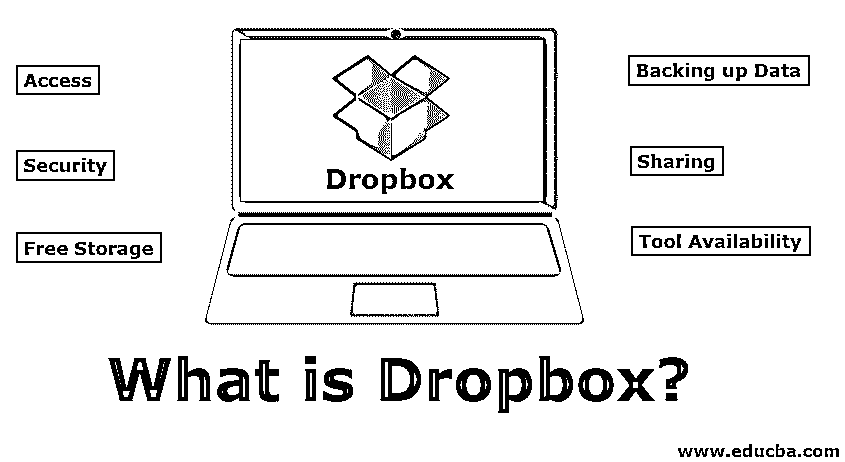

# Dropbox 是什么？

> 原文：<https://www.educba.com/what-is-dropbox/>

## Dropbox 简介

它是为个人和团队构建的基于云的生产力工具，使他们能够跨云保存和存储文档或文件或图片，并在需要时与其他人共享。

最棒的是，它提供了一套惊人的存储和共享功能。它也被称为在线备份服务，因为我们需要备份所有重要的文件，以确保我们永远不会永久丢失这些文件，最好存储在多个地方，我们使用 dropbox。这是免费的。Dropbox 托管在云中，使用起来并不复杂，只需将应用程序下载到您的首选设备上(该应用程序适用于所有平台，例如 Windows、Linux 和 Macintosh 桌面操作系统，甚至适用于 iPad、iPhone、BlackBerry 和 Android 设备。)，下一步是创建一个帐户，并根据需要开始共享内容。这就像你将本地存储与 dropbox 账户数据同步一样，数据将永远可供你使用，即使离线也可以使用。

<small>Hadoop、数据科学、统计学&其他</small>

### Dropbox 的主要特性

简而言之，如果我们可以谈论它的功能，即任何设备的可访问性，自动更新，自动组织和备份，文件存储，高效同步，文件共享，大文件共享，离线访问，手动设置带宽，在线备份和文件恢复，通过聊天，电子邮件或短信简单的链接共享，预览和下载，最后是安全性。

#### 1.空闲存储器

它在各种收费计划中提供高达 2GB 和 100 GB 的免费存储空间。它为团队提供 350 GB 的免费存储空间。

#### 2.加密安全性

最重要的功能是安全性，当我们共享最机密的文件时，安全地共享是很重要的，因此它使用 256 位 AES 加密安全来共享文件。

#### 3.扩展存储

它提供了一个根据付费成本将存储空间扩展到 100 GB 的选项。

#### 4.接近

所有存储的文件都可以随时随地访问，因为它将所有文件存储在远程服务器上，并且可以通过互联网访问。

#### 5.安全性

它安全地存储所有文件，只有通过认证的人才能使用用户名和密码进行访问。您希望使用密码和用户名。

#### 6.备份数据

由于它远程存储所有数据和文件，当您可能需要备份时，它会进行备份，而不是将所有内容存储在您的计算机上。

#### 7.共享

另一个好处是你可以和别人分享文件。为了与他人共享文件，我们需要将文件放在一个 dropbox 文件夹中，该文件夹被指定用于与特定用户或普通公众共享。

#### 8.工具可用性

该工具适用于所有平台，如 windows 操作系统、Linux 操作系统和 Mac 操作系统。该工具甚至也适用于 android 操作系统平台。

#### 9.快速分享截图

截图功能减少了截图的工作量，我们不需要截图，不需要拖拽，也不需要复制分享链接。我们只需要在你的 Mac 或 PC 上启用截图分享功能。

#### 10.向文件添加注释

正如我们所知，共享此文件夹非常简单，只需右键单击我们决定共享的文件夹或文件，并邀请人们加入我们的文件夹，或者另一种方法是只共享文件的链接。现在，在评论功能的帮助下，我们可以向共享文件添加评论，例如使用电子邮件或聊天来讨论您对文件的更改。通过这种方式，我们可以轻松地将关于文件的对话保持在同一个位置。

#### 11.免费在线编辑 Microsoft Office 文件

dropbox 与 Office Online 的功能集成是一个免费的微软 Office 基础版，它运行在你的浏览器中，我们可以通过它打开和编辑 Dropbox 中的 Office 文件，而无需安装 Office 的副本。

#### 12.使用选择性同步来节省空间

用户可以选择最重要的文件保存或同步使用它的选择性同步功能。

#### 13.回到以前的版本

错误的是，如果我们用不同的版本保存文件来恢复它，我们可以借助它的前一版本功能将文件备份到它的前一版本。

#### 14.查找您共享的所有内容

我们所有的共享历史，我们只需打开 Dropbox.com，并选择左侧栏中的共享或链接按钮。

#### 15.将您的所有图片备份到 Dropbox

dropbox 的转盘功能，我们可以根据日期和位置看到你上传的所有照片，这些照片被组织到可共享的相册中。

#### 16.自定义您的收存箱通知

当我们分享和评论大量文件时，dropbox 的电子邮件和推送通知可能会变得不堪重负，但没有问题，Dropbox 通知可以定制，我们可以打开或关闭电子邮件和推送通知。

#### 17.通过 Dropbox 请求文件

它的新功能 FileRequests 是一个简单的工具，使用户能够从其他人那里发送文件请求，并让它们自动显示在你的 Dropbox 文件夹中。

我们可以在 dropbox 中创建两种类型的帐户，即专业和商业标准，这为客户增加了正式的存储空间，允许保存和托管最重要的文件。dropbox 的专业帐户持有人将获得 2000 GB(2tb)的存储和共享空间，而商业标准团队帐户将获得 3000 GB(3tb)的存储和共享空间，这有助于企业轻松简化他们的任务。

### 如何使用 Dropbox？

要使用它或使用它，第一步是下载并安装 dropbox 相关的应用程序，一旦安装完成，在我们登录后，我们可以看到 Dropbox 文件夹。我们可以使用该文件夹将所有重要文件保存到文件夹中，从文件夹中拖放系统文件，就像我们使用本地存储一样，我们可以添加文件夹，删除文件或文件夹，等等。我们通过互联网连接保存到 Dropbox 文件夹中的文件可以在任何地方访问。简而言之，我们需要登录我们的帐户，上传文件，下载任何文件和任何共享文件。

### 如何共享文件？

为了共享文件，首先，我们需要将文件上传到 dropbox 文件夹，然后从 Dropbox 网站生成一个 URL，并将生成的 URL 与我们希望共享文件的其他人共享。我们共享文件的其他人也应该有一个 dropbox 帐户，并注册访问文件或文件夹。共享文件或文件夹显示在收件人的文件夹系统中，他们可以访问和更改共享文件。它使我们能够存储和共享所有版本的文件。广泛应用于 It、邮局、银行、图书馆、音像店等。

### 优势

以下优点解释如下。

*   **无限工作—**使用 Dropbox Sync，我们可以轻松掌控所有项目，而不会耗尽硬盘。
*   **释放桌面空间—**我们所有的桌面数据照片、文件、视频等都可以直接从我们的桌面上传到 dropbox，并从桌面删除，以释放桌面空间。通过这样做，我们将获得更多的空间来存储其他数据。
*   **释放手机空间****–**我们所有的手机数据照片、文件、视频直接从手机上传到 Dropbox，并从手机中删除，以释放手机的宝贵空间。
*   **查看任何文件，无需安装额外的软件–**它的文件预览工具实际上是它更方便的功能之一。如果我们需要关于 Adobe 文件的反馈，而我们团队的其他成员没有安装 Adobe，那么不用担心，它可以预览所有不同类型的文件，所以唯一需要的软件是浏览器。
*   **呈现大文件—**在一个企业或其部门中，大文件需要发送给客户审阅。使用 Gmail 等其他服务，我们无法发送如此大的文件，但使用这项服务，我们可以发送大文件，甚至不用任何网络浏览器下载特殊软件，任何人都可以标记预览。如果我们有一个专业的计划，那么我们可以在 Dropbox Showcase 的帮助下，将文件作为量身定制的演示文稿进行共享。
*   安全保管我们的文件–最大的好处是我们可以安全保管我们所有的文件，并且在需要时可以拿走它们。
*   **社区–**it 社区是最好的东西之一，它创建您的共享文件，当我们编辑系统可用文件时，所有拥有凭据的人都会在更新完成时收到即时通知，并且能够看到它。这种社区交流、讨论变化和团队协作需要编辑文件，这些都可以以最小的成本完成。
*   **自动备份相机照片–**自动备份相机照片功能独一无二，可以自动备份手机或电脑设备上的相机照片。我们只需要登录，所有相机的照片和相册自动按时间顺序存储，并可以在我们需要的时候备份它们，我们可以随时随地进行备份。如果我们误从系统中删除了文件，我们可以选择恢复它们，并在 30 天内撤销历史记录。这是数据安全防范的另一种方式。

### 这要花多少钱？

免费试用版的费用是每月 11.12 美元，或者我们可以每年订阅 99.99 美元，专业版是每月 27.81 美元。

### 结论

*   它是为个人和团队构建的基于云的生产力工具，使我们能够跨云保存和存储文档或文件或图片，并在需要时与其他人共享。
*   其特点是任何设备都可以访问、自动更新、自动组织和备份、文件存储、高效同步、文件共享、共享大文件、离线访问、手动设置带宽、在线备份或文件恢复、通过聊天、电子邮件、短信等进行简单的链接共享、预览和下载以及安全性等。
*   这样做的好处是工作不受限制，释放桌面空间，释放手机空间，查看任何文件，无需安装额外的软件，呈现大文件，以保持我们的文件安全，社区自动备份相机照片。
*   要共享文件，首先我们需要登录 dropbox 帐户，将文件上传到文件夹中，然后我们可以从 Dropbox 网站生成一个 URL，并与我们希望共享文件的其他人共享该 URL。
*   免费试用版的费用是每月 11.12 美元，或者我们可以每年订阅 99.99 美元，专业版是每月 27.81 美元。

### 推荐文章

这是一个什么是 Dropbox 的指南？.在这里，我们讨论了 Dropbox 的基本含义、主要功能以及如何使用它和它的好处。您也可以浏览我们推荐的其他文章，了解更多信息——

1.  [什么是数据科学](https://www.educba.com/what-is-data-science/)
2.  [什么是 React？](https://www.educba.com/what-is-react/)
3.  [C 语言中的数据类型](https://www.educba.com/data-types-in-c/)
4.  [数据科学平台](https://www.educba.com/data-science-platform/)
5.  [用 PHP 上传文件|如何创建？](https://www.educba.com/upload-a-file-in-php/)

