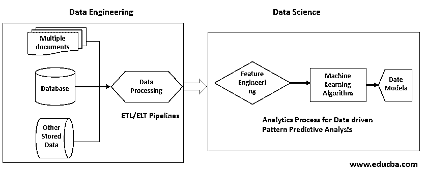

# 什么是数据工程？

> 原文：<https://www.educba.com/what-is-data-engineering/>

## 数据工程导论

数据工程是数据处理、数据清理和准备现成数据用于分析、数据科学和人工智能实施的实践。这主要与机器学习和数据质量检查以及数据管道部署的数据基础设施 ETL 和 ELT 管道开发活动有关。数据工程师的角色是补充数据科学家或分析专家，以构建和实施数据驱动的解决方案框架。

### 对数据工程的需求

理解我们为什么需要数据工程是很重要的。从商业角度来看。

<small>Hadoop、数据科学、统计学&其他</small>

*   这是一个技术堆栈。
*   支持数据科学项目的相关人员。
*   帮助数据驱动的业务决策的设置。
*   应用数据模型为业务创建预测性和规范性分析，以获得更好的结果。

### 数据工程是如何工作的？

实施数据科学或分析项目的组织更喜欢在团队中包括熟练的数据工程专业人员。根据数据架构师的建议，数据工程师使用各种工具和技术进行以下活动，这些活动是他们工作职责的一部分。

*   配置到数据源的连接。
*   用于暂存和流程数据存储的数据存储设置。
*   从源中检索数据
*   存储大量数据
*   数据质量和争论
*   生成标准化数据的处理
*   配置和维护数据管道
*   批处理和实时流数据处理

数据工程依赖于几种[大数据技术](https://www.educba.com/big-data-technologies/)，以下是作为行业最佳实践一部分的工具或技术列表。

*   Hadoop 集群，Apache Spark，Splunk，Apache Flink，Azure HDinsight。
*   NoSQL 数据存储像 Apache Cassandra 数据库，MongoDB。
*   内存缓存数据库，如 Redis、SAP HANA。
*   数据处理工具如[阿帕奇](https://www.educba.com/what-is-apache/) [卡夫卡](https://www.educba.com/what-is-kafka/)，阿帕奇 NiFi，Informatica 云服务。
*   基于云的工具，如 ASES 数据管道、谷歌大查询、[和 Azure](https://www.educba.com/what-is-azure/) 数据工厂。
*   标准 RDBMS 和文件系统。
*   各种特定于操作系统的脚本，如 Linux Shell 脚本、windows 批处理和 Power shell 脚本。
*   像 S3 一样的云存储。
*   基于 API [的工具，如 AWS](https://www.educba.com/what-is-aws/) API gateway，用于预测数据来源和部署分析的数据 API
*   时间序列数据存储。
*   物联网专用工具，如 Node-Red。

有几个标准的 ETL 工具和大数据工具以及像 python 、[这样的](https://www.educba.com/sql-data-types/)[脚本语言，SQL](https://www.educba.com/versions-of-python/) 是数据工程框架的一部分。专业人员通常使用多种技能来构建数据管道。DevOps 专家也是管理可扩展基础设施和基于微服务的数据 API 管理团队的一员。

除了与数据相关的工具，数据工程师还熟悉 Tableau、MS Power BI 等 BI 工具，以帮助 BI 专业人员提供适当的数据格式和结构。

数据工程师还熟悉基于云的工具和 DevOps 工具，如 Jenkins 和 Docker，以创建高效的实施。

到目前为止，我们讨论的数据工程与数据科学或分析项目框架的工具和技术方面有关，而功能工程是另一种相关实践，它根据企业中由数据分析师和数据科学家管理的业务用例场景来处理数据和功能选择的业务领域。

### 数据工程的范围

数据工程的范围主要涉及数据的预处理，这减少了数据科学家和分析师在数据准备阶段的开销。为了更好地理解它，下面是数据科学的数据工程设置的高级框架概述。

在图示中，数据工程是第一阶段，与第二阶段的数据科学相关联。

*   它通过 ETL(提取转换，加载)或 ELT(提取，加载，转换)管道从各种源应用程序，文件系统，物联网传感器和其他文件存储中收集原始数据。
*   ETL 主要用于数据仓库的实现，而 ELT 则用于大数据框架。
*   数据工程包括数据质量过程和转换技术。
*   将预处理后的数据存储在数据仓库或数据湖中以备后用。
*   该设置为数据科学框架提供输入数据。
*   数据分析师和数据科学家对功能工程流程进行初步探索性分析。
*   除了机器学习应用程序之外，这些数据还有助于生成商业智能报告和图表。
*   特征工程是一个迭代过程，进一步优化要由机器学习处理的数据集。
*   数据科学家反复应用几个机器学习模型，为用例生成最适合的机器学习模型。
*   输入数据有助于在开发过程中训练和测试模型。

### 优势

让我们来讨论一些主要优势:

*   它有助于将各种格式和各种不同来源的数据预处理成标准格式和结构。
*   通过实施用于批处理和调度的自动化工具，自动化增量数据或分析解决方案要使用的最新数据的管道。
*   数据工程通过使用最新和最佳实践、Apache Kafka、Spark 和 data-bricks 等技术提供实时分析支持。
*   通过应用各种业务规则来屏蔽和加密机密信息，从而应用数据的治理策略和安全合规性。
*   创建生产就绪数据，以更快完成分析项目实施。
*   通过连接和争论数据来定制数据结构，使其最适合机器学习算法，这需要基于数据科学家的建议。

### 目标受众

*   数据工程的目标受众是为业务流程应用分析的业务堆栈持有者。
*   人工智能应用程序开发人员，他们需要足够的数据来构建高效的认知解决方案。
*   通常参与使用原始数据的[探索性数据分析](https://www.educba.com/exploratory-data-analysis/)的数据分析专家。
*   [数据科学家](https://www.educba.com/data-scientist-work/)使用数据开发和部署商业机器学习模型。

### 结论

这是成功实施数据科学和分析的关键部分。工具和技术的类型是随着时间而发展的。引入了几项新技术来提高效率、延迟、流程和成果。此外，行业中的云和[人工智能趋势](https://www.educba.com/artificial-intelligence-applications/)创造了对数据工程实践的更多需求，并鼓励现有和新的 IT 专业人员获得相关技能并升级他们的工作简介。

### 推荐文章

这是一个什么是数据工程的指南？.这里我们讨论数据工程是如何工作的？需求和范围以及优势。您也可以阅读以下文章，了解更多信息——

1.  [逆向工程](https://www.educba.com/reverse-engineering/)
2.  [什么是数据挖掘？](https://www.educba.com/what-is-data-mining/)
3.  [如何成为一名数据科学家？](https://www.educba.com/what-is-a-data-scientist/)
4.  [用 Python 进行逆向工程](https://www.educba.com/reverse-engineering-with-python/)

