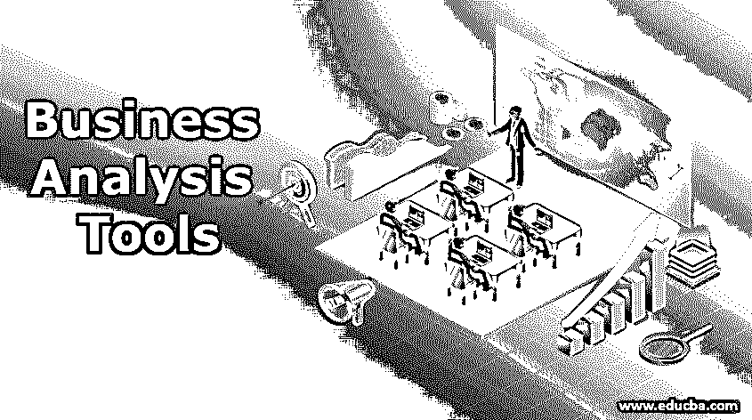
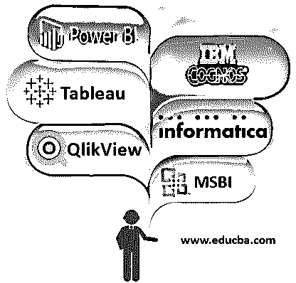

# 商业分析工具

> 原文：<https://www.educba.com/business-analysis-tools/>

## 商业分析工具介绍

业务分析是通过使用业务分析工具(如 tableau(有助于以更快的速度创建可视化)、Informatica(用于分析和可视化的数据集成工具)、Microsoft Business Intelligence(允许用户在不同的介质中协作和共享数据)、IBM Cognos(提供直观的沉浸式用户体验)、Power BI(用于分析和可视化数据的基于云的服务)和 QlikView(业务发现平台))向利益相关者推荐可持续业务洞察力的解决方案，从而在企业中实现修改的实践。

### 经营分析管理中使用的工具

以下是六大商业智能工具，它们与众不同，是组织获得实质性商业洞察力的最佳途径。

<small>Hadoop、数据科学、统计学&其他</small>

#### 1.活人画

Tableau 是一个非常简单但功能强大的商业智能工具[用于尝试和处理数据，并在许多企业中使用和部署。Tableau 让你创建视觉效果的速度比用其他程序和工具快 10 倍。它有非常简单的拖放操作来分析和可视化解决方案。Tableau 可以在任何设备上轻松访问，是一种新的、适应性强的 BI 方法，任何人都可以轻松地理解和实现它。](https://www.educba.com/what-is-business-intelligence/)

Tableau 变得如此受欢迎的原因之一是它的拖放界面使用起来相对简单；因此，没有任何编程知识的用户可以操纵数据来创建交互式可视化。

*   将原始数据转化为业务洞察力。
*   简单的拖放
*   Tableau 提供五个主要项目:Tableau 桌面、Tableau 服务器、Tableau 在线、Tableau 阅读器和 Tableau 公共。

#### 2.信息

Informatica 是一个支持分析和可视化的数据集成工具。它实际上从各种不同的来源收集数据，然后将其加载到目标映射中。Informatica 服务器用于从数据源提取数据。它由一个设计者组成，负责创建源和目标之间的映射。它主要用于商业、工业、医疗保健、金融、保险等领域的集成和服务。

Informatica 允许您加载数据。Informatica 提供四种主要的软件系统产品:Power Mart、Power Center、Power Connector 和 Power Exchange。

*   基于 ETL 的设计和结构。
*   Gartner 魔力象限的领导者。
*   收集数据并加载到目标中。
*   提供数据集成软件和服务。

#### 3.MSBI

MSBI 是微软商业智能的缩写。它提供完整的组合来满足您的 BI 要求和需求。它允许用户与 SharePoint、Excel、SQL 等中的数据协作和共享报告。此外，它还能够通过大量的知识制造快速而精确的输出。它还包括帮助为商业智能和数据处理查询提供有效解决方案的工具。

*   MSBI 是微软商业智能的缩写。
*   商业智能和数据处理工具。
*   为商业智能查询提供优化的解决方案。
*   使用可视化工具获得准确的结果。
*   分为三类—SQL Server 集成服务(SSIS)、SQL Server 分析服务(SSAS)和 SQL Server 报告服务(SSRS)。
*   SSIS 是一个整合服务，SSAS 是一个分析服务，SSRS 是一个报告服务。

#### 4.IBM Cognos

Cognos 是当今世界领先的技术平台之一，它允许用户创建、修改、分发和调度报告给完全不同的社区。它由不同的产品组成，包括仪表板、分析、视觉图像和数据集成等功能。它提供直观的沉浸式用户体验，主要侧重于分析和发现。Cognos 有一个报告工作室，用于创建高级格式和图表。

IBM Cognos 的主要功能包括 IBM Cognos Connection、Insight、Workspace、Report Studio、Event Studio、Query Studio、Analysis Studio 和 Microsoft Office。Cognos 支持默认为 CGI 和 ISAPI 的 Web 网关，以便为 Microsoft Internet Information Services(IIS)提供更快的性能。

*   在线商务智能工具。
*   它提供了一整套商业智能软件。
*   提供身临其境的用户体验

#### 5.功率 BI

Power BI 是一种基于云的业务分析服务，用于分析和可视化数据。它生成有创意的简单报告，并让它们通过 Power BI 服务发布给特定的组织。借助 power bi，任何人都可以通过独特的业务视图轻松创建个性化仪表盘。它用于直观的数据探索，与您的数据源保持实时连接。除此之外，power bi 有一个易于使用的拖放画布，用于出色的可视化模式。

Power BI 最有价值和最关键的功能包括具有自动化机器学习和 Azure 机器学习功能的人工智能，具有可扩展数据模式(如实体、属性和关系)的数据模型支持，用于集成的 API 丰富了 Power BI web 服务中的大数据支持，用于多个报告、仪表板和模型的 Power Query 数据准备。

*   基于云的商业分析服务。
*   分析和可视化数据。
*   能够创建个性化的仪表板。
*   主要功能–内容包、打印仪表板、自定义可视化。

#### 6\. QlikView

[QlikView 是领先的](https://www.educba.com/what-is-qlikview/)业务发现平台。它有许多功能，在从多个数据源创建高级报告和仪表板时非常有用。这种分析工具使用户能够发现跨各种来源的数据洞察力和关系。它拥有内存技术的明确许可，该技术整合来自多个来源的数据，为高级别报告提供集中的数据。

*   领先的业务发现平台。
*   多数据源的广泛数据连接。
*   为数据集成提供端到端平台。
*   数据保存在内存中，以供多个用户使用，并提供出色的用户体验。

### 结论

从计划到产品支持，分析师可以使用业务分析工具进行建模。分析工具可以与任何业务分析过程一起使用，具有广泛的特性，允许分析师使用他们喜欢的方法工作，例如字处理器视图、电子表格视图、图表、关系矩阵和其他扩展特性。分析师会很高兴知道，无论任务是什么，总会有一个分析工具来帮助他们。

### 推荐文章

这是商业分析工具指南。在这里我们讨论一下经营分析管理中使用的工具。您也可以浏览我们的其他相关文章，了解更多信息——

1.  [devo PS 的优势](https://www.educba.com/advantages-of-devops/)
2.  [JavaFX 折线图](https://www.educba.com/javafx-line-chart/)
3.  [QlikView 集合分析](https://www.educba.com/qlikview-set-analysis/)
4.  [云测试工具](https://www.educba.com/cloud-testing-tools/)

