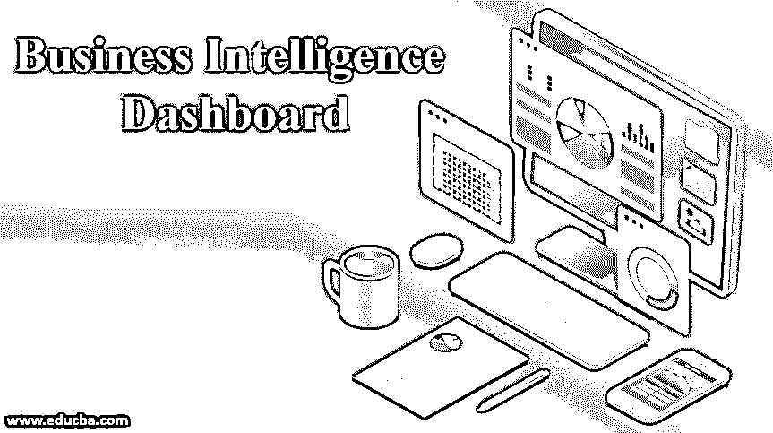

# 商业智能仪表板

> 原文：<https://www.educba.com/business-intelligence-dashboard/>

## 商业智能仪表板简介

商业分析或商业智能(BI)正变得越来越有助于任何企业的最佳管理层对长期战略规划进行可视化、分析和准备。管理这些未来设计相关程序的人将需要知识和对信息的有效分析，以创建关于最佳程序考虑的充分知情的选择。实现商业智能知识仪表板可以提高数据检索的效率，并优化用于程序管理和决策制定的知识分析，目的是实现仪表板以适当的方式呈现分析、数据风格及其相关范例。

### 什么是商业智能仪表板？

商业智能仪表板是一种用于跟踪的 IT 管理工具，有助于分析和显示关键绩效指标 KPI、度量和关键知识点，以观察业务、特定部门或方法的状况。它们将被改变以满足特定部门和公司的特殊需要。或者，仪表板是一个应用程序或计算机程序，它有助于衡量企业的绩效，感知结构单元，以及额外的业务流程。

<small>Hadoop、数据科学、统计学&其他</small>

BI 仪表板允许 BI 软件系统的最终用户和高级用户查看业务或知识分析的实时性能状态的即时结果。此外，仪表板在单个界面中结合了多种数据可视化，这是一种访问性能指标的简单方法。

### 为什么我们要使用商业智能仪表板？

一个仪表板连接到你的文件，不同的 API，不同的服务，然而相反，显示所有这些信息的各种表格，折线图和条形图和大量的量表。数据仪表板是跟踪多个数据源的最有效方式，因为它为多个企业提供了观察和分析绩效的主要位置。一段时间的观察减少了分析时间和长时间的沟通，这在以前是对企业的挑战。它主要熟悉在单个屏幕上显示专有信息，然后将其转换为数据分析和可视化。

*   仪表板回答有关您业务的重要问题与[高级商业智能工具](https://www.educba.com/business-intelligence-tool/)不同，仪表板措施旨在实现快速分析和信息感知。
*   仪表板侧重于展示运营和分析知识。分析仪表板通常旨在帮助决策者、制造商和领导者建立目标，设定不同的目标，并使用他们用来实施可接受的更改的相同信息来了解发生了什么和为什么发生了什么。
*   仪表板习惯于呈现交互式数据可视化。知识在仪表板上是不真实的，如表格、折线图、条形图和许多仪表，因此用户可以根据标准和目标跟踪业务趋势。
*   仪表板习惯于在整个开发过程中使用迭代方法来提炼风格。此外，仪表板还提供了由企业中完全不同的部门定制的功能。
*   业务仪表板通过结合来自多个来源的知识来节省用户的时间，并显示最重要的关键绩效指标。
*   在大型企业中采用业务仪表板来形成数据业务智能平台，以与他们的 IT 系统集成，从而加强业务功能，以关联高级分析、企业质量和定制。
*   精明的企业在分析方面有一个目标，即部署一个基于云的仪表板解决方案，提供一个真理供应的共享。如果团队分布在许多地方，这通常是至关重要的。
*   公司正在使用更微妙的方法来预测需求。天气数据有助于预测在一个受历史气温支持的极端地区，有多少人可能需要冬衣。

### BI 仪表板的重要性

商业智能仪表板通过提供数据和分析的关联扫描，方便企业监控其时间量的绩效指标。仪表板提供了一个关联界面，帮助经理和主管以非常相似的格式从不同的部门即时获取知识，并使其易于访问。此外，仪表板风格在决策和方法制定过程中起着至关重要的作用。它将易于使用，并包括所有的功能，如定制，预期受众目标，色彩鲜艳等。

#### 1.易接近

需要时，可以从多种设备以及手机和平板电脑上访问仪表板。

#### 2.安全和保障

仪表板中的安全协议保证整个知识不受外部入侵，除非您允许访问。多重冗余进一步保证了在任何时候任何目的都不会丢失数据。

#### 3.轻松协作

仪表板不仅可以在云连接设备上可视化，甚至可以通过 pdf 和电子邮件与您的同事等简单共享。用户可以额外利用它的自动化选择以及编程日常电子邮件。

#### 4.数据源

业务仪表板的燃料是数据，因此每个仪表板必须有一个或多个数据源。没有数据，仪表板不会向用户显示任何内容。数据可以通过关联 API、平面文件或信息来连接。一旦数据流入界面，仪表板就会变得栩栩如生。

#### 5.过滤

许多仪表板体现了部分交互性，因此用户可以根据需要浏览数据集。这种方法通常被称为数据发现或自助分析。过滤器将包含日期范围、数据源、地理区域、部门等等。

#### 6.灵活性

基于目的的业务仪表板体现了设备灵活性，允许用户在任何地方、任何设备上访问仪表板并使用仪表板进行操作。这为组织中的任何人提供了快速访问集体知识的洞察力，而无需手动搜索它们。

#### 7.决策

业务仪表板的好处是更好的决策和方法制定过程。它允许用户出现在集体知识的摘要中，以形成明智的商业选择。数据不仅更容易使用，而且可以快速分析。

#### 8.分享见解

关联分析平台的全面实施允许整个企业的人员获得对每个部门的 KPI 的可见性。

仪表板作为一种改变商业文化的工具，在企业层面得到了加强。使用仪表板的最大优点之一是，公司的经理或用户可以通过观察关键风险指标或关键绩效指标来分析屏幕，并可以做出选择和采取行动来降低风险和提高企业绩效。

### 推荐文章

这是商业智能仪表板指南。在这里，我们讨论简介，为什么我们使用商业智能仪表板及其重要性。您也可以阅读以下文章，了解更多信息——

1.  [商业分析工具](https://www.educba.com/business-analysis-tools/)
2.  [Qlikview 仪表盘示例](https://www.educba.com/qlikview-dashboard/)
3.  [什么是 Tableau 仪表盘](https://www.educba.com/what-is-tableau-dashboard/)
4.  [商业智能和大数据](https://www.educba.com/business-intelligence-vs-big-data/)

