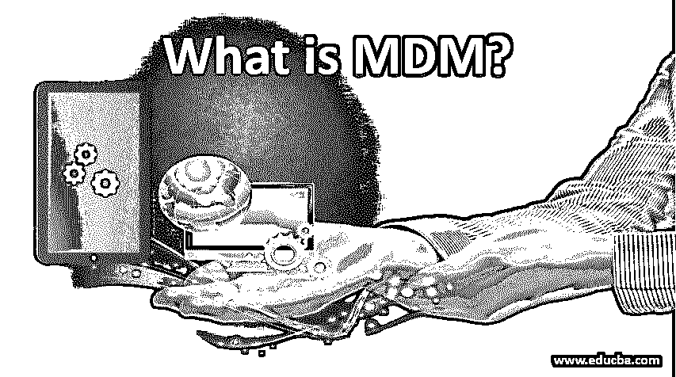

# 什么是 MDM？

> 原文：<https://www.educba.com/what-is-mdm/>

## MDM 简介

主数据是支持组织的交易和分析业务的关键业务数据。破碎的不一致数据导致供应链的低效和市场延迟，这进一步导致市场失灵并导致成本增加。此类数据还会导致销售效率低下、风险增加、客户忠诚度损失等。这些类型的数据包括所有业务实体，如客户、产品和供应商数据，这些数据称为主数据。如果管理不善，这些数据会对组织的繁荣产生许多负面影响。

### 什么是 MDM？

主数据管理(MDM)是一组技术和应用程序，用于清理、组合和增加各种企业的主数据，然后帮助将主数据与应用程序、分析工具和各种相关业务流程同步。主数据管理(MDM)有助于改善决策过程、报告和运营效率。主数据管理工具有助于数据标准化、删除重复数据和消除不正确的数据。通过这些过程，主数据管理提供了权威主数据源的创建。

<small>Hadoop、数据科学、统计学&其他</small>

主数据管理由一系列策略、管理、工具和流程组成，帮助我们定义和管理您组织的主数据。主数据属于已完成业务交易的账户、交易方和产品。问题从各个业务单元和产品渠道分割开始。当同一个客户由不同的产品渠道提供服务，并且为了处理交易而重复输入客户和账户数据时，就会出现这种情况。

MDM 的目标是提供在整个组织中收集、匹配、聚合、保证质量、整合、持久化和分发主数据的流程，以确保应用程序和维护中的控制和一致性。

**MDM 的架构组件:**

主数据管理的架构组件分为两类，它们是:

1.  用于分析、整合和同步整个组织的主数据的技术。
2.  用于管理、清理和丰富组织的非结构化和结构化主数据的应用程序。

### MDM 的特征

MDM 应用程序必须具备以下特征才能成功地控制主数据:

*   它应该有一个灵活、开放、可扩展的数据模型来支持主数据及其属性。
*   它应该有一个应用程序中立的数据模型，支持可以直接连接的应用程序和 OLTP 工作。
*   为各种业务层次和关系管理元数据的良好功能。
*   出色的管理源系统的能力，以满足数据所有权的要求。
*   一种检查数据质量的功能，用于确保消除重复数据，确保数据准确。
*   通过防止即将出现的错误来确保数据质量的界面。
*   不间断地清理数据以保持数据最新的功能。
*   支持所有临时用户和专业人员的适当界面。
*   唯一一个管理主数据所有对象的平台。
*   一个高度可用且可扩展的平台，用于在繁重的工作负载期间访问数据。

### 主数据管理的优势

随着主数据管理的实现，组织可以快速深入地解释业务关系。他们还能够及时实施有关关系的行动和决策，从而提高效率并确保业务增长。主数据管理的一些主要优势是:

*   **效率提升:**由于消除了数据不可访问和不可读取的所有问题，所有必要的数据都可随时获得，不受限制。这进一步有助于提高生产率。
*   **高数据质量:**将数据集成到一个平台，使得所有利益相关方可以无限制地访问最新数据。
*   **消除冗余:**任何组织都可能出现数据冗余。主数据管理最重要的优势之一是消除冗余数据并将其集中化。
*   **决策改进:**当您将所有数据整合到一个地方，从而进一步产生更好的洞察力时，决策过程已经改进了很多。
*   **出色的监管许可:**集中和专业的数据组织方式使您更容易跟踪您所拥有的东西，并让您跟上所有适用的许可法。
*   **有效地确定优先级:**通过集中和整合的客户关系视图，有效地改进了业务上的关键决策。
*   **加快上市时间:**主数据管理帮助您加快上市时间，从而改善业务。
*   **可承受的成本:**主数据管理服务在市场上以非常可承受的成本提供。
*   **有效和有利的数据分析:**冗余和不相关的业务数据会导致不正确的数据分析，其成本也很高。主数据管理为您提供关键、智能和有效的数据决策分析。
*   **数据的一致性:**主数据管理还保证了数据的一致性，这有助于创建一致且更简单的工作流。

### 我们为什么使用 MDM？

主数据管理已经成为当前市场中所有企业的重要组成部分。有效和健康的主数据管理可以让您了解组织中发生的每一件事。主数据管理可以称之为未来高效业务的关键，其包含的功能包括优雅的工具，能够理解昵称、输入错误、不同拼写、数据重复等。只需点击一个按钮。

当然，成功企业的基础是有效和健康的主数据管理。在数据录入项目的每一步，主数据管理都为您提供了严格的质量流程和标准。主数据管理让您能够以合理的成本轻松有效地处理任意数量的数据。MDM 通过为所有关键数据提供单一参考点，帮助组织消除由于冲突和多个可用信息源而导致的昂贵冗余。由于巨大的处理费用，多个信息源对于大型组织来说是一个巨大的问题。

### 结论

主数据管理为您提供了一个高效、便捷的关键数据管理平台，让您为组织的美好未来做出准确的业务决策。MDM 还可以让您以合理的成本高效地交付关键业务数据，从而优化您组织的所有流程。

### 推荐文章

这是一个什么是 MDM 的指南？.在这里，我们讨论主数据管理的介绍、特征和优势。您也可以浏览我们的其他相关文章，了解更多信息——

1.  [什么是 JavaFX 的教程？](https://www.educba.com/what-is-javafx/)
2.  [Java 8 中有哪些新特性？](https://www.educba.com/whats-new-in-java-8/)
3.  [JavaScript 中的 Do While 循环](https://www.educba.com/do-while-loop-in-javascript/)
4.  [Python 中的数组](https://www.educba.com/arrays-in-python/)

