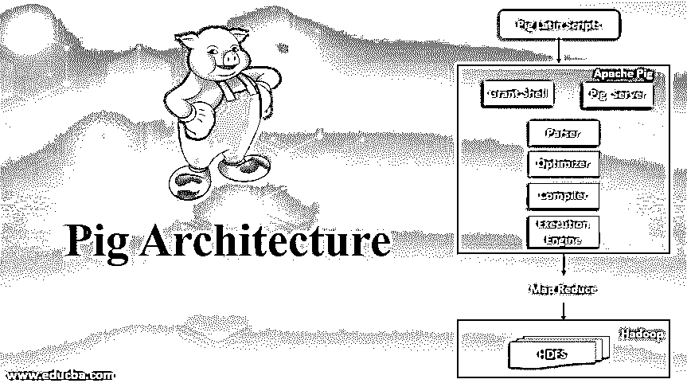
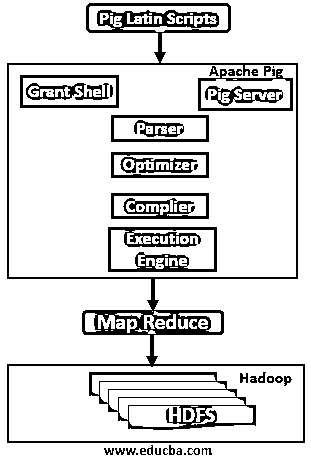

# 猪建筑

> 原文：<https://www.educba.com/pig-architecture/>

## 猪建筑介绍

让我们来看看 Apache pig 架构，它构建在 [Hadoop 生态系统](https://www.educba.com/apache-hadoop-ecosystem/)之上，使用高级数据处理平台。Pig 使用由关系和语句组成的 pig 拉丁数据流语言。Pig 拥有丰富的操作符和数据类型，可以在 Hadoop 中并行执行数据流。一头猪可以在 MapReduce T3、Apache Tez 或 Apache Spark 中执行任务。Pig 程序可以在交互式 shell 中编写，也可以在使用 Pig 框架转换为 Hadoop 作业的脚本中编写，以便 Hadoop 可以以分布式和并行的方式处理大数据。Pig 使用 UDF(用户自定义函数)来扩展其应用程序，这些 UDF 可以用 Java、Python、JavaScript、Ruby 或 Groovy 编写，可以直接调用。现在，我们将了解 Hadoop 生态系统中 pig 架构的简要介绍。

### 猪建筑及其组件

以下是对 Pig 架构及其组件的解释:

<small>Hadoop、数据科学、统计学&其他</small>

Hadoop 存储来自 IOT、网站、手机等各种来源的原始数据。预处理在 Map-reduce 中完成。Pig 框架将任何 pig 作业转换为 Map-reduce，因此我们可以使用 pig 对原始数据执行 ETL(提取、转换和加载)过程。Apache pig 可以处理存储在 Hadoop 中的大型数据，以执行数据分析及其支持的文件格式，如文本、CSV、Excel、RC 等。

使用 Apache pig 是因为它有以下特性

1.  **易于编程:**为了使编程易于编写和理解，大部分复杂的任务都被编码为数据流序列，以实现并行执行。
2.  **优化机会:** Pig 给予系统自动优化任务的权限，让程序员达到语义效率。
3.  **扩展性:**它提供 UDF 以便程序员可以创建自己的函数并进行处理。

### Apache Pig 框架

Apache pig 框架具有以下主要组件作为其架构的一部分:

*   句法分析程序
*   【计算机】优化程序
*   编译程序
*   执行引擎

#### 阿帕奇猪的建筑

让我们简单地一个一个地看看上面的组件:

**1。解析器:**grunt shell 中的任何 pig 脚本或命令都由解析器处理。Parse 将对脚本执行检查，如脚本的语法、类型检查和其他各种检查。这些检查将以有向无环图(DAG)的形式给出输出，其中有一个 pig 拉丁语句和逻辑运算符。DAG 将具有连接到不同边的节点，这里我们的脚本逻辑操作符是节点，数据流是边。

**2。Optimizer:** 一旦解析完成并生成 DAG，它就会被传递给逻辑优化器，以执行逻辑优化，如投影和下推。投影和下推是通过省略不必要的列或数据来提高查询性能，并删减加载器以只加载必要的列。

**3。编译器:**上面生成的优化逻辑计划由编译器编译，生成一系列 Map-Reduce 作业。基本上，编译器会自动将 pig 作业转换为 MapReduce 作业，并利用脚本中的优化机会，因为程序员不必手动调整程序。由于 pig 是一种数据流语言，如果执行计划与原始程序保持一致，其编译器可以对执行序列进行重新排序以优化性能。

**4。执行引擎:**最后，所有通过编译器生成的 MapReduce 作业按照排序后的顺序提交给 Hadoop。最后，MapReduce 的工作在 Hadoop 上执行，以产生所需的输出。

**5。执行模式:**根据脚本运行的位置和数据可用性，Pig 以两种执行模式工作:

*   **本地模式:**本地模式最适合小型数据集。Pig 是在单个 JVM 上实现的，因为所有文件都是在本地主机上安装和运行的，这是因为并行映射器的执行是不可能的。此外，在加载数据时，pig 将始终查看本地文件系统。

在本地模式下调用 grunt shell 的命令:

`pig -x local`

要在 tez 本地模式下运行 pig(内部调用 tez 运行时),请使用以下命令:

`pig -x tez_local`

*   **MapReduce 模式(MR 模式):**在 MapReduce 中，模式程序员需要访问和设置 Hadoop 集群和 HDFS 安装。在这种模式下，进行处理的数据存在于 HDFS 系统中。在 MR 模式下执行 pig 脚本后，pig Latin 语句在后端被转换为 Map Reduce 作业，以对数据执行操作。默认情况下，pig 使用 Map Reduce 模式，因此我们不需要使用-x 标志来指定它。

在 MR 模式下调用 grunt shell 的命令:

`pig -x mapreduce OR pig`

除了执行模式之外，Apache pig 中还有三种不同的执行机制:

1.  **交互模式或 Grunt Shell:** 输入 pig 语句，在命令 Shell 中得到输出。
2.  **批处理模式或脚本模式:**这是一种非交互式的执行方式，程序员用。pig '扩展并执行该扩展。
3.  **嵌入式方式:**在我们的脚本中借助 UDF 使用 java 之类的编程语言。

### 清管作业执行流程

下面我们解释 pig 中的作业执行流程:

*   程序员创建一个 Pig 拉丁脚本，它作为一个函数存在于本地文件系统中。
*   一旦 pig 脚本被提交，它就与一个编译器连接，该编译器生成一系列 MapReduce 作业
*   Pig 编译器从 HDFS 获得原始数据执行运算。
*   MapReduce 作业完成后，结果文件再次被放在 [Hadoop 文件系统(HDFS)](https://www.educba.com/what-is-hdfs/) 中。

### 结论

我们在这里看到了 pig 架构、其工作方式以及 Pig 中不同的执行模式。基于上述架构，我们可以看到 Apache Pig 是 Hadoop 生态系统的重要组成部分之一，具有 [SQL](https://www.educba.com/what-is-sql/) 知识的非程序员可以使用它进行数据分析和商业智能。一个 [pig](https://www.educba.com/what-is-pig/) 是一种数据流语言，它在 ETL 过程中很有用，我们必须获得大量数据来执行转换，并将数据加载回 HDFS。了解 pig 架构的工作有助于组织维护和管理用户数据。

### 推荐文章

这是猪建筑指南。在这里，我们讨论基本概念、Pig 架构、其组件，以及 Apache pig 框架和执行流程。您也可以浏览我们的其他相关文章，了解更多信息——

1.  [猪命令](https://www.educba.com/pig-commands/)
2.  [Hadoop 调度程序](https://www.educba.com/hadoop-schedulers/)
3.  [Pig 数据类型|示例](https://www.educba.com/pig-data-types/)
4.  [小猪 vs 火花](https://www.educba.com/pig-vs-spark/)

