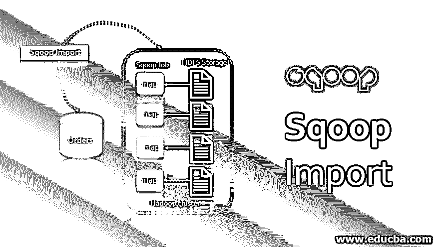

# Sqoop 导入

> 原文：<https://www.educba.com/sqoop-import/>

## Sqoop 导入简介

Sqoop 是 [SQL 和 Hadoop](https://www.educba.com/sql-vs-hadoop/) 的组合。Sqoop 基本上是 RDBMS 和 HDFS 这两个实体之间的桥梁。这是一个从结构化的[数据源，如 RDBMS](https://www.educba.com/what-is-rdbms/) ，数据仓库到 HDFS 的批量数据导入工具。它可以将所有表格、单个表格或表格的一部分导入 HDFS。Sqoop 还可以将数据从 HDFS 导出回数据库，这个过程称为导出。它由 Cloudera 创建，然后开源。在本主题中，我们将了解 Sqoop 导入。

它是一个单独的客户端程序，与 Hadoop 文件系统交互来创建一个或多个 map-reduce 程序。它[使用主键](https://www.educba.com/primary-key-in-sql/)列在其映射器上划分源数据。默认情况下，Sqoop 将产生 4 个映射器。Sqoop 可以与任何符合 T2 JDBC 标准的东西一起工作。对于不兼容的数据库，有 Sqoop 连接器。通用 JDBC 连接器是最基本的非兼容连接器。

<small>Hadoop、数据科学、统计学&其他</small>

### 句法

要进入 Sqoop import 命令，我们需要一个用户有效的登录 id(用户名)和密码，这里是将数据从一个地方传输到另一个地方的基本 Sqoop import 命令。

**语法:**

`$ sqoop import \
--connect jdbc:mysql://localhost:3306/retail_db\
--username cloudera \
--password secretkey \
--table department \
--target-dir /sqoopdata/departments\
--where “department_id = 1000” \
--m 1`

这里，您必须提供数据库名、机器名和端口号，并再次提供数据库名。之后，提供有效的用户名和密码，这是保密的。在命令行中提供密码可能是一个安全问题，因此您也可以将密码存储在文件中，并使用 password 参数访问文件。

接下来是表参数，您必须从这里导入数据或对数据进行 sqoop，这里我们使用部门表进行 sqoop。另一个参数是目标目录，由一个默认的表名和相同的名字创建，你可以自己指定。

" Where "参数用于导入唯一的一个数据子集。

“m”它用于指定地图任务。默认情况下，Sqoop 使用 4 个映射器，但是在“m”的帮助下，我们可以通过指定映射器值和“m”来控制并行度。

### Sqoop 中的导入命令

这里我们已经讨论了 sqoop 中的命令。

1.  导入就是将任何类型的数据从源插入到目的地。
2.  Sqoop 使用 import 命令将数据从 RDBMS 传递到 Hadoop 组件，如 HDFS、Pig、Hive 等。
3.  Sqoop 主要关注安全的数据，并且能够将数据传输到任何地方。
4.  当客户端[提交 Sqoop 命令](https://www.educba.com/sqoop-commands/)时，它在内部工作，Sqoop 进行的第一步是获取元数据，这意味着关于数据的信息，或者你可以说关于数据的数据被称为元数据。
5.  然后它提交或启动 maponly 作业，这是一个无缩减阶段，为什么没有缩减呢？因为我们只是加载和获取数据，所以没有聚合。简而言之，这里没有聚集现象。
6.  默认情况下，它创建 4 个映射任务，并将数据平均分配给映射器以获得高性能，它使用 JDBC 连接，然后它[将数据传输到 HDFS](https://www.educba.com/what-is-hdfs/) 。

**导入分两个阶段完成**

*   第一步是自省数据库以收集元数据(主键信息)
*   在第二阶段，Sqoop 将输入数据集分割成多个部分，然后使用单独的地图任务将这些部分推送到 HDFS。

**例子**

`$ sqoop import \
--connect jdbc:mysql://localhost:3306/retail_db\
--username cloudera \
--password secretkey \
--table department \
--target-dir /sqoopdata/departments\
--where “department_id = 1000” \
--m 1`

这里，您必须提供数据库名、机器名和端口号，并再次提供数据库名。之后，提供有效的用户名和密码，这是保密的。在命令行中提供密码可能是一个安全问题，因此您也可以将密码存储在文件中，并使用 password 参数访问文件。

接下来是表参数，您必须从这里导入数据或对数据进行 sqoop，这里我们使用部门表进行 sqoop。另一个参数是目标目录，由一个默认的表名和相同的名字创建，你可以自己指定。

" Where "参数用于导入唯一的一个数据子集。

“m”它用于指定地图任务。默认情况下，Sqoop 使用 4 个映射器，但是在“m”的帮助下，我们可以通过指定映射器值和“m”来控制并行度。

如果您只想指定特定表中的列，例如 department 表，请使用以下语法:-–列“dept_id，name”。如果您只想从 departments 表中导入匹配的行，那么只需应用条件和“where”参数，即–where“dept _ id > = 1000”。使用以下语法从数据库导入所有表:-

**语法:**

`$sqoop import-all-tables \
--connect jdbc:mysql://localhost:3306/retail_db \
--username cloudera –password secret \
Warehouse-dir /mydata`

导入所有表时，请确保所有表都应该有一个主键。

### 优势

它允许使用各种结构化数据存储来传输数据，如 Teradata、Petadata 等。

*   Sqoop 可以并行执行数据传输。
*   由于数据被传输并且[进入 Hadoop 集群](https://www.educba.com/what-is-hadoop-cluster/)，sqoop 允许将在 [ETL 过程中完成的某些处理卸载到快速、](https://www.educba.com/etl-process/)低成本且有效的过程中。
*   它处理大量的数据。

### 结论

Sqoop 更像是一种安全性高且在预算范围内的交通工具，我们可以在任何地方高效地使用它。由于它在生产过程中速度很快，每个人都希望这项技术在自己的工厂进行处理，以获得更好的结果。

### 推荐文章

这是一个 Sqoop 导入的指南。这里我们讨论 Sqoop 中的 import 命令，以及它的优点、语法和例子。您也可以看看以下文章，了解更多信息–

1.  [Sqoop 命令](https://www.educba.com/sqoop-commands/)
2.  [Sqoop 面试问题](https://www.educba.com/sqoop-interview-questions/)
3.  [Sqoop](https://www.educba.com/sqoop/)
4.  [大数据分析](https://www.educba.com/big-data-analytics/)

